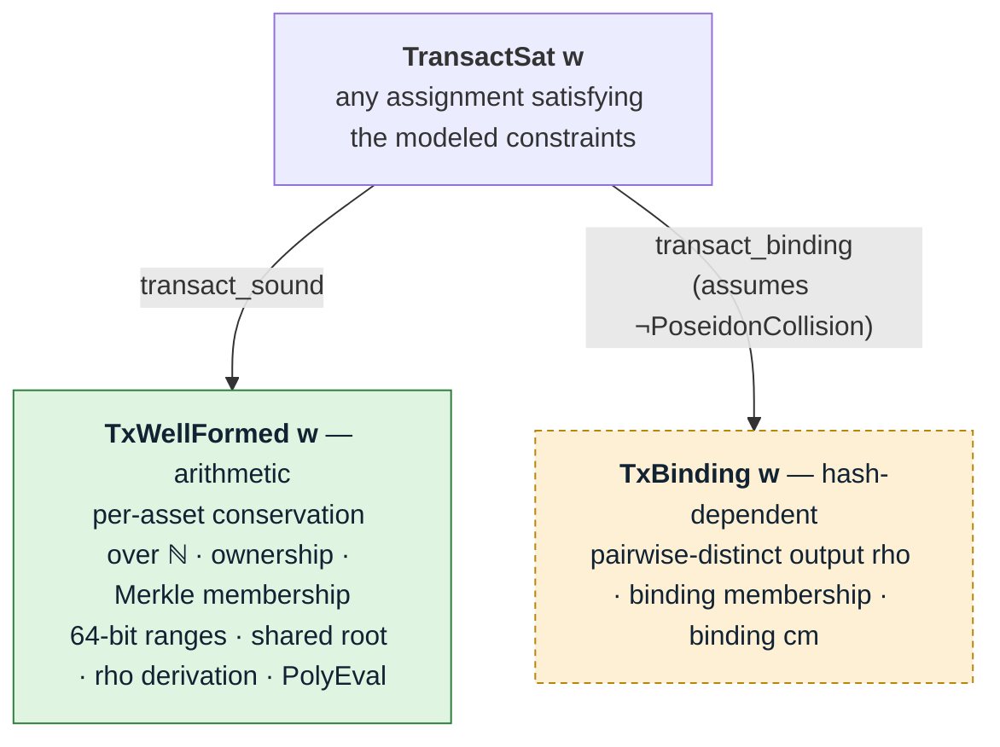
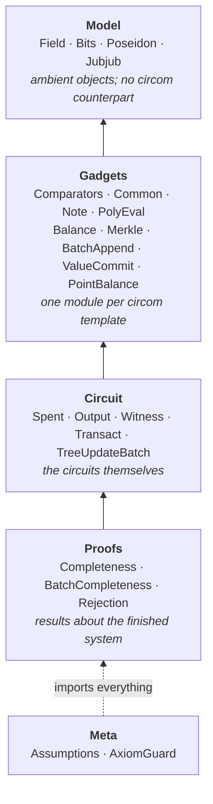

# `lean/` — Lean 4 soundness proofs for the circuits

A machine-checked development for `Transact(DEPTH, N_IN, N_OUT)`, the multi-asset transact
circuit, and for `TreeUpdateBatch(DEPTH, MAX_L)`, the relayer batch tree-advance circuit.
Every result is proved for the generic `Transact(depth, nIn, nOut)` and then instantiated at
**`src/4x6.circom`**, the shape the repository ships: `Transact(11, 4, 6)`, paired with
`TreeUpdateBatch(11, 8)`.

The top-level theorem holds for **any** assignment satisfying the modeled constraint system,
not only those an honest prover produces.

That distinction is the point. The test suite
([test/transact/](../test/transact/), [fuzz/](../test/fuzz/)) exercises the
honest witness-generation path only; `circom_tester` cannot detect an under-constrained
signal, so that bug class is untested by construction. These proofs quantify over satisfying
assignments instead.



The split is load-bearing: `TxWellFormed` depends on `p_prime` and the curve-gadget axioms
and on **nothing about Poseidon**. Everything needing collision resistance is quarantined in
`TxBinding`, whose hypothesis is unsatisfiable — see [What is not proved](#what-is-not-proved).

## Running the checks

```
cd lean
./scripts/check-all.sh            # or: just lean-check
```

Individually:

| Command | Checks |
|---|---|
| `lake build` | elaborates and kernel-checks every proof; runs the axiom guard over every declaration |
| `./scripts/check-axioms.sh` | trusted base still matches `expected/axioms.txt` |
| `./scripts/dump-layout.sh` | the transact and batch layouts still match `expected/layout-*.txt` |
| `python3 lean/scripts/check-prime.py` | discharges the two arithmetic axioms externally |
| `python3 lean/scripts/check-coverage.py` | every `===` / `<==` the circom emits is cited by something in `lean/` |
| `python3 lean/scripts/check-names.py` | every `Lelantos` name the prose claims exists |

CI runs the same set ([.github/workflows/lean.yml](../.github/workflows/lean.yml)).

## What is proved

Rows marked **†** are conditional on `¬ PoseidonCollision`, which is unsatisfiable. They are
assumptions recorded in a statement, not results — see
[What is not proved](#what-is-not-proved). Everything unmarked is unconditional.

### Top-level

| Theorem | Where | Statement |
|---|---|---|
| `transact_sound` | `Circuit/Transact.lean` | `TransactSat w → TxWellFormed w`, for `N_IN ≤ 7` and `N_OUT ≤ 7` |
| `transact4x6_sound` | `Circuit/Transact.lean` | the same at the shipped shape, `Transact(11, 4, 6)` |
| `transact_binding` † | `Circuit/Transact.lean` | `TransactSat w → TxBinding w` |

The `≤ 7` bound is not a property of the circuit — `PerAssetValueBalance` is written for
arbitrary `N_IN` / `N_OUT`. It is the largest slot count for which the balance sums provably
stay below `p` using `two_pow_67_lt_p`, whose proof rounds `(n+1) · 2^64` up to `8 · 2^64`.
Seven is where that argument runs out, not where any shape sits: the widest instantiated is
`nOut = 6`. It is stated at the argument's ceiling rather than at the shipped shape, so a
wider shape within the bound needs no change here. Going past seven needs the next power of
two in `Model/Field.lean` and every theorem citing the bound.

### Value conservation

The load-bearing result, and the one with the smallest trusted base.

| Theorem | Where | Statement |
|---|---|---|
| `perAssetValueBalance_all_assets` | `Gadgets/Balance.lean` | the `N_IN + N_OUT + 1` candidate checks — eleven at `Transact(11, 4, 6)` — imply conservation for **every** asset id in the field |
| `perAssetValueBalance_nat` | `Gadgets/Balance.lean` | …and as an exact **integer** equation, not a modular one |
| `no_asset_creation` | `Circuit/Transact.lean` | an asset on no input and not in the public bucket cannot appear on any output |
| `pointBalance_not_sound` | `Gadgets/PointBalance.lean` | the Edwards point balance is **not** a conservation check; exhibited at a 2-in, 2-out instance |

### Per-slot soundness

| Theorem | Where | Statement |
|---|---|---|
| `spentNote_sound` | `Circuit/Spent.lean` | a non-dummy slot proves ownership and Merkle membership |
| `outputNote_cvDep_same_value` | `Circuit/Output.lean` | `cv` and `cv_dep` open to the note's **own** `value` under its own `V^asset`, differing only in blinding |
| `valueCommit_opens` | `Gadgets/ValueCommit.lean` | `cv = value · V^asset + rcv · H`, where the scalar is the range-checked `value` signal, not an opaque bit array |
| `merkleProofOrDummy_sound` | `Gadgets/Merkle.lean` | a non-dummy slot's leaf sits under the root |
| `num2Bits_sound` | `Model/Bits.lean` | `2ⁿ ≤ p` makes the decomposition alias-free |
| `pathIndexSelectors_sound` | `Gadgets/Common.lean` | the selector is one-hot at `path_index` |
| `packAV_inj` | `Gadgets/Note.lean` | `(asset, value)` packing is injective given the range checks |
| `slots_inj` | `Gadgets/Merkle.lean` | inserting at a fixed position is injective |

### Public-input compression

| Theorem | Where | Statement |
|---|---|---|
| `polyEval_sound` | `Gadgets/PolyEval.lean` | the Horner chain computes `Σ cₖ zᵏ` |
| `polyEval_binding` | `Gadgets/PolyEval.lean` | coefficient vectors differing below `n` agree on at most `n - 1` challenges |
| `transact_pi_binding` | `Circuit/Transact.lean` | two transactions with different public inputs share `(z, y)` for at most `piCount - 1` challenges, 68 at the shipped shape |
| `transact_pi_binding_slot` | `Circuit/Transact.lean` | …stated per **named** public input |
| `piSlot_slotIndex` | `Circuit/Witness.lean` | `slotIndex` inverts the coefficient layout, turning a named-field difference into a coefficient index |
| `slotIndex_piSlot` | `Circuit/Witness.lean` | …and the other way, so no index other than a slot's own carries it |
| `polyEval_forge` | `Gadgets/PolyEval.lean` | one free coefficient sends `y` to **any** target at a nonzero challenge — one linear equation, no collision |
| `polyEval_not_binding` | `Gadgets/PolyEval.lean` | …hence compression binds nothing when a coefficient is unconstrained |

**Read the two halves together.** `transact_pi_binding` is the compression's
security argument and it holds only with the coefficient vector fixed *before*
the challenge. The prover gets the opposite order: `z` is a circuit input, and
the contract derives it from calldata the prover authored. So Schwartz-Zippel
does not carry the argument, and `polyEval_forge` says what fills the gap — the
compression binds exactly when every coefficient is pinned by some other
constraint, because `PolyEval` is affine in each with slope `z^k`.

That makes the layout's *membership* the security property, and the layout is
46 slots rather than 69 for exactly that reason. `recipient`, `chainId`, `payer`,
`relayer`, the FMD clue triples and the payload digest carry no constraint in
`4x6.circom`; as coefficients they were 23 free variables at once. They are not
coefficients: `PubInputs.sol` hashes them into `z` and never evaluates them,
which binds them against a tampering relayer at no cost. `piCount` records the
rule, and the pinning table in `Circuit/Transact.lean` names the constraint
behind every slot that remains.

`TransactSat.not_all_dummy` is the other half of that table. `MerkleProofOrDummy`
skips the root comparison on a dummy slot, so an all-dummy witness leaves
`merkleRoot` read by nothing — a free coefficient. The circuit rejects it and
`TxWellFormed.someRealInput` is the consequence.

### `tree_update_batch.circom`

`Circuit/TreeUpdateBatch.lean` splits the constraint system in two: `BatchChainSat` (leaves,
the tree, padding) and `BatchDepositSat` (the per-leaf deposit binding). The split is
load-bearing for the trusted base — only the deposit half mentions the curve, so every chain
result below depends on `p_prime` alone. The tree itself is `BatchAppend`
(`Gadgets/BatchAppend.lean`), proved against the specification in `Spec/QuatTree.lean`; the
construction is explained once, in the header of `src/lib/batch_append.circom`. Every
result takes a `BatchShape`, the numeric side conditions of an instance.

| Theorem | Where | Statement |
|---|---|---|
| `batch_count_range` | `Circuit/TreeUpdateBatch.lean` | `actual_count ∈ [1, MAX_L]`; `0` is excluded because it would force a decomposition of `p − 1` |
| `batch_active_spec` | `Circuit/TreeUpdateBatch.lean` | `active[k]` is the indicator of `k < actual_count`, hence a contiguous prefix |
| `batch_padding_zero` | `Circuit/TreeUpdateBatch.lean` | every field of an inactive leaf is zero, so padding cannot smuggle values into the compressed PIs |
| `batch_capacity` | `Circuit/TreeUpdateBatch.lean` | `start_index + actual_count ≤ 4^DEPTH`, from one range check on the last inserted index |
| `batch_frontier_canonical` | `Circuit/TreeUpdateBatch.lean` | every `frontier_in` slot at or above its level's digit is zero — the witness has no frontier signal no root reads |
| `batch_old_root` | `Circuit/TreeUpdateBatch.lean` | **`old_root` is `batchTree … 0 …`, the tree holding `start_index` leaves with this frontier** |
| `batch_advances_by_count` | `Circuit/TreeUpdateBatch.lean` | **`new_root` is that tree after appending exactly the first `actual_count` leaves** — the formal content of "odd counts work" |
| `batch_advances_at_positions` | `Circuit/TreeUpdateBatch.lean` | …the same root as `appendRoot`, a run of single-leaf `InsertsTo` steps at positions `start_index + k` |
| `batch_new_root_determined` † | `Circuit/TreeUpdateBatch.lean` | **two proofs from the same `old_root`, `start_index`, `actual_count`, `cms` and `cv_dep` reach the same `new_root`**, whatever private frontier each used |
| `batchPiSlot_batchSlotIndex` | `Circuit/TreeUpdateBatch.lean` | the batch coefficient layout inverts, so `expected/layout-batch-8.txt` is derived from the definition rather than a second copy |
| `BatchShape.deployed` | `Circuit/TreeUpdateBatch.lean` | the numeric side conditions hold at `TreeUpdateBatch(11, 8)`, `COUNT_BITS = 3`; `ZerosCoherent` is the one hypothesis it does not discharge, and `batch_advances_witness` discharges it together with `BatchChainSat` on one assignment |
| `batch_deposit_opens` | `Circuit/TreeUpdateBatch.lean` | an active deposit leaf's `cv_dep` opens to exactly `leaf_public_in` units of `leaf_asset` |
| `batchAppend_sound` | `Gadgets/BatchAppend.lean` | the run fits the tree and the gadget's two roots are `batchTree` at counts `0` and `actual_count`: `batchAppend_old_root`, `batchAppend_new_root` |
| `batchAppend_frontier_zero` | `Gadgets/BatchAppend.lean` | the frontier pin zeroes exactly the slots no digit reads, which is what the linear frontier terms of both roots rely on |
| `batchWindow_covers` | `Gadgets/BatchAppend.lean` | the fixed window is wide enough for every start position and every count up to `MAX_L` |
| `batchTree_eq_appendRoot` | `Spec/QuatTree.lean` | the tree after the append is the root a run of single-leaf `InsertsTo` steps reaches (`append_insertsTo`), by the frontier invariant `seqFr_inv` |
| `batchTree_frontier_inj` † | `Spec/QuatTree.lean` | the tree before the append pins every frontier slot it reads |
| `InsertsTo.unique` | `Spec/QuatTree.lean` | the insert is a **function** of `(leaf, digits, frontier)` — same inputs, same root and frontier |
| `lessThan_sound` | `Gadgets/Comparators.lean` | circomlib `LessThan(n)` is the comparison indicator, given both operands are `n`-bit |

`InsertsTo` is the abstract meaning of an append, the counterpart of `MerkleMember`, and
`InsertsTo.unique` is what keeps it from being the near-tautology `MerkleMember` is. There
the chain is merely witnessed, and only Poseidon collision resistance ties it to the root
(`merkleMember_inj`, a † row). Here `chain 0 = leaf` plus the step equation determine every
node outright, so the root is pinned by plain induction — **no hash assumption**, which is
why the batch rows carry no † except the two that are about the private frontier.

**Both roots, one frontier.** `BatchAppend` computes the old root and the new root from the
same `frontier_in`. `batchAppend_old_root` and `batchAppend_new_root` show they are `batchTree` at
counts `0` and `actual_count` — a declarative definition of the tree, with no windows or
selectors in it — and `batchTree_eq_appendRoot` shows the second is the root a run of
single-leaf inserts reaches, so the batch result can be read in the `InsertsTo` vocabulary of
one insert at a time. The tree lemmas behind it are `batchTree_frozen` (a completed
subtree never changes), `batchTree_empty` (past the run the tree is empty) and
`batchTree_congr` (the tree reads the frontier only where it is filled).

**The frontier is private, and still bound.** `batchTree_frontier_inj` descends from the root:
the old root's preimage is its four children, the child at the digit is the next node down, and
the children below the digit *are* the frontier. So under Poseidon collision resistance the
public `old_root` determines every frontier slot a root reads, and `batch_new_root_determined`
concludes that `new_root` is a function of the public statement. That is the binding the
circuit relies on to stop a relayer pairing a real `old_root` with a forged frontier.

`batch_active_spec` is still the one to read for the leaves. `BatchAppend` zeroes an inactive
leaf slot by multiplying it with `active[k]` and reads the run as a contiguous prefix of its
window, so a non-monotone `active` would drop a leaf from the middle of the run while later
positions still filled. Nothing mentions the parity of `actual_count`, which is the whole point
of the leaf-granular design.

**One hypothesis about a table.** The advance results assume `ZerosCoherent zeros`: the
`EMPTY_SUBTREE` constants are the empty-subtree chain. The reason is in the header of
`src/lib/batch_append.circom`. The hypothesis is about a compile-time table, not the prover;
`ZerosCoherent.eq_emptyChain` shows it determines the table, and `batch_advances_witness`
discharges it on the completeness assignment.

`batch_deposit_opens` is stated per leaf, with no aggregate anywhere in it. An aggregate
form binding only `cv_dep[2i] + cv_dep[2i+1]` would fix `Σvalue` modulo the subgroup order
`ell` and not the split between the two leaves. Binding each leaf on its own removes the
gap rather than
patching it, and the Lean statement shows the difference: it mentions one leaf.

**Read its direction carefully.** It says the leaf *has* an opening at its declared
`(leaf_asset, leaf_public_in)` — an existence statement. It does **not** say the opening is
unique, and it is not: `assetGen` is opaque here, but the circuit's `HashToAssetGen` is
Pedersen over one segment, so `V^a = m(a) · BASE0` and the equality pins the product
`value · m(asset)` rather than the pair. Two registered ids whose multipliers share a large
factor therefore admit a deposit paid as one asset and spent as the other. `assetMul`
(`Model/Jubjub.lean`) is exactly that weakness, imported so `pointBalance_not_sound` can
exhibit it; nothing here rules out its consequences on the deposit path. What does is the
registered id set, checked outside Lean by `scripts/check-asset-ids.ts` (`just asset-ids`).
Listed under *Not covered* below.

### Hash binding †

| Theorem | Where | Statement |
|---|---|---|
| `nullifier_binds_cm` † | `Gadgets/Note.lean` | faerie-gold resistance: `cm` is in the nullifier preimage |
| `noteCommitment_inj` † | `Gadgets/Note.lean` | `cm` binds all five note fields, given the range checks |
| `merkleMember_inj` † | `Gadgets/Merkle.lean` | the root **binds** the leaf at a position |
| `noteCommitment_ne_leafHash` † | `Gadgets/Note.lean` | a leaf hash can never be passed off as a note commitment |
| `merkleNode_inj` / `leafHash_inj` † | `Gadgets/Note.lean` | the supporting injectivity layer |

### Non-vacuity

| Theorem | Where | Statement |
|---|---|---|
| `transactSat_satisfiable` | `Proofs/Completeness.lean` | the constraint system **is satisfiable** |
| `transactSat_spend_satisfiable` | `Proofs/Completeness.lean` | …and satisfiable by a transaction that actually **moves value** through a non-dummy slot |
| `transactSat_twoAsset_satisfiable` | `Proofs/Completeness.lean` | …and by one moving **two distinct assets** with a non-zero public input |
| `spentReal_witness` | `Proofs/Completeness.lean` | `SpentReal` is inhabited, so `spentNote_sound`'s `is_dummy = 0` case is reachable |
| `transact4x6Sat_satisfiable` | `Proofs/Completeness.lean` | …and at `Transact(11, 4, 6)`, **the shipped shape**, the only witness with `nIn ≠ nOut` |
| `batchSat_satisfiable` | `Proofs/BatchCompleteness.lean` | `BatchSat` is satisfiable at `TreeUpdateBatch(11,8)`, so the batch results are not vacuous either |
| `batchSat_partial_batch` | `Proofs/BatchCompleteness.lean` | …by a batch committing **three** leaves into eight slots, so the padding constraints and both muxes are exercised rather than satisfied trivially |

The first four assignments are built at a small `(10, 2, 2)` shape;
`transact4x6Sat_satisfiable` repeats the padding construction at the shipped shape, so
`transact4x6_sound` is non-vacuous too. `padTx` is indexed by depth because those two sit at
different depths. The batch witness lives in `Proofs/BatchCompleteness.lean`.

### Assignments with no satisfying witness

| Theorem | Where | Statement |
|---|---|---|
| `cross_asset_cancellation_rejected` | `Proofs/Rejection.lean` | the `V¹ + V³ = 2·V²` attack that the **point** balance accepts is **rejected** by the full system |
| `inflation_rejected` / `mint_from_nothing_rejected` | `Proofs/Rejection.lean` | no satisfying assignment inflates or mints an asset |

### Guards

| Theorem | Where | Statement |
|---|---|---|
| `poseidon_not_injective` | `Model/Poseidon.lean` | literal injectivity of Poseidon is **false**, so it cannot be reintroduced as an axiom |
| `poseidon_collision` | `Model/Poseidon.lean` | …and therefore the † hypothesis is unsatisfiable |

## Is the theorem vacuous?

Two independent questions hide under that word, and both need an answer.

**Is the hypothesis satisfiable?** Yes, several times over. `transactSat_satisfiable`
constructs the degenerate-but-legal padding transaction; `transactSat_spend_satisfiable` one
that actually spends, with a non-dummy input, a real Merkle path, a non-zero scalar
multiplication and a balance whose sums are not all zero; `transactSat_twoAsset_satisfiable`
one whose balance candidates are not all the same asset. `transact4x6Sat_satisfiable`
repeats the first at the shipped shape, and `batchSat_satisfiable` covers
`TreeUpdateBatch(11, 8)` with a partially-filled batch.

This matters because `A → B` is trivially true when `A` is unsatisfiable, so a modelling slip
that over-constrains the system would fail silently. The spending witness additionally makes
`spentNote_sound` non-vacuous: its hypothesis is `is_dummy = 0`, and until a non-dummy slot
was exhibited (`spentReal_witness`) nothing showed that case was reachable at all.

**Is the axiom set consistent?** Yes. An axiom such as `Function.Injective poseidon` is
refutable — `List F` is infinite, `F` is finite — so it proves `False`, and `False` proves
`TxWellFormed w` for every `w`, satisfying or not. Satisfiability of `TransactSat` is no
defence against that. `poseidon_not_injective` stands in the development as a machine-checked
guard, and the hash assumption survives only as the explicit † hypothesis.

## The two results worth reading first

**Per-asset conservation** mechanizes the candidate-set argument from
[src/README.md § 6 "Value conservation, the binding check"](../src/README.md).
`PerAssetValueBalance` checks only the `N_IN + N_OUT + 1` asset ids present in the
transaction — eleven at the shipped shape; `perAssetValueBalance_all_assets` shows that
covers every asset id, and `perAssetValueBalance_nat` lifts the field equality to `ℕ` using
the 64-bit range checks — the "summands under `2^67 ≪ p`" argument at
[balance.circom:75-81](../src/lib/balance.circom). Remove a `RangeCheck64` upstream and the
theorem loses its hypothesis, which is exactly the failure that comment warns about. Both
results depend on **`p_prime` alone** — no cryptographic assumption, which is what
`PerAssetValueBalance` was written to achieve.

**The point balance is not a conservation check, in both directions.** `HashToAssetGen` is a
single-segment Pedersen hash, so every asset generator is a known multiple of one shared
base, and asset ids 1, 2, 3 land on consecutive multipliers — giving `V¹ + V³ = 2·V²`.
`pointBalance_not_sound` constructs an assignment satisfying the point equation while minting
value; `cross_asset_cancellation_rejected` shows that same asset/value pattern has **no**
satisfying assignment of the full system.

The constraint is stated over the **coordinate pairs** the circuit compares, folded with
`babyAdd` exactly as `PointSum` builds them. It was once stated over group elements, and
that cost `TransactSat` six fields asserting each published `cv` / `rH` pair to be the image
under `coords` of a subgroup element — no such check exists in `4x6.circom`, so they were
the only fields in the model in the dangerous direction of
[FIDELITY.md](FIDELITY.md)'s table. They are gone. Together they are exactly the claim
[balance.circom:53-64](../src/lib/balance.circom) makes in prose, and nothing in the
development may derive conservation from the point equation.

## What is *not* proved

* **Groth16 knowledge soundness.** The theorems concern R1CS satisfaction, not the on-chain
  verifier. Bridging that gap is a separate, much larger development.
* ~~**The old root.**~~ Now covered: `batch_old_root` models the old-root path the circuit
  computes, and `batch_new_root_determined` shows the public `old_root` binds the private
  frontier under collision resistance. This was the largest gap in the batch proof while the
  old root was a separate, unmodelled `FrontierRoot` template.
* **The `EMPTY_SUBTREE` constants.** The batch advance results assume `ZerosCoherent`, that
  the fills form the empty-subtree chain. Lean treats Poseidon as opaque and cannot check the
  eleven numeric constants against it; `test/gadgets/merkle.test.ts` recomputes the chain with
  circomlibjs and asserts every entry.
* **Uniqueness of a deposit leaf's opening.** `batch_deposit_opens` gives existence, not
  uniqueness, and uniqueness is false in general: the Pedersen asset generators are known
  multiples of one base, so `v · m(a) == v' · m(a')` with both values under `2^64` lets a
  deposit be spent as a different asset. Nothing in the circuit closes this — `cms[k]` is
  depositor-chosen and carries no proof — so it rests on which ids are registered.
  `scripts/check-asset-ids.ts` computes the bound over an id set and
  `test/tooling/check_asset_ids.test.ts` pins the gate; both live outside Lean because the argument
  is about `m(·)`, which the model deliberately keeps opaque.
* **`BabyCheck` on `cv_dep` (`tree_update_batch.circom` step 5).** The development has no
  curve equation, only the opaque `coords` / `babyAdd` interface, so "the point is on the
  curve" is not expressible. `batch_deposit_opens` gets its point structure from the
  value-commitment gadget instead.
* ~~**`BatchCompress` slot order.**~~ Now covered: `batchPiSlot` defines the
  `4 + 6·MAX_L` layout, `dump-layout.sh` writes `expected/layout-batch-8.txt`, and
  `test/formal/batch_layout_parity.test.ts` checks the published vector against it. The
  Horner chain itself was always covered by `polyEval_sound` / `polyEval_binding`; what was
  missing was the order, and the batch test anchored on the published vector — the same
  file the SDK and the contracts fixture read, so a drift agreed on by all three was
  invisible. It is now anchored on Lean.
* **Layout parity all the way to the contract.** `dump-layout.sh` pins the `4x6` and
  batch layouts against Lean and the two `*_layout_parity` tests pin the published vectors
  to those dumps, but `PubInputs.sol` has no 69-slot `compress` overload yet, so the
  transact chain ends at the vector rather than at the contract.
* **Under-constrainedness of the compiled R1CS**, beyond what Picus establishes — see
  [Under-constrainedness](#under-constrainedness-of-the-compiled-r1cs) below.
* **Contract obligations.** Nullifier freshness, the `chain_id` / `recipient_address`
  checks and the aux-digest recomputation are recorded in `Lelantos.ContractObligations` as
  `True` and assumed by nothing. A stub there is a claim made outside Lean, not a
  discharged one.
* **That the compression is binding, unconditionally.** It is binding only under
  `ContractObligations.challenge_binds_witness`, and that field is discharged by an argument
  Lean states but does not close: every coefficient is pinned by a constraint the prover
  cannot solve around. "Pinned" is checked slot by slot in the table in
  `Circuit/Transact.lean`; it is not a theorem, because "cannot steer a Poseidon image to a
  chosen value" is a preimage assumption, not arithmetic.
* **The residue in the three 64-bit slots.** `publicAssetId` is free within its range when
  `publicIn = publicOut = 0`, and `(publicIn, publicOut)` shift together without disturbing
  conservation: about 128 bits of freedom against a 254-bit modulus, so a solution to the
  linear equation exists for roughly `2⁻¹²⁶` of challenges. Bounded by the range checks,
  not eliminated, and not proved here.
* **Anything requiring Poseidon collision resistance** — the † rows, i.e. all of `TxBinding`.
  These follow from `¬ PoseidonCollision`, which `poseidon_collision` shows is unsatisfiable,
  so read literally they are vacuous. The assumption sits in the statement rather than in an
  axiom because the axiom version is refutable and would contaminate every other result; a
  non-vacuous treatment needs a concrete-security formulation with an explicit adversary and
  advantage bound, which is a separate and much larger development. The containment is the
  point: `transact_sound`, conservation, the range checks and `PolyEval` are unaffected.
* **The dangerous direction of transcription error** — a model constraint the circuit does
  not impose. `check-coverage.py` and the signal map close the *other* direction and the
  misreading one; catching this needs the witness-parity harness, which is not built. See
  [FIDELITY.md](FIDELITY.md), Defence 2.

## Under-constrainedness of the compiled R1CS

These proofs are about `TransactSat`, a hand-written model. They say nothing about the R1CS
`circom` actually emits — a compiler bug, or a template whose constraints the model reads
more strictly than circom generates them, would be invisible to them. That is a different
question, and it is answered by a different tool.

[**Picus**](https://github.com/Veridise/Picus) (Veridise) decides it directly on the compiled
artifact. Its default check is **weak safety**: for a fixed assignment to the circuit's
declared inputs, is every output uniquely determined? A circuit failing it has a signal the
prover may choose freely in a way that reaches `y`.

| Artifact | Wires | Verdict |
|---|---|---|
| `--O0` build, as Picus recommends | 158,793 | **properly constrained** (exit `8` = `safe`) |
| circom default `--O1` build | 70,171 | **properly constrained** (exit `8` = `safe`) |

Both verdicts came from the propagation phase alone — the `binary01`, `linear`, `basis2`,
`aboz` and `bim` lemmas determined every signal without a single SMT query, which is what
one expects from a circuit assembled entirely out of well-understood circomlib gadgets. Each
run took under 90 seconds. Both wire counts are from the circuit revision current when the
run was recorded; re-run `just picus` after a circuit change rather than reading them as live.

Reproduce with `just picus` (needs Docker; the image is ~4.5 GB). `.github/workflows/picus.yml`
runs `just picus-all` nightly over both circuits; it does not run on pull requests.

Two caveats worth stating precisely:

* **Weak safety is not strong safety.** The runs above pin the *outputs*, not every
  intermediate signal. A free intermediate that cannot reach `y` is harmless to a verifier
  that only sees `(z, y)`, but it is not nothing. `just picus STRONG=1` asks the stronger
  question and is markedly slower.
* **Exit code `0` means *unknown*, not success.** Picus uses `8` for a guarantee and `9` for
  a counterexample, so a naive `$?` check inverts the result. The recipe reports the code.

## Trusted base

Two guards, with different coverage:


`AxiomGuard` is the stronger of the two: it walks every declaration at build time, so an
axiom cannot enter through a theorem nobody remembered to list. `check-axioms.sh` is the more
legible: its diff shows *which* theorem's trusted base moved and how. Per-axiom rationale is
in [Lelantos/Meta/Assumptions.lean](Lelantos/Meta/Assumptions.lean).

**There is no hash axiom.**
[Lelantos/Model/Poseidon.lean](Lelantos/Model/Poseidon.lean) records why each tempting
formulation fails: literal injectivity is refutable and makes the development prove
everything, and a `P ∨ PoseidonCollision` conclusion is discharged by `Or.inr` because
`PoseidonCollision` is itself provable.

The two primality axioms (`p_prime`, `ell_prime`) exist only because Mathlib's `norm_num`
extension is trial-division based and cannot certify 254- and 251-bit numbers.
`lean/scripts/check-prime.py` discharges them externally: for `p` it verifies the full
factorization of `p - 1` and exhibits a base of order exactly `p - 1` — a Lucas certificate,
hence a real primality proof — and checks `babyjub_order = 8 · ell` plus every size bound the
proofs consume. For `ell` it runs 64-round Miller-Rabin only, stated plainly in the script's
output rather than dressed up as a certificate.

## Layout

Modules are grouped by layer, and the layers form a strict dependency chain. `Meta` sits
outside it: it imports the finished development and reports on it, which is why
`lakefile.toml` names it as a separate build target.



```
lean/
  Lelantos.lean            the whole development, with the layering documented
  Lelantos/
    Model/                 the ambient objects; no circom counterpart
      Field                BN254 Fr, size bounds, p_prime
      Bits                 Num2Bits semantics and alias-freeness
      Poseidon             opaque hash, why collision resistance is not an axiom, tags
      Jubjub               the prime-order subgroup, assetGen's known discrete log
    Gadgets/               one module per circomlib or src/lib template
      Comparators          IsZero / IsEqual and the indicators they compute
      Common               PathIndexSelectors
      Note                 key chain, commitment, nullifier, rho
      PolyEval             Horner soundness and Schwartz-Zippel binding
      Balance              RangeCheck64, DummyZeroValue, per-asset conservation
      Merkle               MerkleLevel4 / MerkleRoot / MerkleProofOrDummy
      BatchAppend          both roots of a batch, the count, prefix and capacity checks
      ValueCommit          ValueScalarMul, MulH, opening cv to the note's value
      PointBalance         the proved negative result
    Spec/                  what the tree gadgets are proved against; no signals
      QuatTree             ZerosCoherent, InsertsTo, batchTree, the run of inserts, frontier injectivity
    Circuit/               the circuits themselves
      Spent                SpentNote
      Output               OutputNote
      Witness              TxWitness and the 69-slot public-input layout
      Transact             TransactSat, TxWellFormed, TxBinding, transact_sound
      TreeUpdateBatch      BatchChainSat, BatchDepositSat, the batch advance results
    Proofs/                results about the finished system
      Completeness         concrete satisfying assignments for transact (non-vacuity)
      BatchCompleteness    the same for tree_update_batch, partially filled, empty and filled frontiers
      Rejection            malformed transactions that provably have none
    Meta/                  about the development rather than the circuit
      Assumptions          the trusted base, documented and printed
      AxiomGuard           build-time axiom check over every declaration
  expected/                generated; regenerate with --update on the relevant script
    axioms.txt             expected output of Meta/Assumptions
    layout-4x6.txt         expected output of Circuit/Witness :: layoutNames
  scripts/                 check-all, check-axioms, dump-layout, check-prime
```

Each `…Sat` definition is a named-field structure mirroring one circom template
constraint-for-constraint in source order, every field citing the source line it comes from;
each carries a `…_sound` theorem stating what those constraints buy.
