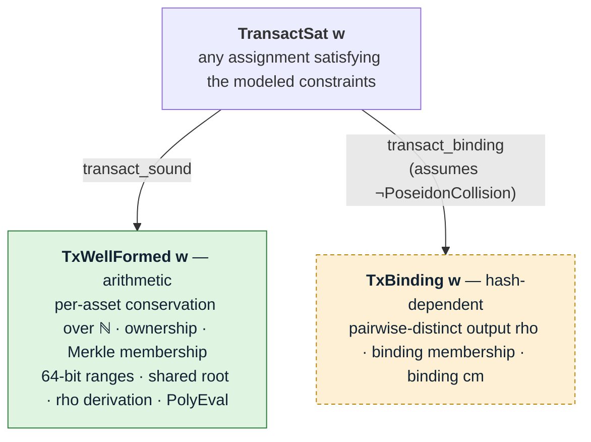
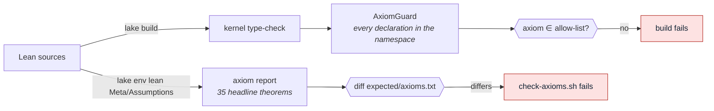
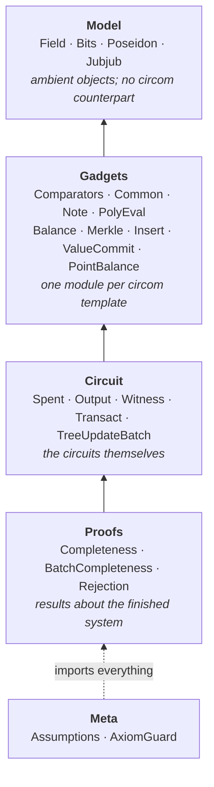

# `lean/` — Lean 4 soundness proofs for the circuits

A machine-checked development for `Transact(DEPTH, N_IN, N_OUT)`, the multi-asset transact
circuit, and for `TreeUpdateBatch(DEPTH, MAX_L)`, the relayer batch tree-advance circuit.
The transact half covers all three shapes the repository instantiates — `src/2x2.circom`,
`src/3x3.circom` and `src/4x4.circom`. `3x3` is the deployed shape: it is what
`PubInputs.sol` compresses and what `contracts/src/verifiers/Verifier.sol` verifies. `2x2`
and `4x4` are retained so the shape-generic results are exercised at more than one slot
count; `4x4` is also what fixes the `≤ 4` slot bound below. All three ship prover artifacts
and a golden vector; only `3x3` is deployed.
The top-level theorem holds for **any** assignment satisfying the modeled constraint system,
not only those an honest prover produces.

That distinction is the point. The test suite
([src/test/transact/](../src/test/transact/), [fuzz/](../src/test/fuzz/)) exercises the
honest witness-generation path only; `circom_tester` cannot detect an under-constrained
signal, so that bug class is untested by construction. These proofs quantify over satisfying
assignments instead.



The split is load-bearing: `TxWellFormed` depends on `p_prime` and the curve-gadget axioms
and on **nothing about Poseidon**. Everything needing collision resistance is quarantined in
`TxBinding`, whose hypothesis is unsatisfiable — see [What is not proved](#what-is-not-proved).

## Running the checks

```
cd lean
./scripts/check-all.sh            # or: just lean-check
```

Individually:

| Command | Checks |
|---|---|
| `lake build` | elaborates and kernel-checks every proof; runs the axiom guard over every declaration |
| `./scripts/check-axioms.sh` | trusted base still matches `expected/axioms.txt` |
| `./scripts/dump-layout.sh` | public-input layouts still match `expected/layout-{2x2,3x3,4x4}.txt` |
| `python3 scripts/check-prime.py` | discharges the two arithmetic axioms externally |

CI runs the same set ([.github/workflows/lean.yml](../.github/workflows/lean.yml)).

## What is proved

Rows marked **†** are conditional on `¬ PoseidonCollision`, which is unsatisfiable. They are
assumptions recorded in a statement, not results — see
[What is not proved](#what-is-not-proved). Everything unmarked is unconditional.

### Top-level

| Theorem | Where | Statement |
|---|---|---|
| `transact_sound` | `Circuit/Transact.lean` | `TransactSat w → TxWellFormed w`, for `N_IN ≤ 4` and `N_OUT ≤ 4` |
| `transact2x2_sound` / `transact3x3_sound` / `transact4x4_sound` | `Circuit/Transact.lean` | the same for each instantiated shape: `Transact(10,3,3)` (deployed), `Transact(10,2,2)` and `Transact(10,4,4)` |
| `transact_binding` † | `Circuit/Transact.lean` | `TransactSat w → TxBinding w` |

The `≤ 4` bound is not a property of the circuit — `PerAssetValueBalance` is written for
arbitrary `N_IN` / `N_OUT`. It is the largest slot count for which the balance sums provably
stay below `p` using `two_pow_67_lt_p` (`(4+1) · 2^64 < 2^67`), and it covers every shape the
repository ships. A wider shape needs a wider bound in `Model/Field.lean` and nothing else —
widening it from `≤ 3` to `≤ 4` for `src/4x4.circom` was exactly that one-line change plus
the new power of two.

### Value conservation

The load-bearing result, and the one with the smallest trusted base.

| Theorem | Where | Statement |
|---|---|---|
| `perAssetValueBalance_all_assets` | `Gadgets/Balance.lean` | the five candidate checks imply conservation for **every** asset id in the field |
| `perAssetValueBalance_nat` | `Gadgets/Balance.lean` | …and as an exact **integer** equation, not a modular one |
| `no_asset_creation` | `Circuit/Transact.lean` | an asset on no input and not in the public bucket cannot appear on any output |
| `pointBalance_not_sound` | `Gadgets/PointBalance.lean` | the Edwards point balance is **not** a conservation check, at the deployed `(2,2)` shape |

### Per-slot soundness

| Theorem | Where | Statement |
|---|---|---|
| `spentNote_sound` | `Circuit/Spent.lean` | a non-dummy slot proves ownership and Merkle membership |
| `outputNote_cvDep_same_value` | `Circuit/Output.lean` | `cv` and `cv_dep` open to the note's **own** `value` under its own `V^asset`, differing only in blinding |
| `valueCommit_opens` | `Gadgets/ValueCommit.lean` | `cv = value · V^asset + rcv · H`, where the scalar is the range-checked `value` signal, not an opaque bit array |
| `merkleProofOrDummy_sound` | `Gadgets/Merkle.lean` | a non-dummy slot's leaf sits under the root |
| `num2Bits_sound` | `Model/Bits.lean` | `2ⁿ ≤ p` makes the decomposition alias-free |
| `pathIndexSelectors_sound` | `Gadgets/Common.lean` | the selector is one-hot at `path_index` |
| `packAV_inj` | `Gadgets/Note.lean` | `(asset, value)` packing is injective given the range checks |
| `slots_inj` | `Gadgets/Merkle.lean` | inserting at a fixed position is injective |

### Public-input compression

| Theorem | Where | Statement |
|---|---|---|
| `polyEval_sound` | `Gadgets/PolyEval.lean` | the Horner chain computes `Σ cₖ zᵏ` |
| `polyEval_binding` | `Gadgets/PolyEval.lean` | distinct coefficient vectors agree on `≤ 30` challenges |
| `transact_pi_binding` | `Circuit/Transact.lean` | two transactions with different public inputs share `(z, y)` for at most 30 challenges |
| `transact_pi_binding_slot` | `Circuit/Transact.lean` | …stated per **named** public input |
| `piSlot_slotIndex` | `Circuit/Witness.lean` | `slotIndex` inverts the coefficient layout, turning a named-field difference into a coefficient index |

### `tree_update_batch.circom`

`Circuit/TreeUpdateBatch.lean` splits the constraint system in two: `BatchChainSat` (the
append machinery) and `BatchDepositSat` (the per-leaf deposit binding). The split is
load-bearing for the trusted base — only the deposit half mentions the curve, so every
chain result below depends on `p_prime` alone.

| Theorem | Where | Statement |
|---|---|---|
| `batch_count_range` | `Circuit/TreeUpdateBatch.lean` | `actual_count ∈ [1, MAX_L]`; `0` is excluded because it would force a decomposition of `p − 1` |
| `batch_active_spec` | `Circuit/TreeUpdateBatch.lean` | `active[k]` is the indicator of `k < actual_count`, hence a contiguous prefix |
| `batch_padding_zero` | `Circuit/TreeUpdateBatch.lean` | every field of an inactive leaf is zero, so padding cannot smuggle values into the compressed PIs |
| `batch_step_inserts` | `Circuit/TreeUpdateBatch.lean` | an active step is a genuine `InsertsTo` of that leaf over the running frontier |
| `batch_step_stalls` | `Circuit/TreeUpdateBatch.lean` | an inactive step carries the running state through unchanged |
| `batch_advances_by_count` | `Circuit/TreeUpdateBatch.lean` | **both halves at once: every step below `actual_count` is a real insert, and `new_root` is the running root at `actual_count`** — the formal content of "odd counts work" |
| `batch_advances_by_count_deployed` | `Circuit/TreeUpdateBatch.lean` | …at `TreeUpdateBatch(10, 4)`, `COUNT_BITS = 2` |
| `batch_bounds_deployed` | `Circuit/TreeUpdateBatch.lean` | the two side conditions are simultaneously satisfiable at the deployed shape, so the results above are not conditional on an impossible hypothesis |
| `batch_deposit_opens` | `Circuit/TreeUpdateBatch.lean` | an active deposit leaf's `cv_dep` opens to exactly `leaf_public_in` units of `leaf_asset` |
| `quaternaryInsertLevel_sound` | `Gadgets/Insert.lean` | the level arithmetic is the fill table: `cur` at the digit, frontier left, empty-subtree hash right — and the frontier update is a *different* mux, also proved |
| `quaternaryInsert_sound` | `Gadgets/Insert.lean` | a satisfying assignment is an `InsertsTo`, with every digit quaternary |
| `InsertsTo.unique` | `Gadgets/Insert.lean` | the insert is a **function** of `(leaf, digits, frontier)` — same inputs, same root and frontier |
| `lessThan_sound` | `Gadgets/Comparators.lean` | circomlib `LessThan(n)` is the comparison indicator, given both operands are `n`-bit |

`InsertsTo` is the abstract meaning of an append, the counterpart of `MerkleMember`, and
`InsertsTo.unique` is what keeps it from being the near-tautology `MerkleMember` is. There
the chain is merely witnessed, and only Poseidon collision resistance ties it to the root
(`merkleMember_inj`, a † row). Here `chain 0 = leaf` plus the step equation determine every
node outright, so the root is pinned by plain induction — **no hash assumption**, which is
why none of the batch rows carry a †.

`batch_active_spec` is the one to read. `batch_advances_by_count` has two halves — every
step below `actual_count` is a real insert, and nothing is folded in past it — and neither
half alone says what is wanted: both would hold of a non-monotone `active` that appended
leaf `k` at tree position `start_index + k` while position `start_index + k − 1` was never
filled. It is the *contiguity* of the active prefix that rules that out. The statement never
mentions the parity of `actual_count`, which is the whole point of the leaf-granular
design.

`batch_deposit_opens` is stated per leaf, with no aggregate anywhere in it. An aggregate
form binding only `cv_dep[2i] + cv_dep[2i+1]` would fix `Σvalue` modulo the subgroup order
`ell` and not the split between the two leaves. Binding each leaf on its own removes the
gap rather than
patching it, and the Lean statement shows the difference: it mentions one leaf.

### Hash binding †

| Theorem | Where | Statement |
|---|---|---|
| `nullifier_binds_cm` † | `Gadgets/Note.lean` | faerie-gold resistance: `cm` is in the nullifier preimage |
| `noteCommitment_inj` † | `Gadgets/Note.lean` | `cm` binds all five note fields, given the range checks |
| `merkleMember_inj` † | `Gadgets/Merkle.lean` | the root **binds** the leaf at a position |
| `noteCommitment_ne_leafHash` † | `Gadgets/Note.lean` | a leaf hash can never be passed off as a note commitment |
| `merkleNode_inj` / `leafHash_inj` † | `Gadgets/Note.lean` | the supporting injectivity layer |

### Non-vacuity

| Theorem | Where | Statement |
|---|---|---|
| `transactSat_satisfiable` | `Proofs/Completeness.lean` | the constraint system **is satisfiable** |
| `transactSat_spend_satisfiable` | `Proofs/Completeness.lean` | …and satisfiable by a transaction that actually **moves value** through a non-dummy slot |
| `transactSat_twoAsset_satisfiable` | `Proofs/Completeness.lean` | …and by one moving **two distinct assets** with a non-zero public input |
| `spentReal_witness` | `Proofs/Completeness.lean` | `SpentReal` is inhabited, so `spentNote_sound`'s `is_dummy = 0` case is reachable |
| `transact3x3Sat_satisfiable` | `Proofs/Completeness.lean` | …and satisfiable at `Transact(10,3,3)`, **the deployed shape** |
| `transact4x4Sat_satisfiable` | `Proofs/Completeness.lean` | …and at `Transact(10,4,4)`, the widest instantiated shape |
| `batchSat_satisfiable` | `Proofs/BatchCompleteness.lean` | `BatchSat` is satisfiable at `TreeUpdateBatch(10,4)`, so the batch results are not vacuous either |
| `batchSat_partial_batch` | `Proofs/BatchCompleteness.lean` | …by a batch committing **three** leaves into four slots, so the padding constraints and both muxes are exercised rather than satisfied trivially |

The first four assignments are built at the `2x2` shape; `transact3x3Sat_satisfiable` and
`transact4x4Sat_satisfiable` repeat the padding construction at the deployed shape and at
`4x4`, so `transact3x3_sound` and `transact4x4_sound` are non-vacuous too. The batch witness
lives in `Proofs/BatchCompleteness.lean`.

### Assignments with no satisfying witness

| Theorem | Where | Statement |
|---|---|---|
| `cross_asset_cancellation_rejected` | `Proofs/Rejection.lean` | the `V¹ + V³ = 2·V²` attack that the **point** balance accepts is **rejected** by the full system |
| `inflation_rejected` / `mint_from_nothing_rejected` | `Proofs/Rejection.lean` | no satisfying assignment inflates or mints an asset |

### Guards

| Theorem | Where | Statement |
|---|---|---|
| `poseidon_not_injective` | `Model/Poseidon.lean` | literal injectivity of Poseidon is **false**, so it cannot be reintroduced as an axiom |
| `poseidon_collision` | `Model/Poseidon.lean` | …and therefore the † hypothesis is unsatisfiable |

## Is the theorem vacuous?

Two independent questions hide under that word, and both need an answer.

**Is the hypothesis satisfiable?** Yes, several times over. `transactSat_satisfiable`
constructs the degenerate-but-legal padding transaction; `transactSat_spend_satisfiable` one
that actually spends, with a non-dummy input, a real Merkle path, a non-zero scalar
multiplication and a balance whose sums are not all zero; `transactSat_twoAsset_satisfiable`
one whose five balance candidates are not all the same asset.
`transact3x3Sat_satisfiable` and `transact4x4Sat_satisfiable` repeat the first at the
deployed `3x3` shape and at `4x4`, and `batchSat_satisfiable` covers `TreeUpdateBatch(10, 4)`
with a partially-filled batch.

This matters because `A → B` is trivially true when `A` is unsatisfiable, so a modelling slip
that over-constrains the system would fail silently. The spending witness additionally makes
`spentNote_sound` non-vacuous: its hypothesis is `is_dummy = 0`, and until a non-dummy slot
was exhibited (`spentReal_witness`) nothing showed that case was reachable at all.

**Is the axiom set consistent?** Yes. An axiom such as `Function.Injective poseidon` is
refutable — `List F` is infinite, `F` is finite — so it proves `False`, and `False` proves
`TxWellFormed w` for every `w`, satisfying or not. Satisfiability of `TransactSat` is no
defence against that. `poseidon_not_injective` stands in the development as a machine-checked
guard, and the hash assumption survives only as the explicit † hypothesis.

## The two results worth reading first

**Per-asset conservation** mechanizes the candidate-set argument from
[src/README.md § 6 "Value conservation (binding check)"](../src/README.md).
`PerAssetValueBalance` checks only the five asset ids present in the transaction;
`perAssetValueBalance_all_assets` shows that covers every asset id, and
`perAssetValueBalance_nat` lifts the field equality to `ℕ` using the 64-bit range checks —
the "three summands under `2^66 ≪ p`" argument at
[balance.circom:75-80](../src/lib/balance.circom). Remove a `RangeCheck64` upstream and the
theorem loses its hypothesis, which is exactly the failure that comment warns about. Both
results depend on **`p_prime` alone** — no cryptographic assumption, which is what
`PerAssetValueBalance` was written to achieve.

**The point balance is not a conservation check, in both directions.** `HashToAssetGen` is a
single-segment Pedersen hash, so every asset generator is a known multiple of one shared
base, and asset ids 1, 2, 3 land on consecutive multipliers — giving `V¹ + V³ = 2·V²`.
`pointBalance_not_sound` constructs an assignment satisfying the point equation while minting
value; `cross_asset_cancellation_rejected` shows that same asset/value pattern has **no**
satisfying assignment of the full system. Together they are exactly the claim
[balance.circom:53-64](../src/lib/balance.circom) makes in prose, and nothing in the
development may derive conservation from the point equation.

## What is *not* proved

* **Groth16 knowledge soundness.** The theorems concern R1CS satisfaction, not the on-chain
  verifier. Bridging that gap is a separate, much larger development.
* **`FrontierRoot` (`src/lib/frontier_root.circom`).** The batch chain results take
  `frontier_in` as given: they say what the circuit does *with* the frontier, not that the
  frontier is the honest one for `old_root`. The constraint `old_root === frontier_root.root`
  is what stops a relayer pairing a real `old_root` with a forged frontier — a permanent-DoS
  vector — and it is modelled nowhere. This is the largest remaining gap in the batch proof.
* **`BabyCheck` on `cv_dep` (`tree_update_batch.circom` step 6).** The development has no
  curve equation, only the opaque `coords` / `babyAdd` interface, so "the point is on the
  curve" is not expressible. `batch_deposit_opens` gets its point structure from the
  value-commitment gadget instead.
* **`BatchCompress` slot order.** `polyEval_sound` and `polyEval_binding` cover the Horner
  chain for any coefficient vector, but the batch layout (`4 + 6·MAX_L`) is pinned against
  `PubInputs.sol` by `src/test/tree_update_batch.test.ts`, not in Lean. `dump-layout.sh`
  covers the transact layouts only.
* **Full layout parity against the SDK for `3x3` and `4x4`.** `dump-layout.sh` pins all
  three layouts against Lean, and `src/test/formal/layout_parity.test.ts` pins each published
  vector to its Lean dump — all three shapes ship one. The hand-written sentinel-per-field
  table in that test, which is what catches a transposition between two same-typed slots,
  exists for `2x2` only. Neither `3x3` nor `4x4` has a `PubInputs.sol` overload yet, so for
  those two the chain ends at the published vector rather than at the contract.
* **Under-constrainedness of the compiled R1CS**, beyond what Picus establishes — see
  [Under-constrainedness](#under-constrainedness-of-the-compiled-r1cs) below.
* **Contract obligations.** Nullifier freshness, `z` being a genuine Fiat-Shamir challenge,
  and the `chain_id` / `recipient_address` checks are recorded in
  `Lelantos.ContractObligations` and assumed by nothing.
* **Anything requiring Poseidon collision resistance** — the † rows, i.e. all of `TxBinding`.
  These follow from `¬ PoseidonCollision`, which `poseidon_collision` shows is unsatisfiable,
  so read literally they are vacuous. The assumption sits in the statement rather than in an
  axiom because the axiom version is refutable and would contaminate every other result; a
  non-vacuous treatment needs a concrete-security formulation with an explicit adversary and
  advantage bound, which is a separate and much larger development. The containment is the
  point: `transact_sound`, conservation, the range checks and `PolyEval` are unaffected.
* **The dangerous direction of transcription error** — see [FIDELITY.md](FIDELITY.md).

## Under-constrainedness of the compiled R1CS

These proofs are about `TransactSat`, a hand-written model. They say nothing about the R1CS
`circom` actually emits — a compiler bug, or a template whose constraints the model reads
more strictly than circom generates them, would be invisible to them. That is a different
question, and it is answered by a different tool.

[**Picus**](https://github.com/Veridise/Picus) (Veridise) decides it directly on the compiled
artifact. Its default check is **weak safety**: for a fixed assignment to the circuit's
declared inputs, is every output uniquely determined? A circuit failing it has a signal the
prover may choose freely in a way that reaches `y`.

| Artifact | Wires | Verdict |
|---|---|---|
| `--O0` build, as Picus recommends | 158,793 | **properly constrained** (exit `8` = `safe`) |
| `build/2x2.r1cs`, circom default `--O1` | 70,171 | **properly constrained** (exit `8` = `safe`) |

Both verdicts came from the propagation phase alone — the `binary01`, `linear`, `basis2`,
`aboz` and `bim` lemmas determined every signal without a single SMT query, which is what
one expects from a circuit assembled entirely out of well-understood circomlib gadgets. Each
run took under 90 seconds. Both wire counts are from the circuit revision current when the
run was recorded; re-run `just picus` after a circuit change rather than reading them as live.

Reproduce with `just picus` (needs Docker; the image is ~4.5 GB). `.github/workflows/picus.yml`
runs `just picus-all` nightly over all three shapes; it does not run on pull requests.

Two caveats worth stating precisely:

* **Weak safety is not strong safety.** The runs above pin the *outputs*, not every
  intermediate signal. A free intermediate that cannot reach `y` is harmless to a verifier
  that only sees `(z, y)`, but it is not nothing. `just picus STRONG=1` asks the stronger
  question and is markedly slower.
* **Exit code `0` means *unknown*, not success.** Picus uses `8` for a guarantee and `9` for
  a counterexample, so a naive `$?` check inverts the result. The recipe reports the code.

## Trusted base

Two guards, with different coverage:



`AxiomGuard` is the stronger of the two: it walks every declaration at build time, so an
axiom cannot enter through a theorem nobody remembered to list. `check-axioms.sh` is the more
legible: its diff shows *which* theorem's trusted base moved and how. Per-axiom rationale is
in [Lelantos/Meta/Assumptions.lean](Lelantos/Meta/Assumptions.lean).

**There is no hash axiom.**
[Lelantos/Model/Poseidon.lean](Lelantos/Model/Poseidon.lean) records why each tempting
formulation fails: literal injectivity is refutable and makes the development prove
everything, and a `P ∨ PoseidonCollision` conclusion is discharged by `Or.inr` because
`PoseidonCollision` is itself provable.

The two primality axioms (`p_prime`, `ell_prime`) exist only because Mathlib's `norm_num`
extension is trial-division based and cannot certify 254- and 251-bit numbers.
`scripts/check-prime.py` discharges them externally: for `p` it verifies the full
factorization of `p - 1` and exhibits a base of order exactly `p - 1` — a Lucas certificate,
hence a real primality proof — and checks `babyjub_order = 8 · ell` plus every size bound the
proofs consume. For `ell` it runs 64-round Miller-Rabin only, stated plainly in the script's
output rather than dressed up as a certificate.

## Layout

Modules are grouped by layer, and the layers form a strict dependency chain. `Meta` sits
outside it: it imports the finished development and reports on it, which is why
`lakefile.toml` names it as a separate build target.



```
lean/
  Lelantos.lean            the whole development, with the layering documented
  Lelantos/
    Model/                 the ambient objects; no circom counterpart
      Field                BN254 Fr, size bounds, p_prime
      Bits                 Num2Bits semantics and alias-freeness
      Poseidon             opaque hash, why collision resistance is not an axiom, tags
      Jubjub               the prime-order subgroup, assetGen's known discrete log
    Gadgets/               one module per circomlib or src/lib template
      Comparators          IsZero / IsEqual and the indicators they compute
      Common               PathIndexSelectors
      Note                 key chain, commitment, nullifier, rho
      PolyEval             Horner soundness and Schwartz-Zippel binding
      Balance              RangeCheck64, DummyZeroValue, per-asset conservation
      Merkle               MerkleLevel4 / MerkleRoot / MerkleProofOrDummy
      Insert               QuaternaryInsert and the frontier update
      ValueCommit          ValueScalarMul, MulH, opening cv to the note's value
      PointBalance         the proved negative result
    Circuit/               the circuits themselves
      Spent                SpentNote
      Output               OutputNote
      Witness              TxWitness and the 31-slot public-input layout
      Transact             TransactSat, TxWellFormed, TxBinding, transact_sound
      TreeUpdateBatch      BatchChainSat, BatchDepositSat, the batch chain results
    Proofs/                results about the finished system
      Completeness         concrete satisfying assignments for transact (non-vacuity)
      BatchCompleteness    the same for tree_update_batch, at a partially-filled batch
      Rejection            malformed transactions that provably have none
    Meta/                  about the development rather than the circuit
      Assumptions          the trusted base, documented and printed
      AxiomGuard           build-time axiom check over every declaration
  expected/                generated; regenerate with --update on the relevant script
    axioms.txt             expected output of Meta/Assumptions
    layout-2x2.txt         expected output of Circuit/Witness :: layoutNames, one per shape
    layout-3x3.txt
    layout-4x4.txt
  scripts/                 check-all, check-axioms, dump-layout, check-prime
```

Each `…Sat` definition is a named-field structure mirroring one circom template
constraint-for-constraint in source order, every field citing the source line it comes from;
each carries a `…_sound` theorem stating what those constraints buy.
