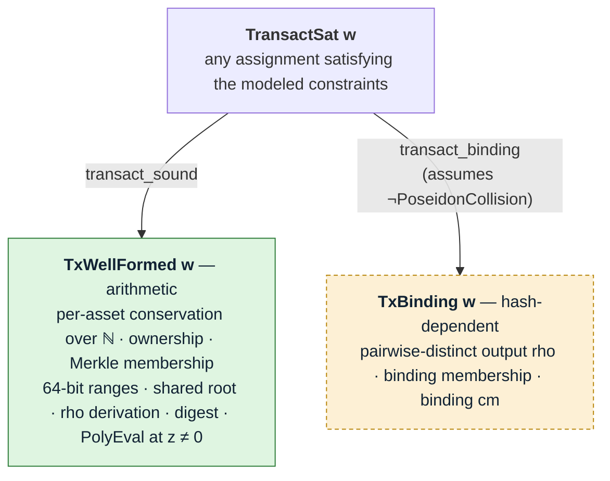
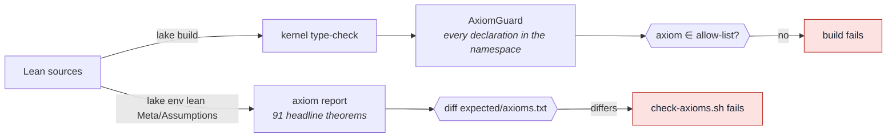
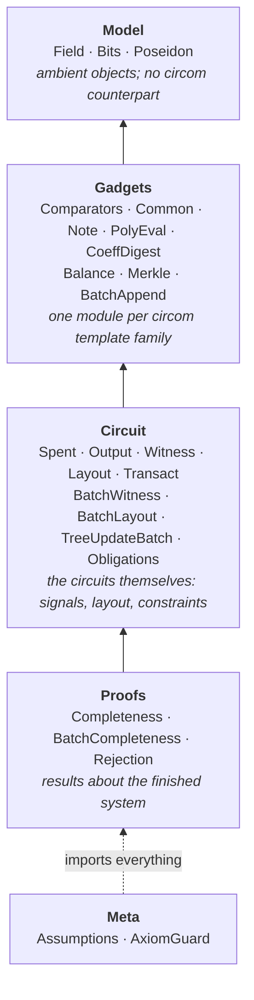

# `lean/` — Lean 4 soundness proofs for the circuits

A machine-checked development for `Transact(DEPTH, N_IN, N_OUT)`, the multi-asset transact
circuit, and for `TreeUpdateBatch(DEPTH, MAX_L)`, the relayer batch tree-advance circuit.
Every result is proved for the generic `Transact(depth, nIn, nOut)` and then instantiated at
**`src/4x6.circom`**, the shape the repository ships: `Transact(11, 4, 6)`, paired with
`TreeUpdateBatch(11, 8)`.

The top-level theorem holds for **any** assignment satisfying the modeled constraint system,
not only those an honest prover produces.

That distinction is the point. The test suite
([test/transact/](../test/transact/), [fuzz/](../test/fuzz/)) exercises the
honest witness-generation path only; `circom_tester` cannot detect an under-constrained
signal, so that bug class is untested by construction. These proofs quantify over satisfying
assignments instead.


```mermaid
flowchart TD
    SAT["<b>TransactSat w</b><br/>any assignment satisfying the modeled constraints"]

    WF["<b>TxWellFormed w</b> — arithmetic<br/>per-asset conservation over ℕ · ownership · Merkle membership<br/>64-bit ranges · shared root · rho derivation · digest · PolyEval at z ≠ 0"]
    BND["<b>TxBinding w</b> — hash-dependent<br/>pairwise-distinct output rho · binding membership · binding cm"]

    SAT -->|transact_sound| WF
    SAT -->|"transact_binding<br/>(assumes ¬PoseidonCollision)"| BND

    classDef proved fill:#dff5e1,stroke:#2f7d3a,color:#123
    classDef assumed fill:#fdf0d5,stroke:#b8860b,color:#123,stroke-dasharray: 4 3
    class WF proved
    class BND assumed
```

The split is load-bearing: `TxWellFormed` depends on `p_prime` and on **nothing about
Poseidon** beyond its being a function. Everything needing collision resistance is
quarantined in `TxBinding` and the other † rows, whose hypothesis is unsatisfiable — see
[What is not proved](#what-is-not-proved).

Neither circuit contains curve arithmetic. A note commits to its `(asset, value)` by hash,
`cm = Poseidon(TAG_CM, asset·2^64 + value, Poseidon(TAG_INNER, pk, rho, rcm))`, the tree
leaf is `cm`, and conservation is integer arithmetic over asset ids. So there is no value
commitment, no generator and no group law to model, and the trusted base is one axiom.

## Running the checks

```
cd lean
./scripts/check-all.sh            # or: just lean-check
```

Individually:

| Command | Checks |
|---|---|
| `lake build` | elaborates and kernel-checks every proof; runs the axiom guard over every declaration |
| `./scripts/check-axioms.sh` | trusted base still matches `expected/axioms.txt` |
| `./scripts/dump-layout.sh` | the transact and batch layouts still match `expected/layout-*.txt` |
| `python3 lean/scripts/check-prime.py` | discharges the arithmetic axiom externally |
| `python3 lean/scripts/check-coverage.py` | every `===` / `<==` the circom emits is cited by something in `lean/` |
| `python3 lean/scripts/check-names.py` | every `Lelantos` name the prose claims exists |

CI runs the same set ([.github/workflows/lean.yml](../.github/workflows/lean.yml)).

## What is proved

Rows marked **†** are conditional on `¬ PoseidonCollision`, which is unsatisfiable. They are
assumptions recorded in a statement, not results — see
[What is not proved](#what-is-not-proved). Everything unmarked is unconditional.

### Top-level

| Theorem | Where | Statement |
|---|---|---|
| `transact_sound` | `Circuit/Transact.lean` | `TransactSat w → TxWellFormed w`, for `N_IN ≤ 7` and `N_OUT ≤ 7` |
| `transact4x6_sound` | `Circuit/Transact.lean` | the same at the shipped shape, `Transact(11, 4, 6)` |
| `transact_binding` † | `Circuit/Transact.lean` | `TransactSat w → TxBinding w` |

The `≤ 7` bound is not a property of the circuit — `PerAssetValueBalance` is written for
arbitrary `N_IN` / `N_OUT`. It is the largest slot count for which the balance sums provably
stay below `p` using `two_pow_67_lt_p`, whose proof rounds `(n+1) · 2^64` up to `8 · 2^64`.
Seven is where that argument runs out, not where any shape sits: the widest instantiated is
`nOut = 6`. It is stated at the argument's ceiling rather than at the shipped shape, so a
wider shape within the bound needs no change here. Going past seven needs the next power of
two in `Model/Field.lean` and every theorem citing the bound. The digest fold has no arity
cap and does not enter the bound.

### Value conservation

The load-bearing result.

| Theorem | Where | Statement |
|---|---|---|
| `perAssetValueBalance_all_assets` | `Gadgets/Balance.lean` | the `N_IN + N_OUT + 1` candidate checks — eleven at `Transact(11, 4, 6)` — imply conservation for **every** asset id in the field |
| `perAssetValueBalance_nat` | `Gadgets/Balance.lean` | …and as an exact **integer** equation, not a modular one |
| `no_asset_creation` | `Circuit/Transact.lean` | an asset on no input cannot appear on any output with a non-zero value |
| `no_asset_withdrawal` | `Circuit/Transact.lean` | an asset on no input cannot be withdrawn through the transparent bucket |

The equation has the transparent bucket on the output side only:
`Σ in = Σ out + public_out`. There is no public input; a transact proof never moves tokens
in.

### The transparent bucket

| Theorem | Where | Statement |
|---|---|---|
| `publicBucket_zero_asset` | `Circuit/Transact.lean` | `public_out = 0 ⇒ public_asset_id = 0`: a transaction that withdraws nothing names no asset. Direct from the one constraint |
| `publicBucket_zero_out` | `Circuit/Transact.lean` | `public_asset_id = 0 ⇒ public_out = 0`. No constraint states it; it follows from conservation at id 0, the `asset ≠ 0` rules and `DummyZeroValue` |
| `publicBucket_zero_iff` | `Circuit/Transact.lean` | the two together |

### Per-slot soundness

| Theorem | Where | Statement |
|---|---|---|
| `spentNote_sound` | `Circuit/Spent.lean` | a non-dummy slot proves ownership and Merkle membership of its commitment |
| `spentNote_assetRange` / `spentNote_valueRange` | `Circuit/Spent.lean` | both packed fields are 64-bit on **every** input slot, dummies included |
| `outputNote_sound` | `Circuit/Output.lean` | an output's `cm` is the commitment of its own note, with a non-zero 64-bit asset id and a 64-bit value |
| `merkleProofOrDummy_sound` | `Gadgets/Merkle.lean` | a non-dummy slot's leaf sits under the root |
| `num2Bits_sound` | `Model/Bits.lean` | `2ⁿ ≤ p` makes the decomposition alias-free |
| `pathIndexSelectors_sound` | `Gadgets/Common.lean` | the selector is one-hot at `path_index` |
| `packAV_inj` | `Gadgets/Note.lean` | `(asset, value)` packing is injective given the two range checks |
| `slots_inj` | `Gadgets/Merkle.lean` | inserting at a fixed position is injective |

### Public-input compression

The verifier's public signals are `(y, digest, z)`, in that order, for both circuits. `z`
is the challenge, an input. `y` is the evaluation of the coefficient vector at `z`.
`digest` is the `CoeffDigest` of the same vector, a `Poseidon(5)` fold. The digest is a
public output; it is not a coefficient and is not evaluated into `y`.

| | coefficients (evaluated and digested) | challenge preimage (hashed into `z`) |
|---|---:|---:|
| `4x6` | 13 | 38: the 13 coefficients, the digest word, 24 challenge-only words |
| `tree_update_batch` | 36 | 37: the 36 coefficients, the digest word |

| Theorem | Where | Statement |
|---|---|---|
| `polyEval_sound` | `Gadgets/PolyEval.lean` | the Horner chain computes `Σ cₖ zᵏ` |
| `polyEvalSat_z_ne_zero` | `Gadgets/PolyEval.lean` | the challenge is nonzero |
| `coeffDigest_sound` | `Gadgets/CoeffDigest.lean` | the `Poseidon(5)` block chain computes `coeffDigest`, a function of its `m` input words |
| `transact_digest_public` | `Circuit/Transact.lean` | the public `digest` of a satisfying transact witness is `coeffDigest` of its coefficient vector |
| `digest_inj` † | `Gadgets/CoeffDigest.lean` | equal `CoeffDigest(m)` outputs force equal length-`m` inputs |
| `txCoeffs_determined_by_digest` † | `Circuit/Transact.lean` | two satisfying witnesses with the same public digest have the same coefficient vector |
| `slotValue_determined_by_digest` † | `Circuit/Transact.lean` | …stated per named public input |
| `transact_calldata_binding` † | `Circuit/Transact.lean` | a calldata coefficient vector whose `coeffDigest` is the public digest of a satisfying witness is that witness's coefficient vector |
| `polyEval_binding` | `Gadgets/PolyEval.lean` | coefficient vectors differing below `n` agree on at most `n - 1` challenges |
| `transact_pi_binding` | `Circuit/Transact.lean` | two transactions with different coefficient vectors share `(z, y)` for at most `piCount - 1` challenges, 12 at the shipped shape |
| `transact_pi_binding_slot` | `Circuit/Transact.lean` | …stated per **named** public input |
| `transact_calldata_pi_binding` | `Circuit/Transact.lean` | a calldata vector that differs from the witness's and evaluates to the proof's `y` at the proof's `z` does so for at most `piCount - 1` challenges |
| `piSlot_slotIndex` | `Circuit/Layout.lean` | `slotIndex` inverts the coefficient layout, turning a named-field difference into a coefficient index |
| `slotIndex_piSlot` | `Circuit/Layout.lean` | …and the other way, so no index other than a slot's own carries it |
| `polyEval_forge` | `Gadgets/PolyEval.lean` | one coefficient chosen after the challenge sends `y` to **any** target at a nonzero `z` — one linear equation |
| `polyEval_not_binding` | `Gadgets/PolyEval.lean` | …hence the evaluation alone does not bind a vector chosen after the challenge |

The batch rows of the same argument (`batch_digest_public`,
`batchCoeffs_determined_by_digest` †, `batch_calldata_binding` †, `batch_pi_binding`) are in
the next table.

**The argument, and where the proofs stop.** The contract reads the digest word `d` from
calldata, derives `z = keccak(coefficients, d, challenge-only words) mod r`, computes `y`
over the calldata coefficients, and verifies the proof against the public signals
`(y, d, z)`. The proof shows a witness `w` with `CoeffDigest(w) = d` and `Σ wₖ zᵏ = y`.
(`r` is the BN254 scalar-field modulus, `p` in the Lean sources.)

The evaluation alone would not bind: `z` is a circuit input derived from calldata the
prover authored, so the prover reads it before choosing a witness (`polyEval_forge`). What
binds is the order of commitment and challenge:

* `d` is in the preimage of `z`, and under collision resistance of the `Poseidon(5)` fold
  the prover knows only one coefficient vector with digest `d`. So the witness vector is
  fixed before `z`.
* The calldata vector `c` is in the preimage too. If `w ≠ c`, they are distinct polynomials
  of degree `< N` fixed before a random `z`, and agree there with probability at most
  `(N − 1)/r`: `12/r` for `4x6`, `35/r` for the batch.

This is commit-then-challenge Fiat-Shamir. It assumes Poseidon collision resistance, which
is the † hypothesis, and keccak256 as a random oracle.

Proved in Lean:

* the public digest is the `CoeffDigest` of the witness's coefficient vector
  (`transact_digest_public`, `batch_digest_public`; unconditional);
* the digest binds the vector (`digest_inj` †, `txCoeffs_determined_by_digest` †,
  `transact_calldata_binding` †, and the batch counterparts);
* distinct vectors agree on at most `N − 1` challenges (`polyEval_binding`,
  `transact_pi_binding`, `transact_calldata_pi_binding`, `batch_pi_binding`;
  unconditional).

**Not formalised:** the step that turns "the digest binds the vector (†)" plus "distinct
vectors agree on at most `N − 1` challenges" into "no forged calldata verifies except with
negligible probability". That is the standard Fiat-Shamir forking / random-oracle argument.
It quantifies over provers and treats keccak256 as a random oracle; this development
models neither. It is prose.

The argument needs three things from the contract, recorded in `ContractObligations` and
`BatchContractObligations`: the calldata digest word is passed to the verifier unmodified
as the `digest` public signal (`digest_passed_unmodified`, stated); it is in the keccak
preimage of `z` (`digest_in_challenge`, a stub); and every coefficient is in the keccak
preimage of `z` (`coefficients_in_challenge`, a stub). The digest is not evaluated into
`y`, and the contract never recomputes it.

`recipient`, `chainId`, `payer`, `relayer`, the intent hash, the FMD clue triples and the
payload digest are not signals of `4x6.circom`, so they are not coefficients:
`PubInputs.sol` hashes them into `z` and never evaluates them. The coefficient digest does
not absorb them, since there is no witness copy of them to disagree with calldata.
`piCount` records the rule, and the table in `Circuit/Transact.lean` names the constraint
that gives each coefficient its meaning.

`TransactSat.not_all_dummy` belongs to that table. `MerkleProofOrDummy` skips the root
comparison on a dummy slot, so with every slot dummy no spend constraint reads
`merkleRoot`. The circuit rejects that witness and `TxWellFormed.someRealInput` is the
consequence.

### `tree_update_batch.circom`

`Circuit/TreeUpdateBatch.lean` holds one constraint system, `BatchSat`. It used to be two,
split so the tree results could be shown to reach no curve axiom; with no curve in the
circuit the split has nothing to separate. The tree itself is `BatchAppend`
(`Gadgets/BatchAppend.lean`), proved against the specification in `Spec/QuatTree.lean`; the
construction is explained once, in the header of `src/lib/batch_append.circom`. Every
result takes a `BatchShape`, the numeric side conditions of an instance.

| Theorem | Where | Statement |
|---|---|---|
| `batch_count_range` | `Circuit/TreeUpdateBatch.lean` | `actual_count ∈ [1, MAX_L]`; `0` is excluded because it would force a decomposition of `p − 1` |
| `batch_active_spec` | `Circuit/TreeUpdateBatch.lean` | `active[k]` is the indicator of `k < actual_count`, hence a contiguous prefix |
| `batch_padding_zero` | `Circuit/TreeUpdateBatch.lean` | every field of an inactive slot is zero, so padding cannot smuggle values into the compressed PIs |
| `batch_spend_fields_zero` | `Circuit/TreeUpdateBatch.lean` | a spend slot carries no `leaf_asset` and no `leaf_public_in` |
| `batch_deposit_leaf` | `Circuit/TreeUpdateBatch.lean` | **a deposit slot's leaf is `NoteCommitment(leaf_asset, leaf_public_in, cms[k])`**, the commitment over the public amount and the depositor's `inner` |
| `batch_spend_leaf` | `Circuit/TreeUpdateBatch.lean` | a spend slot's leaf is `cms[k]` itself |
| `batch_no_value_under_zero` | `Circuit/TreeUpdateBatch.lean` | `leaf_asset = 0 ⇒ leaf_public_in = 0`, the one-way guard |
| `batch_deposit_opening_unique` † | `Circuit/TreeUpdateBatch.lean` | **a note commitment equal to a deposit leaf has exactly that leaf's `(leaf_asset, leaf_public_in)` and `inner`** |
| `batch_deposit_spend_binds` † | `Circuit/TreeUpdateBatch.lean` | …read from `SpentNote`: a slot whose commitment is that leaf spends exactly `leaf_public_in` units of `leaf_asset` |
| `batch_capacity` | `Circuit/TreeUpdateBatch.lean` | `start_index + actual_count ≤ 4^DEPTH`, from one range check on the last inserted index |
| `batch_frontier_canonical` | `Circuit/TreeUpdateBatch.lean` | every `frontier_in` slot at or above its level's digit is zero — the witness has no frontier signal no root reads |
| `batch_old_root` | `Circuit/TreeUpdateBatch.lean` | **`old_root` is `batchTree … 0 …`, the tree holding `start_index` leaves with this frontier** |
| `batch_advances_by_count` | `Circuit/TreeUpdateBatch.lean` | **`new_root` is that tree after appending exactly the first `actual_count` leaves** — the formal content of "odd counts work" |
| `batch_advances_at_positions` | `Circuit/TreeUpdateBatch.lean` | …the same root as `appendRoot`, a run of single-leaf `InsertsTo` steps at positions `start_index + k` |
| `batch_new_root_determined` † | `Circuit/TreeUpdateBatch.lean` | **two proofs from the same `old_root`, `start_index`, `actual_count`, `cms`, `leaf_asset`, `leaf_public_in` and `is_deposit` reach the same `new_root`**, whatever private frontier each used |
| `batch_compression` / `batch_challenge_nonzero` | `Circuit/TreeUpdateBatch.lean` | `y` is the evaluation of the 36-coefficient batch layout at a nonzero `z` |
| `batch_digest_public` | `Circuit/TreeUpdateBatch.lean` | the public `digest` of a satisfying batch witness is `coeffDigest` of its 36 coefficients (nine `Poseidon(5)` blocks) |
| `batchCoeffs_determined_by_digest` † | `Circuit/TreeUpdateBatch.lean` | two satisfying batch witnesses with the same public digest have the same coefficient vector; `batchSlotValue_determined_by_digest` † states it per named public input |
| `batch_calldata_binding` † | `Circuit/TreeUpdateBatch.lean` | a calldata coefficient vector whose `coeffDigest` is the public digest of a satisfying batch witness is that witness's coefficient vector |
| `batch_pi_binding` / `batch_calldata_pi_binding` | `Circuit/TreeUpdateBatch.lean` | two distinct batch coefficient vectors evaluate equally on at most `batchPiCount - 1` challenges, 35 at the shipped shape |
| `batchPiSlot_batchSlotIndex` | `Circuit/BatchLayout.lean` | the batch coefficient layout inverts, so `expected/layout-batch-8.txt` is derived from the definition rather than a second copy |
| `BatchShape.deployed` | `Circuit/TreeUpdateBatch.lean` | the numeric side conditions hold at `TreeUpdateBatch(11, 8)`, `COUNT_BITS = 3`; `ZerosCoherent` is the one hypothesis it does not discharge, and `batch_advances_witness` discharges it together with `BatchSat` on one assignment |
| `batchAppend_sound` | `Gadgets/BatchAppend.lean` | the run fits the tree and the gadget's two roots are `batchTree` at counts `0` and `actual_count`: `batchAppend_old_root`, `batchAppend_new_root` |
| `batchAppend_frontier_zero` | `Gadgets/BatchAppend.lean` | the frontier pin zeroes exactly the slots no digit reads, which is what the linear frontier terms of both roots rely on |
| `batchWindow_covers` | `Gadgets/BatchAppend.lean` | the fixed window is wide enough for every start position and every count up to `MAX_L` |
| `batchTree_eq_appendRoot` | `Spec/QuatTree.lean` | the tree after the append is the root a run of single-leaf `InsertsTo` steps reaches (`append_insertsTo`), by the frontier invariant `seqFr_inv` |
| `batchTree_frontier_inj` † | `Spec/QuatTree.lean` | the tree before the append pins every frontier slot it reads |
| `InsertsTo.unique` | `Spec/QuatTree.lean` | the insert is a **function** of `(leaf, digits, frontier)` — same inputs, same root and frontier |
| `lessThan_sound` | `Gadgets/Comparators.lean` | circomlib `LessThan(n)` is the comparison indicator, given both operands are `n`-bit |

`InsertsTo` is the abstract meaning of an append, the counterpart of `MerkleMember`, and
`InsertsTo.unique` is what keeps it from being the near-tautology `MerkleMember` is. There
the chain is merely witnessed, and only Poseidon collision resistance ties it to the root
(`merkleMember_inj`, a † row). Here `chain 0 = leaf` plus the step equation determine every
node outright, so the root is pinned by plain induction — **no hash assumption**, which is
why the tree rows carry no † except the two that are about the private frontier.

**Both roots, one frontier.** `BatchAppend` computes the old root and the new root from the
same `frontier_in`. `batchAppend_old_root` and `batchAppend_new_root` show they are `batchTree` at
counts `0` and `actual_count` — a declarative definition of the tree, with no windows or
selectors in it — and `batchTree_eq_appendRoot` shows the second is the root a run of
single-leaf inserts reaches, so the batch result can be read in the `InsertsTo` vocabulary of
one insert at a time. The tree lemmas behind it are `batchTree_frozen` (a completed
subtree never changes), `batchTree_empty` (past the run the tree is empty) and
`batchTree_congr` (the tree reads the frontier only where it is filled).

**The frontier is private, and still bound.** `batchTree_frontier_inj` descends from the root:
the old root's preimage is its four children, the child at the digit is the next node down, and
the children below the digit *are* the frontier. So under Poseidon collision resistance the
public `old_root` determines every frontier slot a root reads, and `batch_new_root_determined`
concludes that `new_root` is a function of the public statement. That is the binding the
circuit relies on to stop a relayer pairing a real `old_root` with a forged frontier.

**`new_root` is not the commitment to the coefficients.** Every active word reaches it,
but it is not injective in them: a zero leaf is the empty leaf, so a run with a trailing
zero leaf and a shorter run have the same roots. The batch therefore has its own
`CoeffDigest` public signal over the 36 coefficients (`batch_digest_public`), and the
binding of calldata is the transact argument above, with `N = 36`.

`batch_active_spec` is still the one to read for the leaves. `BatchAppend` zeroes an inactive
leaf slot by multiplying it with `active[k]` and reads the run as a contiguous prefix of its
window, so a non-monotone `active` would drop a leaf from the middle of the run while later
positions still filled. Nothing mentions the parity of `actual_count`, which is the whole point
of the leaf-granular design.

**One hypothesis about a table.** The advance results assume `ZerosCoherent zeros`: the
`EMPTY_SUBTREE` constants are the empty-subtree chain. The reason is in the header of
`src/lib/batch_append.circom`. The hypothesis is about a compile-time table, not the prover;
`ZerosCoherent.eq_emptyChain` shows it determines the table, and `batch_advances_witness`
discharges it on the completeness assignment.

**The deposit binding.** A deposit has no transact proof, so the batch circuit builds the
leaf: `batch_deposit_leaf` says it is the note commitment of the declared
`(leaf_asset, leaf_public_in)` over the word in `cms[k]`. The statement is per leaf, with no
aggregate anywhere in it, and it mentions no private signal. `batch_deposit_opening_unique`
then says the opening is unique: both scalars are 64-bit, so the packing is injective, and a
second opening is a Poseidon collision. Nothing depends on which asset ids are registered.
`batch_deposit_spend_binds` reads the same fact from the spending side, where `SpentNote`
supplies the opener's two range checks unconditionally.

**Read `batch_deposit_leaf`'s hypothesis carefully.** It is `is_deposit[k] = 1`, and the
circuit constrains `is_deposit` only to be boolean. Set on a spend leaf, the leaf is the hash
of `out_cm` under `(leaf_asset, leaf_public_in)`, which has no opening as a note, so the
spend's outputs are burned; cleared on a deposit leaf, the depositor's word is inserted as
it stands. Both satisfy `BatchSat`. Which slots are deposits is the contract's to pin
(`BatchContractObligations.is_deposit_pinned`).

**Where the tree is, not only where it goes.** `old_root`, `start_index` and `actual_count`
are *inputs* of the batch, so every row above is conditional on them: a proof over a stale
root, a wrong start position or a count the payload does not carry satisfies all of them.
The same holds of the leaves — `batch_deposit_leaf` builds leaf `k` from the fields leaf `k`
declares, not from the asset and amount someone escrowed. `BatchContractObligations` is that
residue, the batch's counterpart of `ContractObligations`: the three compression
conditions (`digest_passed_unmodified` stated, `digest_in_challenge` and
`coefficients_in_challenge` as stubs), and `old_root_is_live`,
`start_index_is_committed_count`, `count_matches_payload`, `is_deposit_pinned` and
`leaves_match_escrow` as stubs naming checks `MASP._requireTreePosition`,
`MASP._validateBatchHeader` and `MASP._drainDeposit` perform. No theorem assumes any of
them.

### Hash binding †

| Theorem | Where | Statement |
|---|---|---|
| `nullifier_binds_cm` † | `Gadgets/Note.lean` | faerie-gold resistance: `cm` is in the nullifier preimage |
| `noteCommitment_inj` † | `Gadgets/Note.lean` | `cm` binds `(asset_id, value, inner)`, given both 64-bit range checks |
| `noteInner_inj` † | `Gadgets/Note.lean` | `inner` binds `(pk, rho, rcm)` |
| `noteCm_inj` † | `Gadgets/Note.lean` | the two composed: `cm` binds all five note fields |
| `merkleMember_inj` † | `Gadgets/Merkle.lean` | the root **binds** the leaf at a position |
| `merkleNode_inj` † | `Gadgets/Note.lean` | the supporting injectivity layer |
| `noteCommitment_ne_deriveRho` † | `Gadgets/Note.lean` | the two arity-3 sites are separated by their leading tags |
| `noteInner_ne_nullifier` † | `Gadgets/Note.lean` | the two arity-4 sites likewise |
| `noteCommitment_ne_merkleNode` † | `Gadgets/Note.lean` | a leaf is never an internal node (arity 3 against 5) |
| `digestBlock_zero_ne_merkleNode` † | `Gadgets/CoeffDigest.lean` | block 0 of a digest is never a Merkle node. Nothing is claimed about the later blocks, which lead with a hash output rather than a tag |

### Non-vacuity

| Theorem | Where | Statement |
|---|---|---|
| `transactSat_satisfiable` | `Proofs/Completeness.lean` | the constraint system **is satisfiable** |
| `transactSat_spend_satisfiable` | `Proofs/Completeness.lean` | …by a transaction that **moves value** through a non-dummy slot and withdraws nothing, so its bucket names asset 0 |
| `transactSat_withdraw_satisfiable` | `Proofs/Completeness.lean` | …and by one that **withdraws** a non-zero amount of a non-zero asset, with balance candidates that do not all agree |
| `transactSat_twoAsset_satisfiable` | `Proofs/Completeness.lean` | …and by one moving **two distinct assets**: two real inputs at different positions under one root, each paid out as a note |
| `spentReal_witness` | `Proofs/Completeness.lean` | `SpentReal` is inhabited, so `spentNote_sound`'s `is_dummy = 0` case is reachable |
| `transact4x6Sat_satisfiable` | `Proofs/Completeness.lean` | …and at `Transact(11, 4, 6)`, **the shipped shape**, the only witness with `nIn ≠ nOut` |
| `batchSat_satisfiable` | `Proofs/BatchCompleteness.lean` | `BatchSat` is satisfiable at `TreeUpdateBatch(11,8)`, so the batch results are not vacuous either |
| `batchSat_partial_batch` | `Proofs/BatchCompleteness.lean` | …by a batch committing **three** leaves into eight slots, so the padding constraints are exercised rather than satisfied trivially |
| `batchSat_deposit_and_spend` | `Proofs/BatchCompleteness.lean` | …one of them an active deposit of a non-zero amount, another an active spend leaf, so both branches of the leaf mux are taken |
| `batchSat_nonzero_frontier` | `Proofs/BatchCompleteness.lean` | …and at a start position whose frontier holds non-zero values |

The small assignments are built at a `(10, 2, 2)` shape;
`transact4x6Sat_satisfiable` repeats the first construction at the shipped shape, so
`transact4x6_sound` is non-vacuous too. The witness is indexed by depth because those two sit
at different depths. Every witness evaluates at the challenge `z = 1`, since the circuit
rejects `z = 0`, and carries the digest of its own coefficients as its public `digest`.

There is no witness with a public input, because there is no public input: the two-asset
assignment gets its second asset from a second real note, which is why it is the one
witness whose Merkle path leaves position `0`.

### Assignments with no satisfying witness

| Theorem | Where | Statement |
|---|---|---|
| `inflation_rejected` / `mint_from_nothing_rejected` | `Proofs/Rejection.lean` | no satisfying assignment inflates or mints an asset |
| `withdraw_from_nothing_rejected` | `Proofs/Rejection.lean` | …or withdraws one nobody spent |
| `transfer_naming_asset_rejected` / `withdraw_asset_zero_rejected` | `Proofs/Rejection.lean` | the bucket cannot name an asset with nothing withdrawn, nor withdraw under id 0 |
| `oversized_input_asset_rejected` / `oversized_output_asset_rejected` / `oversized_public_rejected` | `Proofs/Rejection.lean` | an asset id or a public word at or above `2^64` is rejected on every slot kind, dummies included |
| `zero_challenge_rejected` | `Proofs/Rejection.lean` | `z = 0` has no satisfying assignment |
| `wrong_digest_rejected` | `Proofs/Rejection.lean` | a public `digest` other than the `coeffDigest` of the witness's coefficients has no satisfying assignment |

### Guards

| Theorem | Where | Statement |
|---|---|---|
| `poseidon_not_injective` | `Model/Poseidon.lean` | literal injectivity of Poseidon is **false**, so it cannot be reintroduced as an axiom |
| `poseidon_collision` | `Model/Poseidon.lean` | …and therefore the † hypothesis is unsatisfiable |

## Is the theorem vacuous?

Two independent questions hide under that word, and both need an answer.

**Is the hypothesis satisfiable?** Yes, several times over. `transactSat_satisfiable`
constructs a legal transaction; `transactSat_spend_satisfiable` shows it actually spends,
with a non-dummy input, a real Merkle path, a public digest over its seven coefficients and
a balance whose sums are not all zero; `transactSat_withdraw_satisfiable` one whose transparent
bucket is in use; `transactSat_twoAsset_satisfiable` one whose balance carries value for two
different assets. `transact4x6Sat_satisfiable` repeats
the first at the shipped shape, and `batchSat_satisfiable` covers `TreeUpdateBatch(11, 8)`
with a partially-filled batch holding both kinds of leaf.

This matters because `A → B` is trivially true when `A` is unsatisfiable, so a modelling slip
that over-constrains the system would fail silently. The spending witness additionally makes
`spentNote_sound` non-vacuous: its hypothesis is `is_dummy = 0`, and until a non-dummy slot
was exhibited (`spentReal_witness`) nothing showed that case was reachable at all.

**Is the axiom set consistent?** Yes. An axiom such as `Function.Injective poseidon` is
refutable — `List F` is infinite, `F` is finite — so it proves `False`, and `False` proves
`TxWellFormed w` for every `w`, satisfying or not. Satisfiability of `TransactSat` is no
defence against that. `poseidon_not_injective` stands in the development as a machine-checked
guard, and the hash assumption survives only as the explicit † hypothesis. The one axiom
that remains, `p_prime`, is a true statement about a number.

## The results worth reading first

**Per-asset conservation** mechanizes the candidate-set argument from
[src/README.md § 6 "Value conservation"](../src/README.md).
`PerAssetValueBalance` checks only the `N_IN + N_OUT + 1` asset ids present in the
transaction — eleven at the shipped shape; `perAssetValueBalance_all_assets` shows that
covers every asset id, and `perAssetValueBalance_nat` lifts the field equality to `ℕ` using
the 64-bit range checks — the "summands below `2^64`" argument at
[balance.circom:44-48](../src/lib/balance.circom). Remove a `RangeCheck64` upstream and the
theorem loses its hypothesis, which is exactly the failure that comment warns about. Both
results depend on **`p_prime` alone** — no cryptographic assumption, which is what
`PerAssetValueBalance` was written to achieve.

**The commitment binds the note through two hashes.** `noteCommitment_inj` is the outer
one, and it is where both range checks are consumed: without `asset_id < 2^64` a prover
could trade asset id against value inside the packed field. That is why the asset bound is
unconditional on every slot kind, dummies included (`spentNote_assetRange`), and why
`tree_update_batch.circom` range-checks both deposit fields on every slot.
`batch_deposit_opening_unique` is the same lemma applied to a deposit leaf, and it is the
whole deposit binding.

**The digest.** `transact_calldata_binding` and `transact_calldata_pi_binding` are the two
halves of the calldata binding, and both are short. Read them with the paragraph above
about the step between them that is not formalised.

## What is *not* proved

* **Groth16 knowledge soundness.** The theorems concern R1CS satisfaction, not the on-chain
  verifier. Bridging that gap is a separate, much larger development.
* **That no forged calldata verifies.** The claim is that a proof verifies only for the
  calldata its witness describes, except with probability at most `(N − 1)/r`. Its two
  halves are proved: the digest binds the coefficient vector (`transact_calldata_binding` †,
  `batch_calldata_binding` †), and two distinct vectors agree on at most `N − 1` challenges
  (`polyEval_binding`). The step that joins them is the standard Fiat-Shamir forking /
  random-oracle argument. It is prose and is **not formalised**: no theorem states it, no
  hypothesis carries the random-oracle assumption on keccak256, and nothing in `lean/`
  models a prover. It also needs the three contract conditions in
  `ContractObligations` and `BatchContractObligations`, two of which are stubs.
* **Separation of the later digest blocks from a Merkle node.** Block 0 leads with
  `TAG_DIGEST` (`digestBlock_zero_ne_merkleNode` †). A later block leads with the previous
  block's output, and "a hash output is not `TAG_MERKLE`" is a preimage statement, not a
  collision one.
* **The `EMPTY_SUBTREE` constants.** The batch advance results assume `ZerosCoherent`, that
  the fills form the empty-subtree chain. Lean treats Poseidon as opaque and cannot check the
  eleven numeric constants against it; `test/gadgets/merkle.test.ts` recomputes the chain with
  circomlibjs and asserts every entry.
* **Which batch slots are deposits.** `is_deposit` is only boolean in the circuit.
  `batch_deposit_leaf` and `batch_deposit_opening_unique` are conditional on it being set,
  `batch_spend_leaf` on it being clear, and a slot flagged the wrong way satisfies `BatchSat`
  in both directions. `BatchContractObligations.is_deposit_pinned` is a stub naming the
  check.
* **Layout parity all the way to the contract.** `dump-layout.sh` pins the `4x6` and
  batch layouts against Lean and the two `*_layout_parity` tests pin the published vectors
  to those dumps. `PubInputs.sol` has not yet been moved to the 13-coefficient and
  36-coefficient layouts or to the three public signals `(y, digest, z)`, so both chains end
  at the vector rather than at the contract.
* **Under-constrainedness of the compiled R1CS**, beyond what Picus establishes — see
  [Under-constrainedness](#under-constrainedness-of-the-compiled-r1cs) below.
* **That two input slots hold different notes.** Each slot is opened against the shared
  root on its own, so one note can fill two of them and `PerAssetValueBalance` will count
  its value twice on the input side. The circuit assigns the check to its consumer
  (`src/4x6.circom:60-62`) and `ContractObligations.nullifiers_distinct` is that obligation
  written down; `MASP._validateRequest` is where it is performed.
* **That two leaves hold different notes.** Two leaves with the same `cm` share a nullifier.
  That takes a deposit repeating an earlier `(asset, value, inner)` exactly, and the second
  leaf is then unspendable. Nothing here excludes it.
* **Hiding.** Nothing is proved about what a published `cm` or `inner` reveals. Output
  hiding rests on `rcm` alone, since an output's `rho` is publicly derivable; that is a
  property of the witness distribution, which this development does not model.
* **Contract obligations.** Nullifier freshness, the `chain_id` / `recipient_address`
  checks, the digest word and the coefficients being in the keccak preimage of `z`, and the
  aux-digest recomputation are recorded in `Lelantos.ContractObligations` as `True` and
  assumed by nothing. A stub there is a claim made outside Lean, not a discharged one. The
  two fields that *are* stated — `digest_passed_unmodified` and `nullifiers_distinct` — are
  still obligations, not results: nothing here proves them.
* **The batch's position and its payload.** `Lelantos.BatchContractObligations` is the same
  ledger for `tree_update_batch.circom`, and seven of its eight fields are stubs: the two
  keccak-preimage conditions, that `old_root` is the live root, that `start_index` is the
  committed leaf count, that `actual_count` matches the payload, that `is_deposit` is
  pinned, and that each leaf is the one its escrow record describes. Every batch result above is conditional on those inputs,
  so a proof over a stale root or a wrong start position satisfies all of them.
* **Anything requiring Poseidon collision resistance** — the † rows, i.e. all of `TxBinding`,
  the digest injectivity and the deposit opening. These follow from `¬ PoseidonCollision`,
  which `poseidon_collision` shows is unsatisfiable, so read literally they are vacuous. The
  assumption sits in the statement rather than in an axiom because the axiom version is
  refutable and would contaminate every other result; a non-vacuous treatment needs a
  concrete-security formulation with an explicit adversary and advantage bound, which is a
  separate and much larger development. The containment is the point: `transact_sound`,
  conservation, the range checks and `PolyEval` are unaffected.
* **The dangerous direction of transcription error** — a model constraint the circuit does
  not impose. `check-coverage.py` and the signal map close the *other* direction and the
  misreading one; catching this needs the witness-parity harness, which is not built. See
  [FIDELITY.md](FIDELITY.md), Defence 2.

## Under-constrainedness of the compiled R1CS

These proofs are about `TransactSat`, a hand-written model. They say nothing about the R1CS
`circom` actually emits — a compiler bug, or a template whose constraints the model reads
more strictly than circom generates them, would be invisible to them. That is a different
question, and it is answered by a different tool.

[**Picus**](https://github.com/Veridise/Picus) (Veridise) decides it directly on the compiled
artifact. Its default check is **weak safety**: for a fixed assignment to the circuit's
declared inputs, is every output uniquely determined? A circuit failing it has a signal the
prover may choose freely in a way that reaches `y` or `digest`.

Weak safety, `just picus-all` on 2026-10-04, over the `--O0` builds Picus recommends, with
both outputs (`y` and `digest`) in scope:

| Circuit | Wires (`--O0`) | Verdict |
|---|---:|---|
| `4x6` | 110,397 | **properly constrained** (exit `8` = `safe`) |
| `tree_update_batch` | 66,042 | **properly constrained** (exit `8` = `safe`) |

Strong safety was not run on these circuits, and the default `--O1` builds were not run
separately. A verdict holds for the revision it was run on and must be repeated after any
change to `src/` (`just picus`, needs Docker; the image is ~4.5 GB).
`.github/workflows/picus.yml` runs `just picus-all` nightly over both circuits; it does not
run on pull requests.

Two caveats worth stating precisely:

* **Weak safety is not strong safety.** A weak-safety run pins the *outputs*, `y` and
  `digest`, not every intermediate signal. A free intermediate that cannot reach either is
  harmless to a verifier that only sees `(y, digest, z)`, but it is not nothing.
  `just picus STRONG=1` asks the stronger question and is markedly slower.
* **Exit code `0` means *unknown*, not success.** Picus uses `8` for a guarantee and `9` for
  a counterexample, so a naive `$?` check inverts the result. The recipe reports the code.

## Trusted base

One axiom about the circuit, and Lean's own three:

| Axiom | Content |
|---|---|
| `p_prime` | the BN254 scalar-field modulus is prime |
| `propext`, `Classical.choice`, `Quot.sound` | Lean's; not assumptions about the circuit |

Every headline theorem depends on exactly those, or on fewer. There is no curve axiom: the
group law, the scalar-multiplication gadgets, the two Pedersen bases and the known discrete
log of the asset generators all left with the value commitments.

Two guards, with different coverage:


```mermaid
flowchart LR
    SRC["Lean sources"]

    SRC -->|"lake build"| KERNEL["kernel type-check"]
    KERNEL --> GUARD["AxiomGuard<br/><i>every declaration in the namespace</i>"]
    GUARD --> ALLOW{{"axiom ∈ allow-list?"}}
    ALLOW -->|no| FAILB["build fails"]

    SRC -->|"lake env lean Meta/Assumptions"| PRINT["axiom report<br/><i>91 headline theorems</i>"]
    PRINT --> DIFF{{"diff expected/axioms.txt"}}
    DIFF -->|differs| FAILA["check-axioms.sh fails"]

    classDef fail fill:#fde2e2,stroke:#b3261e,color:#123
    class FAILA,FAILB fail
```

`AxiomGuard` is the stronger of the two: it walks every declaration at build time, so an
axiom cannot enter through a theorem nobody remembered to list. `check-axioms.sh` is the more
legible: its diff shows *which* theorem's trusted base moved and how. Per-axiom rationale is
in [Lelantos/Meta/Assumptions.lean](Lelantos/Meta/Assumptions.lean).

**There is no hash axiom.**
[Lelantos/Model/Poseidon.lean](Lelantos/Model/Poseidon.lean) records why each tempting
formulation fails: literal injectivity is refutable and makes the development prove
everything, and a `P ∨ PoseidonCollision` conclusion is discharged by `Or.inr` because
`PoseidonCollision` is itself provable.

**The trusted base is not the whole of what is assumed.** It is what the *theorems* assume.
The † hypothesis, Poseidon collision resistance, is in their statements. The other
assumption of the calldata-binding argument, keccak256 as a random oracle, is in none of
them: the Fiat-Shamir step that needs it is prose, in this file and in
`Circuit/Transact.lean`, and is not formalised.

`p_prime` exists only because Mathlib's `norm_num` extension is trial-division based and
cannot certify a 254-bit number. `lean/scripts/check-prime.py` discharges it externally: it
verifies the full factorization of `p - 1` and exhibits a base of order exactly `p - 1` — a
Lucas certificate, hence a real primality proof — and repeats every size bound the proofs
consume.

## Layout

Modules are grouped by layer, and the layers form a strict dependency chain. `Meta` sits
outside it: it imports the finished development and reports on it, which is why
`lakefile.toml` names it as a separate build target.


```mermaid
flowchart BT
    MODEL["<b>Model</b><br/>Field · Bits · Poseidon<br/><i>ambient objects; no circom counterpart</i>"]
    GADGETS["<b>Gadgets</b><br/>Comparators · Common · Note · PolyEval · CoeffDigest<br/>Balance · Merkle · BatchAppend<br/><i>one module per circom template family</i>"]
    CIRCUIT["<b>Circuit</b><br/>Spent · Output · Witness · Layout · Transact<br/>BatchWitness · BatchLayout · TreeUpdateBatch · Obligations<br/><i>the circuits themselves: signals, layout, constraints</i>"]
    PROOFS["<b>Proofs</b><br/>Completeness · BatchCompleteness · Rejection<br/><i>results about the finished system</i>"]
    META["<b>Meta</b><br/>Assumptions · AxiomGuard"]

    GADGETS --> MODEL
    CIRCUIT --> GADGETS
    PROOFS --> CIRCUIT
    META -.->|imports everything| PROOFS
```

```
lean/
  Lelantos.lean            the whole development, with the layering documented
  Lelantos/
    Model/                 the ambient objects; no circom counterpart
      Field                BN254 Fr, size bounds, p_prime
      Bits                 Num2Bits semantics and alias-freeness
      Poseidon             opaque hash, why collision resistance is not an axiom, tags
    Gadgets/               one module per circomlib or src/lib template family
      Comparators          IsZero / IsEqual and the indicators they compute
      Common               PathIndexSelectors
      Note                 key chain, the two-step commitment, nullifier, rho
      PolyEval             Horner soundness, z != 0, Schwartz-Zippel binding
      CoeffDigest          the Poseidon(5) fold over the coefficients, and its injectivity
      Balance              RangeCheck64, DummyZeroValue, per-asset conservation
      Merkle               MerkleLevel4 / MerkleRoot / MerkleProofOrDummy
      BatchAppend          both roots of a batch, the count, prefix and capacity checks
    Spec/                  what the tree gadgets are proved against; no signals
      QuatTree             ZerosCoherent, InsertsTo, batchTree, the run of inserts, frontier injectivity
    Circuit/               the circuits themselves, three modules per circuit:
                           its signals, its coefficient layout, its constraint system
      Spent                SpentNote
      Output               OutputNote
      Witness              TxWitness: every signal of Transact
      Layout               PISlot, piSlot, txCoeffs, and the inverse slotIndex
      Transact             TransactSat, TxWellFormed, TxBinding, transact_sound, the digest and binding results
      BatchWitness         BatchSignals: every signal of TreeUpdateBatch
      BatchLayout          BatchPISlot, batchPiSlot, batchCoeffs, batchSlotIndex
      TreeUpdateBatch      BatchSat, the leaf and deposit results, the batch advance results, the digest
      Obligations          what each circuit leaves to its verifier, for both
    Proofs/                results about the finished system
      Completeness         concrete satisfying assignments for transact (non-vacuity)
      BatchCompleteness    the same for tree_update_batch, partially filled, empty and filled frontiers
      Rejection            malformed transactions that provably have none
    Meta/                  about the development rather than the circuit
      Assumptions          the trusted base, documented and printed
      AxiomGuard           build-time axiom check over every declaration
  expected/                generated; regenerate with --update on the relevant script
    axioms.txt             expected output of Meta/Assumptions
    layout-4x6.txt         expected output of Circuit/Layout :: layoutNames
    layout-batch-8.txt     expected output of Circuit/BatchLayout :: batchLayoutNames
    coverage.txt           the constraints no narrow citation reaches
    signal-map.json        model field to circom signal, hand-maintained
  scripts/                 check-all, check-axioms, dump-layout, check-prime, check-citations,
                           check-coverage, check-names
```

Each `…Sat` definition is a named-field structure mirroring one circom template
constraint-for-constraint in source order, every field citing the source line it comes from;
each carries a `…_sound` theorem stating what those constraints buy.
