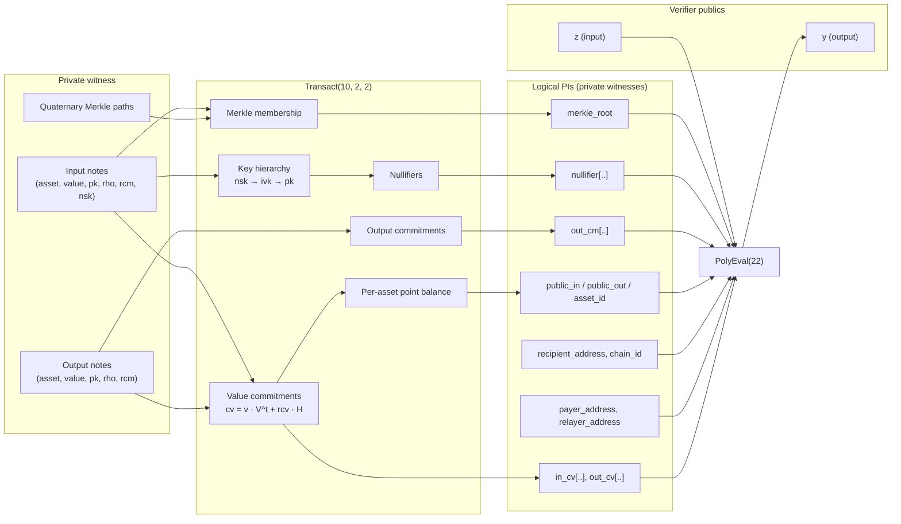
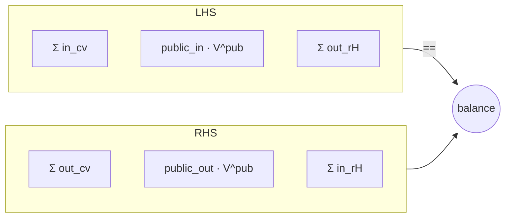
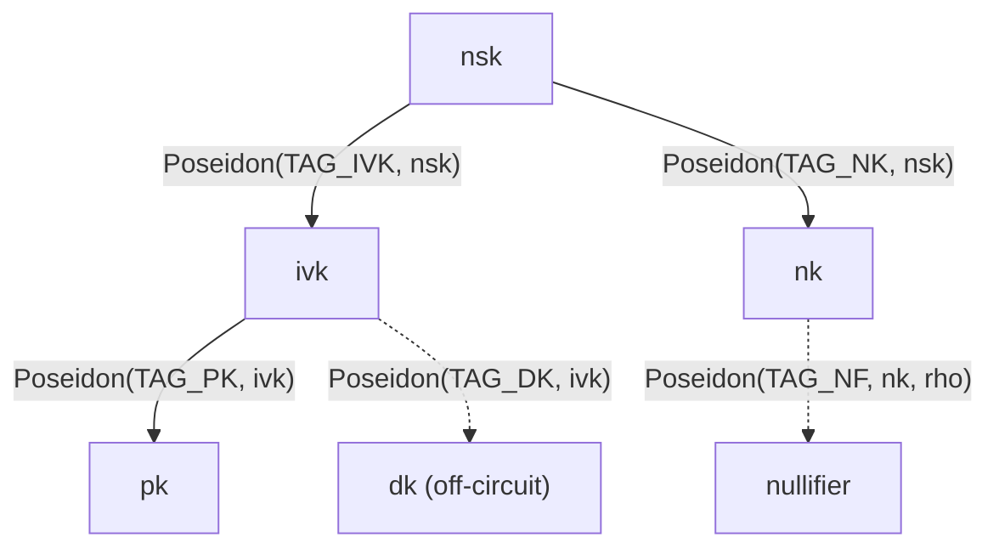
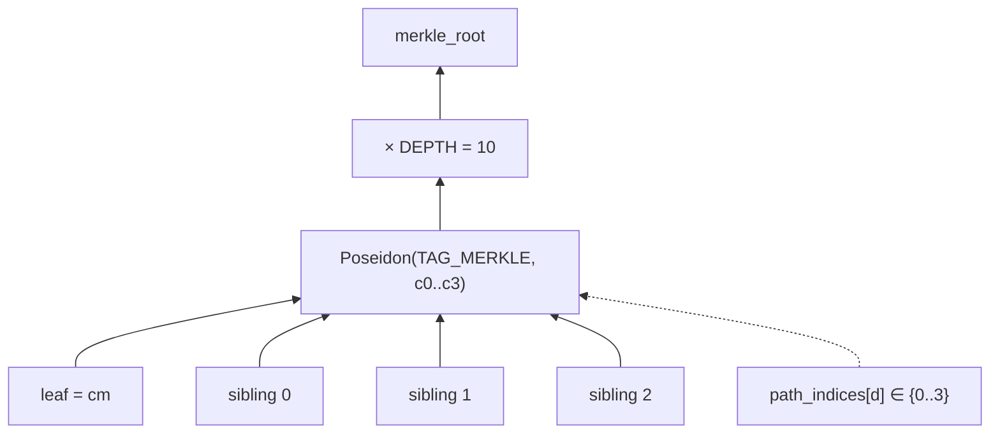
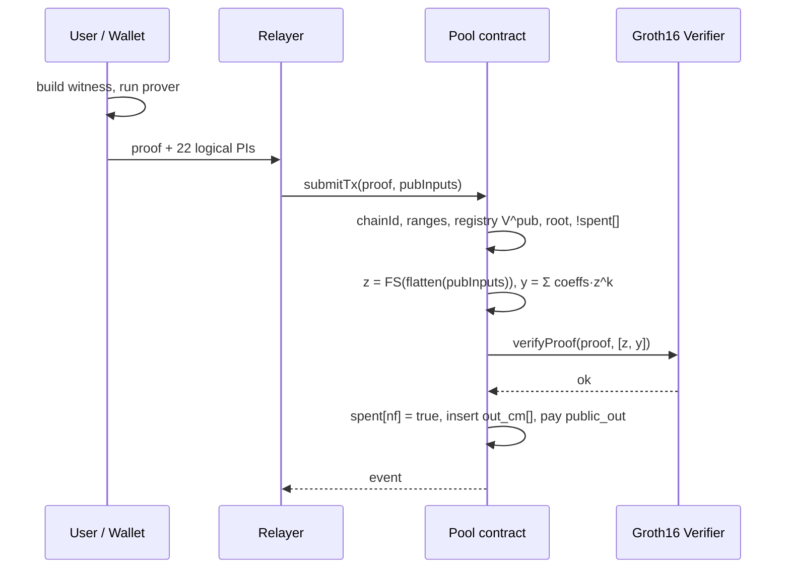

# MASP Circuits

Multi-Asset Shielded Pool circuits implemented in Circom 2.2.3 over the
BN254 scalar field, with Baby-Jubjub used for the value-commitment subgroup.
The package exports two Groth16-friendly entry points:

- [`Transact(DEPTH, N_IN, N_OUT)`](2x2.circom), instantiated as
  `Transact(10, 2, 2)` — the on-chain pool transact circuit: a quaternary
  Merkle tree of depth 10 (`4^10 = 1,048,576` leaves) consuming up to two
  shielded inputs and producing up to two shielded outputs per proof.
- [`TreeUpdate(DEPTH)`](tree_update.circom), instantiated as
  `TreeUpdate(10)` — a relayer-side proof that the canonical commitment
  tree advances `old_root → new_root` by inserting two leaves at
  `[start_index, start_index + 1]` over a relayer-supplied frontier. See
  §16.

The design follows the Sapling/Namada multi-asset model: each note carries
a private `asset_id`; a per-asset Baby-Jubjub generator `V^t` is derived
in-circuit by Pedersen hash-to-curve; value commitments are
`cv = value · V^t + rcv · H`; and per-asset value conservation is enforced
as Edwards-point equality across the spent and output bundles.

---

## 1. Threat model and security goals

The circuit, in conjunction with the on-chain contract obligations listed
in §10, enforces the following properties for every accepted transaction:

- **Ownership.** Each spent note is opened against a witness key
  hierarchy `nsk → ivk → pk` whose `pk` is bound inside the note
  commitment.
- **No double spend.** Every spent slot — real or padding — emits a
  Poseidon nullifier `nf = Poseidon(TAG_NF, nk, rho)` with `nk = Poseidon(TAG_NK, nsk)`. The contract
  rejects collisions with the global `spent` set.
- **Per-asset value conservation.** For every asset class, the sum of
  inputs (shielded plus the transparent bucket) equals the sum of outputs.
  Cross-asset cancellation is infeasible without breaking the discrete
  log of the Pedersen-derived generators.
- **Recipient binding.** `recipient_address` and `chain_id` are bound
  through the `PolyEval` Fiat-Shamir digest `(z, y)` checked by Groth16;
  a relayer cannot rewrite the withdrawal target or replay the proof on
  a sibling chain without producing a fresh proof.
- **Indistinguishable padding.** Unused input slots produce real-looking
  Poseidon nullifiers; unused output slots are real `value=0` notes whose
  commitment is a real Poseidon hash. No `bytes32(0)` sentinel leaks the
  transaction shape.

Out of scope: EdDSA spend authorization, encrypted memo layout, FMD
detection, and Solidity-side hash-to-curve. The contract supplies the
public-bucket generator from a precomputed registry; see §10.

---

## 2. I/O surface

The verifier sees only **two** field elements — `z` (Fiat-Shamir
challenge) and `y` (Horner evaluation). The 22 logical PIs below are
demoted to private witnesses and bound into `(z, y)` by the
[`PolyEval(22)`](lib/poly_eval.circom) gadget; see §2a.

Verifier-visible public signals:

| Signal | Kind | Purpose |
|---|---|---|
| `z` | public input | Fiat-Shamir challenge supplied by the contract. |
| `y` | public output | `Σ_{k=0..21} coeffs[k] · z^k` — binds all logical PIs. |

Logical "public" inputs (private witnesses, bound through `PolyEval`):

| Signal | Width | Purpose |
|---|---|---|
| `merkle_root` | 1 | Root of the on-chain commitment tree. |
| `nullifier[N_IN]` | 2 | One per spent slot. |
| `out_cm[N_OUT]` | 2 | One per output slot. |
| `public_asset_id` | 1 | Asset id of the transparent bucket. |
| `pub_asset_gen_x`, `pub_asset_gen_y` | 2 | `V^pub` from registry. |
| `public_in`, `public_out` | 2 | Transparent deposit / withdrawal. |
| `in_cv[N_IN][2]`, `out_cv[N_OUT][2]` | 8 | Sapling value commitments. |
| `recipient_address` | 1 | Withdrawal target (`uint160`). |
| `chain_id` | 1 | Replay protection. |
| `payer_address` | 1 | Transparent depositor (`uint160`); zero when no deposit. Bound so the contract can settle `public_in` against the right account. |
| `relayer_address` | 1 | Relayer payout target (`uint160`); zero for self-submitted proofs. Bound to prevent relayer substitution after proof generation. |

### 2a. SnarkCompression (PolyEval binding)

The 22 logical PIs above are packed in a fixed slot order and fed into
[`PolyEval(22)`](lib/poly_eval.circom) as Horner-form coefficients:

```
y = coeffs[0] + coeffs[1]·z + coeffs[2]·z^2 + … + coeffs[21]·z^21
```

Slot layout (MUST match `contracts/src/MASP.sol::_flatten()`
byte-for-byte; reordering is a soundness change for the contract):

| Slot | Coeff | Slot | Coeff |
|---|---|---|---|
| 0 | `merkle_root`     | 11 | `in_cv[0][1]` |
| 1 | `nullifier[0]`    | 12 | `in_cv[1][0]` |
| 2 | `nullifier[1]`    | 13 | `in_cv[1][1]` |
| 3 | `out_cm[0]`       | 14 | `out_cv[0][0]` |
| 4 | `out_cm[1]`       | 15 | `out_cv[0][1]` |
| 5 | `public_asset_id` | 16 | `out_cv[1][0]` |
| 6 | `pub_asset_gen_x` | 17 | `out_cv[1][1]` |
| 7 | `pub_asset_gen_y` | 18 | `recipient_address` |
| 8 | `public_in`       | 19 | `chain_id` |
| 9 | `public_out`      | 20 | `payer_address` |
| 10 | `in_cv[0][0]`    | 21 | `relayer_address` |

Soundness: any tampering with `coeffs[k]` changes `y` for all but at
most 21 values of `z` (Schwartz–Zippel over BN254 scalar field;
collision probability `≤ 21 / r ≈ 2^-249` — negligible). The contract
MUST derive `z` from a Fiat-Shamir transcript over the full 22-slot
flattened vector after canonicalising every slot to `uint256`; sampling
`z` independently of the slots breaks the binding.

The Solidity verifier exported via `snarkjs zkey export
solidityverifier` exposes only `IC0`, `IC1`, `IC2` and a
`verifyProof(uint[2] _pA, uint[2][2] _pB, uint[2] _pC, uint[2] _pubSignals)`
signature, where `_pubSignals = [z, y]`.

Private inputs (per slot):

- Spent: `asset, value, pk, rho, rcm, nsk, rcv,
  path_elements[DEPTH][3], path_indices[DEPTH], is_dummy`.
- Output: `asset, value, pk, rho, rcm, rcv`. No `is_dummy` — padding
  outputs are real `value = 0` notes.

Relayer compensation is **not** a public input. Fees are paid as a
shielded output addressed to the relayer's zk-pk (Railgun-style); see
[`../RELAYER.md`](../RELAYER.md).

---

## 3. High-level dataflow



[`2x2.circom`](2x2.circom) is a wiring layer: it instantiates `SpentNote`
per input, `OutputNote` per output, and feeds the exposed `rH` components
plus the public `cv`s into `PerAssetPointBalance`.

---

## 4. Note commitment

File: [`lib/note.circom`](lib/note.circom).

```
cm = Poseidon(packed_av, owner_pk, rho, rcm)
packed_av = asset_id · 2^64 + value
```

`asset_id` is range-checked `< 2^64` so the packing is injective. Because
`V^t` is a deterministic in-circuit function of `asset_id`, binding
`asset_id` inside `cm` suffices to lock a commitment to its generator —
no prover can pair the same `cm` with a different `V^t`. Domain
separation comes from the arity-4 Poseidon site combined with the field
packing; the explicit `TAG_CM` constant is reserved but unused.

`rho` provides per-note uniqueness and feeds the nullifier; `rcm` is the
hiding randomness.

---

## 5. Asset generator (domain-separated Pedersen hash-to-curve)

File: [`lib/asset_gen.circom`](lib/asset_gen.circom).

```
V^t = HashToAssetGen(asset_id)
    = Pedersen( TAG_ASSET || Num2Bits(64, asset_id) )
```

Bit layout fed to circomlib `Pedersen(72)` (LSB-first per window):

```
bits[ 0.. 7] = TAG_ASSET (= 7), one byte LSB-first
bits[ 8..71] = asset_id (64 bits LSB-first; Num2Bits(64) bounds asset_id < 2^64)
```

`Num2Bits(64)` enforces `asset_id < 2^64` in-circuit, matching the on-chain
`uint64 publicAssetId` and bounding all private in/out asset_ids too.
`TAG_ASSET` (one byte) gives the hash a domain string distinct from any
other Pedersen call sharing Baby-Jubjub. 72 bits → 1 Pedersen segment
(`BASE[0]`); the `H` base used by `ValueCommit` is `BASE[2]`, preserving
generator independence.

The SDK mirror in [`sdk/src/crypto/jubjub.ts`](../../sdk/src/crypto/jubjub.ts)
passes the 9-byte buffer `[TAG_ASSET, ...asset_id_LE_8]` to
`circomlibjs.pedersen.hash`, producing the same point byte-for-byte.

Soundness rests on the fact that `V^t` is a witnessed deterministic
function of `asset_id`; combined with `PerAssetPointBalance` this enforces
per-asset conservation without trusting any off-chain table.

Defense in depth: real notes reject `asset_id == 0` via
`(1 - is_dummy) · IsZero(asset_id) === 0`. The current Pedersen encoding
does not map `0` to identity, but the explicit reject future-proofs
against any hash-to-curve replacement that might. Cost ≈ 2.1k constraints
per call.

---

## 6. Value commitment and balance

Files: [`lib/value_commit.circom`](lib/value_commit.circom),
[`lib/balance.circom`](lib/balance.circom).

Per-note Sapling commitment:

```
cv = value · V^t + rcv · H
```

`value · V^t` is computed by `EscalarMulAny(64)` (variable-base, 64-bit
scalar, ~2k constraints). For `value = 0` the result is the identity
`(0, 1)` regardless of `asset_id`, so dummies are colour-neutral.
`rcv · H` uses `EscalarMulFix(253, H)` (~3k constraints). `ValueCommit`
exposes the `rH = rcv · H` component so balance can sum points; collapsing
it to a scalar `Σrcv_in − Σrcv_out` would wrap when outputs exceed inputs
and break a 253-bit decomposition.

Per-asset point balance, equivalent to per-asset value conservation:

```
Σ in_cv  + public_in · V^pub  + Σ out_rH
   ==
Σ out_cv + public_out · V^pub + Σ in_rH
```



`V^pub` is supplied as `(pub_asset_gen_x, pub_asset_gen_y)` — the contract
looks it up in a precomputed registry — and validated in-circuit by
`SafePoint` (`BabyCheck` + `x != 0`), which rejects off-curve points, the
identity `(0, 1)`, and the 2-torsion element `(0, -1)`. Without
`SafePoint`, `EscalarMulAny` silently substitutes `G8` whenever the base
has `x == 0`, which a malicious prover could exploit to pass arbitrary
`public_out` against an all-dummy spend bundle. Subgroup membership
(cofactor 8) is enforced off-chain by registry construction; see §10.5.

---

## 7. Key hierarchy and nullifier

```
nsk  (spend authority)
 ├─ ivk = Poseidon(TAG_IVK, nsk)        (incoming view key)
 │    └─ pk  = Poseidon(TAG_PK, ivk)      (bound in note cm)
 └─ nk  = Poseidon(TAG_NK, nsk)         (nullifier-deriving key; FVK)

nf  = Poseidon(TAG_NF, nk, rho)
dk  = Poseidon(TAG_DK, ivk)              (off-circuit; FMD)
```



`ivk` confers detection/decryption rights; `nk` adds spent-note visibility
(Full Viewing Key). Neither lets the holder spend — `nsk` is required to
satisfy the in-circuit `pk_check` derived via `ivk`, and Poseidon is
one-way so neither `ivk` nor `nk` reveals `nsk`.

Every spent slot — real or dummy — constrains
`nullifier[i] === Poseidon(TAG_NF, nk[i], rho[i])` where `nk` is derived
in-circuit from the prover-supplied `nsk`. Dummies use prover-chosen
private `(nsk, rho)` so their public nullifier is
indistinguishable from a real spend, and the contract inserts every
nullifier unconditionally (no sentinel skip). On-chain checks reject
collisions and intra-tx duplicates.

---

## 8. Quaternary Merkle membership

File: [`lib/merkle.circom`](lib/merkle.circom).

Each level: `node = Poseidon(TAG_MERKLE, c0, c1, c2, c3)`. `path_indices[d]`
ranges over `{0, 1, 2, 3}` and selects the position of the proven child.
`MerkleProofOrDummy` skips inclusion when `is_dummy == 1`, allowing
dummies to bypass the root check while still constraining `nullifier`,
`asset != 0`, and value commitment.



At depth 10 the tree holds `4^10 = 1,048,576` leaves — equivalent to a
binary depth-20 tree at roughly half the constraint cost per inclusion.

---

## 9. Multi-asset semantics and padding

The circuit places **no** constraint linking `in_asset[i]` to
`in_asset[k]` or to any `out_asset[j]`. A single proof may therefore mix
up to `N_IN` distinct shielded asset ids on the input side and up to
`N_OUT` on the output side, in any combination, provided per-asset
conservation holds.

Constraints that hold regardless of asset mix:

- `RangeCheck64` on every private `value`.
- Real notes reject `asset_id == 0`.
- `cv` is bound to `(asset_id, value, rcv)`; `cv`s are summed as Edwards
  points so distinct assets — living in distinct subgroups — cannot
  cancel.

Caveats:

- The transparent bucket is single-asset per tx: depositing or
  withdrawing two transparent assets simultaneously requires two proofs.
- Slot count caps the colour count: at `N_IN = N_OUT = 2`, at most two
  asset ids per side. Larger mixes require recompiling
  `Transact(DEPTH, N_IN, N_OUT)` with larger `N`.

Padding rules:

- **Spent dummies** carry `is_dummy = 1`, bypass the key check, the
  Merkle check, and the `asset != 0` reject. `DummyZeroValue` enforces
  `is_dummy · value === 0`. Their nullifier is computed normally.
- **Output padding** is a real `value = 0` note addressed to a
  registered asset (typically `self`). Its `cm` is a real Poseidon
  insertion into the commitment tree — no on-chain sentinel.

---

## 10. Smart-contract obligations

The on-chain verifier wrapper MUST, before invoking the Groth16 verifier:

0. **Fiat-Shamir.** Flatten the 22 logical PIs in the canonical slot
   order (§2a), reduce each to `uint256` mod `r` (BN254 scalar prime),
   derive `z = H(transcript) mod r` for a domain-separated hash `H`
   over the flat vector, and compute `y = Σ coeffs[k]·z^k mod r`. Pass
   `[z, y]` to `Verifier.verifyProof`. `z` MUST be a deterministic
   function of every slot — sampling `z` before fixing the slots breaks
   the PolyEval binding.
1. `require(chainId == block.chainid)`.
2. `require(public_in < 2**64 && public_out < 2**64)`.
3. `require(public_asset_id < 2**64)` (or whatever the registry key range
   demands).
4. `require(registry[public_asset_id] == (pub_asset_gen_x, pub_asset_gen_y))`
   — critical for soundness of the public bucket.
5. **Prime-order subgroup membership** for `pub_asset_gen`. The circuit
   rejects off-curve points and `x == 0`, but cannot cheaply reject
   4-torsion or 8-torsion. The registry maintainer must therefore store
   only cofactor-cleared points — e.g. `gen = 8 · Pedersen(asset_id)`
   computed once off-chain. A small-order point in the registry breaks
   per-asset balance.
6. `require(nullifier[0] != nullifier[1])` (no `!= 0` exception).
7. Type `recipient_address`, `payer_address`, `relayer_address` as
   `address`; pass `uint256(uint160(addr))`. Use `address(0)` for unused
   slots (e.g. `payer_address` on a pure withdraw, `relayer_address` on
   a self-submitted proof).
8. `require(merkleRoots[merkle_root])`.
9. For each input slot: `require(!spent[nullifier[i]]); spent[nullifier[i]] = true;`.
   No sentinel skip.
10. For each output slot: insert `out_cm[j]` into the on-chain commitment
    tree and emit the leaf event.
11. (Optional) emit `in_cv[]` / `out_cv[]` for off-chain auditors.
12. Move `public_in` in (deposit) — pulled from `payer_address` — and
    pay the full `public_out` to `recipient_address` (withdraw). Relayer
    compensation, if any, is a shielded note inside `out_cm[]`; the bound
    `relayer_address` is for off-chain accounting / event indexing, not
    for on-chain transparent fee transfer.

`rcv` per note is implicitly bounded to 253 bits by the in-circuit
`Num2Bits(253)` inside `MulH`. Wallets should sample `rcv` uniformly over
`[0, 2^252)` to stay clear of the boundary.

---

## 11. Verifier flow



---

## 12. Domain-separation tags

Defined in [`lib/tags.circom`](lib/tags.circom) as the single source of
truth across `note.circom`, `merkle.circom`, `output.circom`, `2x2.circom`
and `test/helpers.ts`. Tag values bake into hash inputs — changing any
constant breaks commitment / nullifier / Merkle-node compatibility with
prior proofs and with test helpers. Update in lockstep.

| Function | Value | Use | Arity |
|---|---|---|---|
| `TAG_CM()` | 1 | Reserved. `NoteCommitment` uses (asset,value)-packing + arity 4 instead. | — |
| `TAG_NF()` | 2 | `nf = Poseidon(TAG_NF, nk, rho)` | 3 |
| `TAG_PK()` | 3 | `pk = Poseidon(TAG_PK, ivk)` | 2 |
| `TAG_IVK()` | 4 | `ivk = Poseidon(TAG_IVK, nsk)` | 2 |
| `TAG_MERKLE()` | 5 | `node = Poseidon(TAG_MERKLE, c0..c3)` | 5 |
| `TAG_DK` | 6 | `dk = Poseidon(TAG_DK, ivk)` (off-circuit; FMD). | 2 |
| `TAG_NK()` | 9 | `nk = Poseidon(TAG_NK, nsk)` (Full Viewing Key). | 2 |

Combined arity + tag prevents Poseidon collisions across hash sites.

### `TAG_CM` → 1

Reserved slot. `NoteCommitment` currently has no explicit tag input —
domain separation comes for free from arity 4 + the `(asset_id || value)`
field-element packing, which no other site mimics. Reserved so a future
redesign that adds a tag input has a known constant ready.

### `TAG_NF` → 2

Prefix for nullifier hash. Arity 3: `Poseidon(2, nk, rho)` where
`nk = Poseidon(TAG_NK, nsk)`. Prevents collision with any other arity-3
site (none today, but tag is cheap insurance).

### `TAG_PK` → 3

Prefix for owner-key derivation. Both `pk` and `ivk` are Poseidon arity 2
— they share an arity, so domain tags here are mandatory, not optional.
Without distinct tags `Poseidon(x, y)` could be reinterpreted as either
derivation.

### `TAG_IVK` → 4

Prefix for incoming-view-key derivation. Pairs with `TAG_PK` to
disambiguate the two arity-2 sites. See `note.circom::DeriveIvk`.

### `TAG_MERKLE` → 5

Prefix for quaternary-Merkle internal nodes. `NoteCommitment` also uses
arity 4; without an explicit tag a malicious prover could pick an
internal-node value colliding with a leaf commitment, breaking soundness.
Bumps Merkle hash to arity 5.

### `TAG_ASSET` for `HashToAssetGen`

`HashToAssetGen` prepends one `TAG_ASSET` byte (= 7) to the 64-bit
`asset_id` decomposition before feeding `Pedersen(72)`. Pedersen's
internal generator separation (`BASE[0..9]`) already isolates this hash
from every Poseidon site, but a tag byte is cheap defense-in-depth: any
future Pedersen call hashing on Baby-Jubjub in another protocol cannot
collide with an asset generator. `H` (the value-commitment blinding
base) is `BASE[2]`, outside the image of the 72-bit `HashToAssetGen`
which consumes only `BASE[0]`.

### `POW_2_64()` → 18446744073709551616

`2^64`. Two callers:

- `NoteCommitment` packing multiplier: `packed_av = asset_id * 2^64 + value`.
  Injective only if both fields `< 2^64`.
- `RangeCheck64` is the matching bound enforced on private `value` signals.

Bundling as a function keeps the literal in one place — no risk of typo
divergence between the multiplier and the range check.

---

## 13. Constraint budget

### `Transact(10, 2, 2)`

```
total constraints:  59,358
wires:              59,425
public inputs:      1   (z)
public outputs:     1   (y)
private inputs:     130
```

Approximate component breakdown:

| Component | Cost |
|---|---|
| 4 × `HashToAssetGen` (Pedersen 72) | ~8.4k |
| 4 × `ValueCommit` (no redundant Num2Bits) | ~20k |
| 2 × `ValueScalarMul` + 2 × `RangeCheck64` (public bucket) | ~4k |
| `PerAssetPointBalance` point sums | ~70 |
| Note commitments + Merkle + nullifiers | ~15k |
| `PolyEval(22)` Horner chain | ~22 |
| **Total** | **~59k** |

Depth-10 figures already include the +1.1k overhead (~270 constraints per
extra level × 2 levels × 2 input branches) over the depth-8 baseline.
The PolyEval gadget adds 22 quadratic constraints — negligible compared
to the savings on Solidity verifier calldata (2 vs 22 field elements)
and IC-table size (3 vs 23 G1 points).

### `TreeUpdate(10)`

```
total constraints:  34,068
wires:              34,082
public inputs:      1   (z)
public outputs:     1   (y)
private inputs:     35  (5 logical PIs + 30 frontier signals = 10 levels × 3)
```

Dominated by the 20 × `Poseidon(5)` calls (10 zero-subtree precomputes +
10 level hashes, run twice for two inserts ≈ 30k constraints). The slot
selectors / frontier writes add ~3k. `PolyEval(5)` is negligible.

---

## 14. Out of scope (v1)

- EdDSA spend authorization (only key derivation is in-circuit).
- Encrypted memo ciphertext layout.
- FMD clue verification.
- Solidity-side hash-to-curve (registry approach sidesteps it).
- Sapling-style binding signature on `bvk` — balance is enforced
  in-circuit, so a separate `bvk` signature is redundant.

---

## 15. File map

| File | Role |
|---|---|
| [`2x2.circom`](2x2.circom) | Main 2-in × 2-out transact circuit. |
| [`tree_update.circom`](tree_update.circom) | Relayer tree-advance circuit (lazy-root model). See §16. |
| [`lib/tags.circom`](lib/tags.circom) | Domain-separation tag constants and `2^64`. |
| [`lib/note.circom`](lib/note.circom) | Note commitment, key derivation, nullifier. |
| [`lib/merkle.circom`](lib/merkle.circom) | Quaternary Merkle level (Poseidon(5)), root, dummy-aware proof. |
| [`lib/asset_gen.circom`](lib/asset_gen.circom) | `HashToAssetGen` — Pedersen hash-to-curve for asset generators. |
| [`lib/value_commit.circom`](lib/value_commit.circom) | `ValueScalarMul`, `MulH`, `ValueCommit`, `PointSum`, `H_BASE`. |
| [`lib/balance.circom`](lib/balance.circom) | Range check, dummy bookkeeping, `PerAssetPointBalance`. |
| [`lib/spent.circom`](lib/spent.circom) | `SpentNote` — per-slot key/Merkle/nullifier/range/cv binding. |
| [`lib/output.circom`](lib/output.circom) | `OutputNote` (cm + dummy gate + range). |
| [`lib/insert.circom`](lib/insert.circom) | `QuaternaryInsert(DEPTH)` — single-leaf incremental insert with frontier IO; used twice by `TreeUpdate`. |
| [`lib/poly_eval.circom`](lib/poly_eval.circom) | `PolyEval(N)` — Horner-form evaluation gadget for SnarkCompression. |
| [`test/helpers.ts`](test/helpers.ts) | Test witness builders, Pedersen hash-to-curve, value-commit helpers. |
| [`test/transact.test.ts`](test/transact.test.ts) | Transact circuit test suite. |
| [`test/merkle.test.ts`](test/merkle.test.ts) | Merkle library test suite. |
| [`test/tree_update.test.ts`](test/tree_update.test.ts) | TreeUpdate circuit test suite. |
| [`test/fixtures/`](test/fixtures/) | Frozen witness vectors used by the test suites. |

---

## 16. `TreeUpdate(DEPTH)` — relayer tree-advance proof

File: [`tree_update.circom`](tree_update.circom). Uses [`lib/insert.circom`](lib/insert.circom).

**Purpose.** Lets the contract commit a fresh `newRoot` after two leaves
are inserted, *without* recomputing the tree on-chain. Pairs with each
`MASP.transact` call: the contract carries `(transact_2x2 proof,
tree_update proof)`, checks `oldRoot == currentRoot()` and
`startIndex == committedCount`, then advances the on-chain root ring.

**Inputs.**

| Logical PI | Purpose |
|---|---|
| `old_root` | Anchor — contract validates against `currentRoot()`. |
| `new_root` | Output — bound to `QuaternaryInsert(cm1).root`. |
| `cm0`, `cm1` | The two leaves to insert (must equal `out_cm[0..1]` from the paired transact proof). |
| `start_index` | First insertion slot. Contract validates against `committedCount`. |

Private witness: `frontier_in[DEPTH][3]` — relayer-supplied per-level
sibling triples for the current frontier.

**Range bound.** `Num2Bits(2*DEPTH)` on `start_index + 1` enforces
`start_index ≤ 4^DEPTH − 2`, leaving room for the second insert at
`start_index + 1 ≤ 4^DEPTH − 1`. At `DEPTH = 10`, capacity = `2^20`
leaves.

**Soundness model (lazy root).** `old_root` is *not* recomputed
in-circuit from the frontier — the chain check (`oldRoot ==
currentRoot()`) is the anchor. A relayer feeding an inconsistent
`(frontier_in, old_root)` still produces *some* `new_root` that the
contract would commit, but no honest reconstruction would reproduce it
— a useless ring entry. The relayer harms only itself; no soundness
break for shielded transactions verifying against valid roots.

**SnarkCompression.** 5 logical PIs folded into `(z, y)` via `PolyEval(5)`.
Slot order MUST match `_compressTreeUpdatePI` in the contract:

| Slot | Coeff |
|---|---|
| 0 | `old_root` |
| 1 | `new_root` |
| 2 | `cm0` |
| 3 | `cm1` |
| 4 | `start_index` |

**`QuaternaryInsert(DEPTH)`** in [`lib/insert.circom`](lib/insert.circom)
mirrors the on-chain `CommitmentTree._insert` semantics: per level it
computes the four child slots from `(cur, frontier_in[level], zeros[level])`
under a 4-way one-hot selector `(s0, s1, s2, s3)` derived from the 2-bit
quaternary digit, hashes via `Poseidon(TAG_MERKLE, c0, c1, c2, c3)`, and
emits `frontier_out` (slots 0..2; slot 3 needs no write because the
parent advances). Precomputed empty-subtree roots `zeros[0..DEPTH]` are
generated in-circuit.
