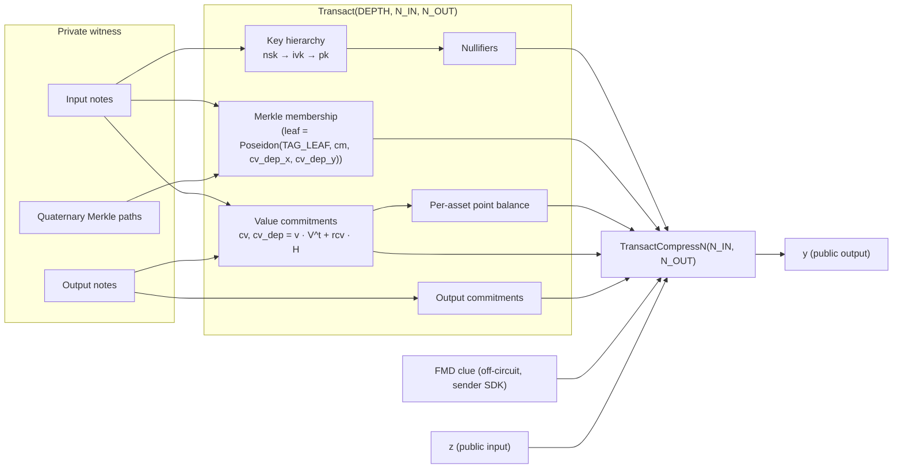

# MASP Circuits

Multi-Asset Shielded Pool circuits implemented in Circom 2.2.3 over the
BN254 scalar field, with Baby-Jubjub used for the value-commitment
subgroup. Three Groth16 entry points:

| Circuit | Instantiation | Status | Purpose |
|---|---|---|---|
| [`2x2.circom`](2x2.circom) | `Transact(10, 2, 2)` | not deployed | Second instantiation of the shared template, and the shape the Lean witnesses are built at. |
| [`3x3.circom`](3x3.circom) | `Transact(10, 3, 3)` | the transact shape; on-chain wiring incomplete | Transact at 3 shielded inputs × 3 shielded outputs. 42-slot PI layout (§2a). |
| [`tree_update_batch.circom`](tree_update_batch.circom) | `TreeUpdateBatch(10, 4)` | deployed | Relayer-side proof that the commitment tree advances `old_root → new_root` by inserting up to 4 leaves, any count (odd included). See §14. |

Both transact shapes instantiate one shared template,
[`Transact(DEPTH, N_IN, N_OUT)`](lib/transact.circom), over a quaternary
Merkle tree of depth 10 (`4^10 = 1,048,576` leaves). Each output carries
an off-circuit FMD clue `(R, clue_bits)` supplied by the sender and
bound via PolyEval (§7a).

`3x3` is built by `just build-artifacts-3x3`, ships prover artefacts in
the npm package, and is pinned by the vectors in
[`vectors/`](../vectors/). `just rebuild-3x3` exports its verifier to
`contracts/src/verifiers/Verifier.sol` — the path the deployed verifier
occupies, which is why `rebuild-2x2` deliberately never writes there.
Wiring it up still requires a `PubInputs.compress` overload for its 42
slots, a production ceremony, `TRANSACT_OUT_LEAVES = 3` on the spend
path, and generalising §10's pairwise-nullifier check to all three pairs.

The design follows the Sapling/Namada multi-asset model: each note
carries a private `asset_id`; a per-asset Baby-Jubjub generator `V^t`
is derived in-circuit by Pedersen hash-to-curve; value commitments are
`cv = value · V^t + rcv · H`. Per-asset value conservation is enforced
arithmetically over asset ids (§6) — **not** by the Edwards point
balance, which is defense in depth only (§5).

---

> **Machine-checked proofs.** Several arguments in this document are formalised in Lean 4
> under [`lean/`](../lean/README.md) — notably the candidate-set argument of §6
> (`perAssetValueBalance_all_assets`), its no-wrap lift to integers
> (`perAssetValueBalance_nat`), the Schwartz–Zippel binding of §2
> (`polyEval_binding`), and the faerie-gold defence of §7 (`nullifier_binds_cm`).
> The known-discrete-log weakness of §5 is formalised too — as a *negative* result,
> `pointBalance_not_sound`, so that no one can re-derive conservation from the Edwards
> point balance. Soundness is stated for the generic `(N_IN, N_OUT)` model and so
> covers both shapes, and each has an exhibited satisfying assignment
> (`transactSat_satisfiable`, `transact3x3Sat_satisfiable`), so neither soundness
> result is vacuous. See
> [`lean/README.md`](../lean/README.md) for what is and is not covered, and
> [`lean/FIDELITY.md`](../lean/FIDELITY.md) for how faithfully the Lean model tracks
> this source.
>
> `tree_update_batch.circom` is covered too: `batch_advances_by_count` proves `new_root`
> is the root after exactly `actual_count` appends — for any count, odd included — and
> `batch_deposit_opens` proves the per-leaf deposit binding of §14. Both are insensitive
> to the parity of `actual_count`. `batchSat_satisfiable` exhibits a satisfying assignment
> for `TreeUpdateBatch(10, 4)` committing three leaves into four slots, so the padding
> constraints and both muxes are exercised rather than satisfied trivially, and none of the
> batch results is vacuous. `FrontierRoot` and the `BabyCheck` on `cv_dep` are **not**
> modelled; see [`lean/README.md`](../lean/README.md) for that gap.

---

## 1. Threat model and security goals

The circuit, together with the on-chain contract obligations in §10,
enforces the following properties for every accepted transaction:

- **Ownership.** Each spent note is opened against a witness key
  hierarchy `nsk → ivk → pk` whose `pk` is bound inside the note
  commitment.
- **No double spend.** Every spent slot — real or padding — emits a
  Poseidon nullifier `nf = Poseidon(TAG_NF, nk, rho, cm)` with
  `nk = Poseidon(TAG_NK, nsk)`. The contract rejects collisions with
  the global `spent` set. `cm` is in the preimage so the nullifier
  identifies the exact note: two notes sharing `(nk, rho)` no longer
  share a nullifier, which is what blocks faerie-gold griefing (§7).
- **Per-asset value conservation.** For every asset class, the sum of
  inputs (shielded plus the transparent bucket) equals the sum of
  outputs. Enforced by `PerAssetValueBalance` as explicit integer
  arithmetic over asset ids compared as field elements — **no**
  group-theoretic assumption. Do not rely on the Edwards point balance
  for this: the Pedersen asset generators share one base and have
  publicly computable discrete logs (§5).
- **Recipient binding.** `recipient_address` and `chain_id` are bound
  through the `PolyEval` Fiat-Shamir digest `(z, y)` checked by
  Groth16; a relayer cannot rewrite the withdrawal target or replay
  the proof on a sibling chain without producing a fresh proof.
- **Indistinguishable padding.** Unused input slots produce real
  Poseidon nullifiers; unused output slots are real `value=0` notes
  whose commitment is a real Poseidon hash. No `bytes32(0)` sentinel
  leaks the transaction shape.
- **Deposit binding.** For every deposit-mode leaf in
  `tree_update_batch`, the Pedersen equality
  `cv_dep[k] == leaf_public_in[k] · V^leaf_asset[k] + rcv[k] · H` pins
  that leaf to exactly `leaf_public_in` units of `leaf_asset`. Binding
  each leaf on its own is what makes this tight: an aggregate over
  several leaves would fix only `Σvalue` mod the subgroup order, and
  hence not the split (§14). Each spend of those leaves later
  recomputes the same `cv_dep` from `(asset, value, rcv_dep)`, so
  substituting `(asset, value)` at spend time is infeasible.
- **FMD clue binding.** Each output carries a sender-computed FMD2
  clue `(R, clue_bits)` passed as off-circuit witnesses and bound into
  the proof via PolyEval (§7a). A relayer cannot corrupt `R` or
  `clue_bits` after proof generation without invalidating `y`. Honest
  derivation from the recipient's flag-key is a sender obligation, not
  an in-circuit constraint.

Out of scope (v1): EdDSA spend authorization (only key derivation is
in-circuit), encrypted memo layout, and a Sapling-style binding
signature on `bvk` — balance is enforced in-circuit. The public-bucket
generator is derived in-circuit from `public_asset_id` via
`HashToAssetGen`.

---

## 2. I/O surface

The verifier sees only **two** field elements — `z` (Fiat-Shamir
challenge) and `y` (Horner evaluation). The `9 + 3·N_IN + 8·N_OUT`
logical PIs below are private witnesses bound into `(z, y)` by the
[`TransactCompressN(N_IN, N_OUT)`](lib/poly_eval.circom) gadget (§2a) —
31 slots at `N_IN = N_OUT = 2`, 42 at `3×3`.

Verifier-visible public signals:

| Signal | Kind | Purpose |
|---|---|---|
| `z` | public input  | Fiat-Shamir challenge supplied by the contract. |
| `y` | public output | `Σ_{k=0..N-1} coeffs[k] · z^k` — binds all logical PIs. |

Logical "public" inputs (private witnesses, bound through `PolyEval`;
widths for 2×2):

| Signal | Width | Purpose |
|---|---|---|
| `merkle_root` | 1 | Root of the on-chain commitment tree. |
| `nullifier[N_IN]` | 2 | One per spent slot. |
| `out_cm[N_OUT]` | 2 | One per output slot. |
| `public_asset_id` | 1 | Asset id of the transparent bucket. `V^pub = HashToAssetGen(public_asset_id)` derived in-circuit, not a PI. |
| `public_in`, `public_out` | 2 | Transparent deposit / withdrawal. |
| `in_cv[N_IN][2]`, `out_cv[N_OUT][2]` | 8 | Sapling value commitments. |
| `recipient_address` | 1 | Withdrawal target (`uint160`). |
| `chain_id` | 1 | Replay protection. |
| `payer_address` | 1 | Transparent depositor (`uint160`); `0` when no deposit. |
| `relayer_address` | 1 | Relayer payout target (`uint160`); `0` for self-submitted proofs. |
| `out_cv_dep[N_OUT][2]` | 4 | Per-output deposit-anchored Pedersen value commitment. Exposed so `tree_update_batch` can bind to the same `cv_dep` baked into the inserted Merkle leaf. |
| `out_clue_Rx[N_OUT]`, `out_clue_Ry[N_OUT]` | 4 | FMD clue point `R = r·G_8` per output (Baby-Jubjub coords). |
| `out_clue_bits[N_OUT]` | 2 | Packed FMD clue bits per output (γ bits LSB-first, padded to 14; contract masks upper-2-bits via `CLUE_BITS_MASK = 0x3FFF`). |

Private inputs (per slot):

- Spent: `asset_id, value, pk, rho, rcm, nsk, rcv, rcv_dep,
  path_elements[DEPTH][3], path_indices[DEPTH], is_dummy`.
- Output: `asset_id, value, pk, rho, rcm, rcv, rcv_dep`. No
  `is_dummy` — padding outputs are real `value = 0` notes.

Relayer compensation is **not** a public input. Fees are paid as a
shielded output addressed to the relayer's zk-pk (Railgun-style).

### 2a. SnarkCompression (PolyEval binding)

Logical PIs are packed in a fixed slot order and fed to
[`TransactCompressN(N_IN, N_OUT)`](lib/poly_eval.circom) as Horner-form
coefficients:

```
y = coeffs[0] + coeffs[1]·z + coeffs[2]·z^2 + … + coeffs[N-1]·z^(N-1)
```

Slot layout for `Transact(10, 2, 2)` (MUST match
`contracts/src/libs/PubInputs.sol :: compress(Transact, aux)`
byte-for-byte; reordering is a soundness change for the contract):

| Slot | Coeff | Slot | Coeff |
|---|---|---|---|
|  0 | `merkle_root`        | 15 | `out_cv[1][1]` |
|  1 | `nullifier[0]`       | 16 | `recipient_address` |
|  2 | `nullifier[1]`       | 17 | `chain_id` |
|  3 | `out_cm[0]`          | 18 | `payer_address` |
|  4 | `out_cm[1]`          | 19 | `relayer_address` |
|  5 | `public_asset_id`    | 20 | `out_cv_dep[0][0]` |
|  6 | `public_in`          | 21 | `out_cv_dep[0][1]` |
|  7 | `public_out`         | 22 | `out_cv_dep[1][0]` |
|  8 | `in_cv[0][0]`        | 23 | `out_cv_dep[1][1]` |
|  9 | `in_cv[0][1]`        | 24 | `out_clue_Rx[0]` |
| 10 | `in_cv[1][0]`        | 25 | `out_clue_Ry[0]` |
| 11 | `in_cv[1][1]`        | 26 | `out_clue_bits[0]` |
| 12 | `out_cv[0][0]`       | 27 | `out_clue_Rx[1]` |
| 13 | `out_cv[0][1]`       | 28 | `out_clue_Ry[1]` |
| 14 | `out_cv[1][0]`       | 29 | `out_clue_bits[1]` |
|    |                      | 30 | `out_aux_digest` |

Clue slots are appended in output order: `[Rx_j, Ry_j, bits_j]` for
`j = 0..N_OUT-1`, starting at slot `8 + 3·N_IN + 5·N_OUT` (24 at 2×2,
32 at 3×3). `out_aux_digest` is the single final slot, at
`8 + 3·N_IN + 8·N_OUT`.

The same layout at `Transact(10, 3, 3)` gives 42 slots — see the header
comment in [`3x3.circom`](3x3.circom) for the expanded ranges. That
layout is pinned twice: `scripts/gen-vectors.ts` refuses to publish
[`vectors/transact-3x3.json`](../vectors/transact-3x3.json) unless the
compiled circuit's `y` matches the reference PolyEval over all 42
coefficients, and `test/formal/layout_parity.test.ts` pins the published
vector against the Lean dump `lean/expected/layout-3x3.txt`.

`out_aux_digest` is `keccak256(abi.encode(aux)) mod r` over the whole
`AuxValidation.Output` array. The contract MUST **recompute** it from
the aux calldata rather than accept it as an input; only the
recomputation ties the coefficient to the payload the recipient
receives. Without this slot, `out_clue_{Rx,Ry,bits}` are the only
per-output fields bound, so a relayer can leave the clue intact — proof
still verifies, recipient's FMD scan still flags the note — while
corrupting `ephPub` and the ciphertext. The recipient then cannot derive
the ECDH secret, cannot decrypt the opening, and cannot spend a note
whose inputs are already nullified. Not theft (the sender still holds
the opening and can re-deliver out of band), but there is no on-chain
recourse, and on a transfer the victim is a third party who never chose
the relayer.

Soundness: any tampering with `coeffs[k]` changes `y` for all but at
most `N-1` values of `z` (Schwartz–Zippel over the BN254 scalar field;
collision probability `≤ (N-1) / r ≈ 2^-249`). The contract MUST
derive `z` from a Fiat-Shamir transcript over the full flattened
vector; sampling `z` independently of the slots breaks the binding
completely (a prover free to choose `z` picks a forged PI vector and
solves `forged(z) - real(z) = 0` for `z`).

The contract MUST also **reject any slot that is not already reduced
mod `r`**, not merely reduce it while compressing. `compress()` works
in `addmod`/`mulmod`, so `v` and `v + r` produce the same `y`: without
an explicit `slot < r` check every PI is malleable after the fact.
That matters most for the unconstrained clue slots (`out_clue_Rx`,
`out_clue_Ry`, `out_clue_bits`) — anyone relaying the transaction
could mutate the emitted clue while keeping the proof valid, leaving
the recipient unable to detect their own note.

The Solidity verifier exported via `snarkjs zkey export
solidityverifier` exposes `IC0`, `IC1`, `IC2` and a
`verifyProof(uint[2] _pA, uint[2][2] _pB, uint[2] _pC, uint[2] _pubSignals)`
signature, with `_pubSignals = [y, z]`.

The order is `[y, z]`, **not** `[z, y]`: circom lays out the main
component's outputs before its public inputs, and `Transact` declares
`signal output y` while `z` arrives via `component main { public [z] }`.
So wire 1 is `main.y` and wire 2 is `main.z`. Confirm against the
compiled `.sym` rather than trusting prose — an integrator who swaps
these rejects every proof.

---

## 3. High-level dataflow



The top-level files are wiring layers: each instantiates `SpentNote`
per input, `OutputNote` per output, feeds the exposed `rH` components
plus the public `cv`s into `PerAssetPointBalance`, and binds
`out_cv_dep[j]` to `OutputNote.cv_dep`.

---

## 4. Note commitment

File: [`lib/note.circom`](lib/note.circom).

```
cm = Poseidon(packed_av, owner_pk, rho, rcm)
packed_av = asset_id · 2^64 + value
```

`asset_id` is range-checked `< 2^64` (inside `HashToAssetGen` via
`Num2Bits(64)`) so the packing is injective. `V^t` is a deterministic
in-circuit function of `asset_id`, so binding `asset_id` inside `cm`
locks a commitment to its generator — no prover can pair the same
`cm` with a different `V^t`. Domain separation comes from the
arity-4 Poseidon site combined with the field packing (`packed_av ≥
2^64` for any nonzero asset_id, distinguishing it from
`Poseidon(TAG_LEAF, cm, cv_dep_x, cv_dep_y)` where `TAG_LEAF = 10`).
`TAG_CM` is reserved but unused.

`rho` provides per-note uniqueness and feeds the nullifier; `rcm` is
the hiding randomness.

---

## 5. Asset generator (domain-separated Pedersen hash-to-curve)

File: [`lib/asset_gen.circom`](lib/asset_gen.circom).

```
V^t = HashToAssetGen(asset_id)
    = Pedersen( TAG_ASSET || Num2Bits(64, asset_id) )
```

Bit layout fed to circomlib `Pedersen(72)` (LSB-first per window):

```
bits[ 0.. 7] = TAG_ASSET (= 7), one byte LSB-first
bits[ 8..71] = asset_id (64 bits LSB-first; Num2Bits(64) bounds < 2^64)
```

`Num2Bits(64)` enforces `asset_id < 2^64` in-circuit, matching the
on-chain `uint64 publicAssetId` and bounding all private in/out
asset_ids too. `TAG_ASSET` gives the hash a domain string distinct
from any other Pedersen call sharing Baby-Jubjub. 72 bits → 1 Pedersen
segment (`BASE[0]`); the `H` base used by `ValueCommit` is `BASE[2]`,
outside the image of the 72-bit `HashToAssetGen`.

> **The asset generators are NOT independent.** Because 72 bits fit in
> a single Pedersen segment, `V^a = m(a) · BASE[0]` where `m(a)` is the
> signed-4-bit-window multiplier — an integer anyone can compute from
> `a`. All asset generators therefore live in the *same* prime-order
> group with *known* relative discrete logs. `m(·)` is only ~2^85 and
> is affine in the low nibbles of `asset_id`, so exact relations are
> trivial to find; e.g. `V^1 + V^3 == 2·V^2`. Consequently the Edwards
> point balance alone is satisfied by spending `X` of asset 1 plus `X`
> of asset 3 to mint `2X` of asset 2. Value conservation is enforced by
> `PerAssetValueBalance` instead (§6); the point balance is retained
> only as defense in depth. `H = BASE[2]` is unaffected — blinding is
> still sound. Replacing this with a real hash-to-curve (unknown DL)
> would let the point balance stand on its own again, but requires a
> new ceremony and an SDK/WASM mirror.

Two mirrors reproduce this off-circuit, byte-for-byte: the test
reference [`test/ref/jubjub.ts`](test/ref/jubjub.ts) passes the 9-byte
buffer `[TAG_ASSET, ...asset_id_LE_8]` to `circomlibjs.pedersen.hash`,
and the SDK's `hashToAssetGen`
([`sdk/src/crypto/jubjub-wasm/`](../../sdk/src/crypto/jubjub-wasm/))
does the same in Rust/WASM. Agreement is pinned by the published
[`vectors/`](../vectors/).

Defense in depth: real notes reject `asset_id == 0` via
`(1 - is_dummy) · IsZero(asset_id) === 0`. Output notes apply the
same check unconditionally.

Cost = 975 constraints per call: 911 for `Pedersen(72)` plus 64 for the
`Num2Bits(64)`. (Measured from `build/2x2.r1cs` + `2x2.sym`.)

---

## 6. Value commitment and balance

Files: [`lib/value_commit.circom`](lib/value_commit.circom),
[`lib/balance.circom`](lib/balance.circom).

Per-note Sapling commitment:

```
cv     = value · V^t + rcv     · H
cv_dep = value · V^t + rcv_dep · H
```

`value · V^t` is computed by `EscalarMulAny(64)` (variable-base, 64-bit
scalar, 586 constraints). For `value = 0` the result is the identity
`(0, 1)` regardless of `asset_id`, so dummies are colour-neutral.
`rcv · H` uses `FixedBaseMul(252, H)`
([`lib/fixed_base_mul.circom`](lib/fixed_base_mul.circom)), 748
constraints; with its `Num2Bits(252)` the whole `MulH` is 1,000.

> `FixedBaseMul` is used in place of circomlib's `EscalarMulFix`, which costs
> 3,864 constraints for the same group element. `EscalarMulFix` takes its base
> as a signal even though the base is a template parameter, so circom cannot
> constant-fold, and each of its 85 windows spends 22 constraints rebuilding a
> compile-time-constant table plus 3 on a compensation chain undoing the `+1·B`
> offset baked into every window. `FixedBaseMul` builds the tables in `var`
> arithmetic and starts each window at the identity, so neither cost arises. The
> two agree on every scalar — pinned by the committed `vectors/` and by
> [`test/fuzz/fixed_base_mul.fuzz.test.ts`](test/fuzz/fixed_base_mul.fuzz.test.ts),
> which compares them over arbitrary 252-bit scalars.

`ValueCommit` exposes the `rH = rcv · H` component so balance can sum
points; collapsing it to a scalar `Σrcv_in − Σrcv_out` would wrap into 254
bits when outputs exceed inputs and break the decomposition.

**Value conservation (binding check).** `PerAssetValueBalance` checks,
for every asset id `c` appearing anywhere in the transaction:

```
Σ_i in_value[i]·[in_asset[i] == c]  + public_in ·[public_asset_id == c]
  == Σ_j out_value[j]·[out_asset[j] == c] + public_out·[public_asset_id == c]
```

Candidates are `{in_asset[*], out_asset[*], public_asset_id}`; any
asset outside that set contributes zero to both sides, so covering the
candidates covers every asset present. Assets are compared as field
elements via `IsEqual`, values are 64-bit with at most `N_IN + 1` terms
per side, so the sums stay far below `r` — exact integer arithmetic, no
modular wrap, and **no group-theoretic assumption**. Dummy inputs carry
`value = 0` (`DummyZeroValue`) and are neutral whatever `asset_id` they
declare. Cost ≈ 40 constraints per candidate.

**Per-asset point balance (defense in depth).**

```
Σ in_cv  + public_in · V^pub  + Σ out_rH
   ==
Σ out_cv + public_out · V^pub + Σ in_rH
```

`V^pub` is derived in-circuit as `HashToAssetGen(public_asset_id)`.
The Pedersen image lies in the prime-order subgroup by construction,
so off-curve / small-order attacks are infeasible without breaking
Pedersen. This equation is kept because every honest transaction
satisfies it and it keeps `cv` a meaningful on-chain value commitment,
but it does **not** imply per-asset conservation on its own — the asset
generators are known multiples of a single base (§5), so cross-asset
cancellation is easy. Never treat it as the conservation guarantee.

---

## 7. Key hierarchy and nullifier

```
nsk  (spend authority)
 ├─ ivk = Poseidon(TAG_IVK, nsk)        (incoming view key)
 │    └─ pk  = Poseidon(TAG_PK, ivk)      (bound in note cm)
 └─ nk  = Poseidon(TAG_NK, nsk)         (nullifier-deriving key; FVK)

nf  = Poseidon(TAG_NF, nk, rho, cm)
dk  = Poseidon(TAG_DK, ivk)              (off-circuit; FMD)
```

`ivk` confers detection/decryption rights; `nk` adds spent-note
visibility (Full Viewing Key). Neither lets the holder spend — `nsk`
is required to satisfy the in-circuit `pk_check` derived via `ivk`,
and Poseidon is one-way so neither `ivk` nor `nk` reveals `nsk`.

Every spent slot — real or dummy — constrains
`nullifier[i] === Poseidon(TAG_NF, nk, rho, cm)` where `nk` is derived
in-circuit from the prover-supplied `nsk` and `cm` is the commitment
`SpentNote` recomputes from the same witness. Dummies use prover-chosen
private `(nsk, rho)` so their public nullifier is indistinguishable
from a real spend, and the contract inserts every nullifier
unconditionally (no sentinel skip).

**Why `cm` is in the preimage (faerie gold).** Keyed on `(nk, rho)`
alone, two notes sharing a `rho` share a nullifier, and spending
either permanently bricks the other. That is reachable: output `rho`
is `Poseidon(TAG_RHO, nullifier[0], j)` and `nullifier[0]` is a public
input, so every output note's `rho` is publicly computable; and the
deposit path supplies `cms[]` to `tree_update_batch` with no rho
constraint and no SNARK, so an attacker can plant a dust note at a
victim's `pk` reusing an existing `rho`, delivered through the normal
deposit FMD clue + ciphertext. Binding `cm` closes this for **every**
inserter rather than relying on each one deriving `rho` correctly;
`DeriveRho` (§) remains as the transact-path defense.

---

## 7a. FMD2 clue — off-circuit

Each output carries an FMD2 clue `(R, clue_bits)` computed by the
sender SDK off-circuit and passed as plain witnesses. The circuit
imposes **no constraints** on `out_clue_Rx`, `out_clue_Ry`, or
`out_clue_bits` beyond including them as PolyEval coefficients — a
relayer cannot alter them after proof generation without invalidating
`y`, but the circuit does not verify honest derivation from the
recipient flag-key.

The sender SDK derives clues as:

```
R         = r · G_8                              (Baby-Jubjub fixed base)
S_i       = r · fk_i                             for i ∈ [GAMMA]
bit_i     = legendre_bit(Poseidon(TAG_FMD_BIT, R.x, R.y, i, S_i.x, S_i.y))
clue_bits = pack(1 - bit_i for i in [GAMMA])     (sender flips; receiver ⊕ == 1)
```

`legendre_bit(h)` is computed off-circuit by `fmdLegendreWitness`
([`test/ref/sqrt.ts`](test/ref/sqrt.ts), mirrored in
[`sdk/src/crypto/sqrt.ts`](../../sdk/src/crypto/sqrt.ts)): for nonzero
`h`, `bit = 1` iff `h` is a quadratic residue (`h = y²`), else `bit = 0`
and `h = y²·Z` for the fixed non-residue `Z = 5` (`FMD_LEGENDRE_QNR`).
Exactly one of `{h, h·Z⁻¹}` is a residue, so the bit is well-defined.

`clue_bits` is a single field element; the contract masks upper bits
via `CLUE_BITS_MASK = 0x3FFF`. `GAMMA` is a subscription-time
parameter chosen by the client, not a circuit parameter.

Constraint cost: **0 additional** (clue signals are leaf coefficients
in the PolyEval chain only).

---

## 8. Quaternary Merkle membership

Files: [`lib/merkle.circom`](lib/merkle.circom),
[`lib/common.circom`](lib/common.circom).

Each level: `node = Poseidon(TAG_MERKLE, c0, c1, c2, c3)`.
`path_indices[d] ∈ {0, 1, 2, 3}` selects the position of the proven
child via `PathIndexSelectors()` (one-hot selectors `s[0..3]` from a
2-bit digit). `MerkleProofOrDummy` skips inclusion when
`is_dummy == 1`, allowing dummies to bypass the root check while
still constraining `nullifier`, `asset != 0`, and value commitment.

Spent-leaf format is `Poseidon(TAG_LEAF, cm, cv_dep_x, cv_dep_y)` —
the deposit-anchored Pedersen value commitment is baked into the leaf
hash, so a future spend of this leaf cannot open it under a different
`(asset_id, value)` (see §1 "Deposit binding").

---

## 9. Multi-asset semantics and padding

The circuit places **no** constraint linking `in_asset[i]` to
`in_asset[k]` or to any `out_asset[j]`. A single proof may mix up to
`N_IN` distinct shielded asset ids on the input side and up to `N_OUT`
on the output side, provided per-asset conservation holds.

Constraints that hold regardless of asset mix:

- `RangeCheck64` on every private `value`.
- Real notes reject `asset_id == 0`.
- `cv` is bound to `(asset_id, value, rcv)`. This does **not** stop
  `cv`s of distinct assets from cancelling — the generators share a
  base (§5) — which is why conservation is arithmetic
  (`PerAssetValueBalance`), not group-theoretic.
- `in_asset` / `out_asset` / `public_asset_id` are compared as field
  elements, so an asset id can only cancel against itself.
- `cv_dep` is bound to `(asset_id, value, rcv_dep)` and pinned into
  the Merkle leaf hash, so the deposit-anchored asset/value cannot
  drift from one spend to the next.

Caveats: the transparent bucket is single-asset per tx, and each side
mixes at most `N_IN` / `N_OUT` asset ids — `3x3` raises that bound to 3
per side; beyond it, recompile at a larger shape.

Padding rules:

- **Spent dummies** carry `is_dummy = 1`, bypass the `pk_check`, the
  Merkle check, and the `asset != 0` reject. `DummyZeroValue` enforces
  `is_dummy · value === 0`. Their nullifier is computed normally.
- **Output padding** is a real `value = 0` note addressed to a
  registered asset (typically `self`). Its `cm` is a real Poseidon
  insertion into the commitment tree — no on-chain sentinel.

---

## 10. Smart-contract obligations

The on-chain verifier wrapper MUST, before invoking the Groth16
verifier:

0. **Fiat-Shamir.** Flatten the logical PIs in the canonical slot
   order (§2a) into the `uint256` array, derive
   `z = H(transcript) mod r` for a domain-separated hash `H` over the
   flat vector, and compute `y = Σ coeffs[k]·z^k mod r`. Pass
   `[y, z]` to `Verifier.verifyProof` — in that order, see §2a. `z`
   MUST be a deterministic function of every slot.
0a. **Canonical slots.** Either `require(slot < r)` for *every* one of
   the `9 + 3·N_IN + 8·N_OUT` logical PIs before compressing, **or**
   derive `z` by hashing the raw pre-reduction slot words. One of the
   two is mandatory; doing neither is exploitable. `compress()`
   is modular, so `v` and `v + r` yield the same `y`; if `z` is also
   derived from reduced values, any slot — in particular the
   unconstrained `out_clue_*` — can be mutated in calldata while the
   proof still verifies. Hashing the raw words instead closes it from
   the other side: the mutation changes `z`, so the proof no longer
   verifies. The current consumer takes that route (`PubInputs.sol`
   keccaks the copied calldata words), which is why it carries no
   explicit `slot < r` check. Do not "fix" that by reducing the slots
   before hashing — that reintroduces the malleability.
0b. **Aux digest.** Fill slot `8 + 3·N_IN + 8·N_OUT` with
   `keccak256(abi.encode(aux)) mod r` computed from the aux calldata.
   Never read this slot from the caller: taking it as an input makes it
   agree with any payload and restores the tampering it exists to
   prevent (§2a).
1. `require(chainId == block.chainid)`.
2. `require(public_in < 2**64 && public_out < 2**64)`.
3. `require(public_asset_id < 2**64)` (or whatever the registry
   key range demands).
4. `require(registry[public_asset_id].token != address(0))` — asset
   must be registered.
5. `require(nullifier[i] != nullifier[k])` for every pair `i < k` (no
   `!= 0` exception). At `2x2` that is one comparison; a `3x3`
   deployment needs all three.
6. Type `recipient_address`, `payer_address`, `relayer_address` as
   `address`; pass `uint256(uint160(addr))`. Use `address(0)` for
   unused slots.
7. `require(merkleRoots[merkle_root])`.
8. For each input slot: `require(!spent[nullifier[i]]);
   spent[nullifier[i]] = true;`. No sentinel skip.
9. For each output slot: insert `out_cm[j]` into the on-chain
   commitment tree and emit the leaf event. Forward `out_cv_dep[j]`
   to the paired `tree_update_batch` PI vector (slot `cv_dep[2k+?]`).
10. Move `public_in` in (deposit) from `payer_address`; pay
    `public_out` to `recipient_address`.

`rcv` per note is bounded to `RCV_BITS = 252` bits by the in-circuit
`Num2Bits(252)` inside `MulH` ([`lib/value_commit.circom`](lib/value_commit.circom)).
Wallets should sample `rcv` uniformly below the Baby-Jubjub subgroup order
`ell < 2^251`, which stays clear of the boundary.

---

## 11. Domain-separation tags

Defined in [`lib/tags.circom`](lib/tags.circom) as the single source
of truth across the in-circuit hash sites and the test helpers. Tag
values bake into hash inputs — changing any constant breaks
compatibility with prior proofs and with test helpers.

| Function | Value | Use | Arity |
|---|---|---|---|
| `TAG_CM()` | 1 | Reserved. `NoteCommitment` uses (asset,value)-packing + arity 4 instead. | — |
| `TAG_NF()` | 2 | `nf = Poseidon(TAG_NF, nk, rho, cm)` | 4 |
| `TAG_PK()` | 3 | `pk = Poseidon(TAG_PK, ivk)` | 2 |
| `TAG_IVK()` | 4 | `ivk = Poseidon(TAG_IVK, nsk)` | 2 |
| `TAG_MERKLE()` | 5 | `node = Poseidon(TAG_MERKLE, c0..c3)` | 5 |
| `TAG_DK()` | 6 | `dk = Poseidon(TAG_DK, ivk)` (off-circuit; FMD). | 2 |
| `TAG_ASSET()` | 7 | `V^t = Pedersen(TAG_ASSET ‖ asset_id_bits)` | Pedersen(72) |
| `TAG_FMD_BIT()` | 8 | `bit_i = legendre_bit(Poseidon(TAG_FMD_BIT, R.x, R.y, i, S_i.x, S_i.y))` (FMD2 clue, §7a) | 6 |
| `TAG_NK()` | 9 | `nk = Poseidon(TAG_NK, nsk)` (Full Viewing Key). | 2 |
| `TAG_LEAF()` | 10 | `leaf = Poseidon(TAG_LEAF, cm, cv_dep_x, cv_dep_y)` | 4 |

Combined arity + tag prevents Poseidon collisions across hash sites.
`POW_2_64() = 2^64` is exposed as the packing multiplier in
`NoteCommitment` and the bound enforced by `RangeCheck64`.

---

## 12. Constraint budget

R1CS totals from `snarkjs r1cs info`. Each circuit has one public input
(`z`) and one public output (`y`).

| Circuit | Constraints | Wires | Private inputs |
|---|---:|---:|---:|
| `Transact(10, 2, 2)` | 44,406 | 44,475 | 143 |
| `Transact(10, 3, 3)` | 65,523 | 65,624 | 210 |
| `TreeUpdateBatch(10, 4)` | 57,106 | 57,054 | 62 |

All three now fit the **2^16** FFT domain, and `just budget` pins each to
it so regrowth is a CI failure rather than a silent doubling of proving
time.

`Transact(10, 3, 3)` clears it by **10** constraints. snarkjs sizes the
domain from `nConstraints + nPubInputs + nOutputs`, so the largest count
that still fits 2^16 is 65,533 rather than 65,536 — a build at 65,534
already needs 2^17. Treat that as a cliff, not headroom: any addition to
a per-slot gadget is multiplied by 6.
`TreeUpdateBatch(10, 4)` has 8,427 of room, `Transact(10, 2, 2)` 21,127.

> `just budget` reports `13 under 65536` for this shape, not 10:
> `scripts/check-budget.mjs` compares the raw constraint count against
> `domain` and does not add the two public signals. It would therefore
> pass a build at 65,534–65,536 that silently lands on 2^17. The
> exact-count assertion catches such a change anyway, since the count
> would no longer match `budget.json` — but the reported slack reads
> three too high.

### Measured gadget costs

Everything below is attributed from `build/2x2.r1cs` + `2x2.sym`, not
estimated. Counts are as this repo compiles, at circom's default `--O1`,
so surviving linear rows are included.

| Gadget | Cost |
|---|---:|
| `HashToAssetGen` = `Num2Bits(64)` + `Pedersen(72)` | 975 |
| `MulH` = `Num2Bits(252)` + `FixedBaseMul(252, H)` | 1,000 |
| `EscalarMulAny(64)` | 586 |
| `Poseidon(2)` / `Poseidon(3)` / `Poseidon(4)` | 517 / 605 / 736 |
| `BabyAdd`, `BabyDbl` | 6 |
| `ValueCommitPair` (1 × `EscalarMulAny` + 2 × `MulH` + 2 × `BabyAdd`) | 2,579 |

### `Transact` breakdown (2×2; per-slot rows scale with `N_IN + N_OUT`)

| Component | Cost |
|---|---:|
| 5 × `HashToAssetGen` | 4,875 |
| 8 × `MulH` (`cv` and `cv_dep` per slot) | 8,000 |
| 6 × `EscalarMulAny(64)` (4 per-slot + 2 public bucket) | 3,516 |
| Note commitments + Merkle + nullifiers + leaf hashes + key derivation | ~27k |
| `PerAssetValueBalance` per-asset conservation | ~200 |
| `PerAssetPointBalance` point sums (defense in depth) | ~70 |
| `PolyEval(31)` Horner chain | ~30 |
| FMD clue signals | 0 (off-circuit, §7a) |

### `TreeUpdateBatch(10, 4)`

Dominated by MAX_L single-leaf inserts × 10 Merkle levels of
`Poseidon(5)`, plus the `MAX_L` deposit-binding equalities
(each: `HashToAssetGen` + `ValueScalarMul` + `MulH` + `BabyAdd`).
`FrontierRoot` adds ~8.7k constraints. `PolyEval(28)` is negligible.

**`MAX_L = 4` is the floor, not a tuning choice.** `COUNT_BITS` requires
a power of two, and a spend emits `TRANSACT_OUT = 3` leaves that must
fit one batch — `MASP.sol` pins `actualCount` to exactly that on the
transfer path. Only `flushBatch` (deposits, one leaf each) ever uses more
than three, so a wider batch would be padding on every transfer.

A leaf slot costs ~12k constraints, so the width drives the domain: at
`MAX_L = 4` the circuit is 57,106 constraints and fits 2^16 with
`ptau_16`, with 8,427 of room.

Verification gas is unaffected by any of it (195,026, a fixed pairing
check over 2 public inputs) — halving the width does not make a batch
cheaper to verify, it caps how many deposits share one verification.

---

## 13. File map

| File | Role |
|---|---|
| [`2x2.circom`](2x2.circom) | `Transact(10, 2, 2)` — deployed 2-in × 2-out transact circuit. |
| [`3x3.circom`](3x3.circom) | `Transact(10, 3, 3)` — 3-in × 3-out shape; built and vector-pinned, not on-chain. |
| [`tree_update_batch.circom`](tree_update_batch.circom) | Relayer batch tree-advance circuit (frontier-bound). See §14. |
| [`lib/transact.circom`](lib/transact.circom) | `Transact(DEPTH, N_IN, N_OUT)` — the shared transact template both shapes instantiate. |
| [`lib/tags.circom`](lib/tags.circom) | Domain-separation tag constants and `2^64`. |
| [`lib/common.circom`](lib/common.circom) | `PathIndexSelectors`, `EmptySubtreeHashes` — shared between merkle / insert / frontier_root. |
| [`lib/note.circom`](lib/note.circom) | Note commitment, key derivation, nullifier. |
| [`lib/merkle.circom`](lib/merkle.circom) | Quaternary Merkle level (Poseidon(5)), root, dummy-aware proof. |
| [`lib/asset_gen.circom`](lib/asset_gen.circom) | `HashToAssetGen` — Pedersen hash-to-curve for asset generators. |
| [`lib/value_commit.circom`](lib/value_commit.circom) | `ValueScalarMul`, `MulH`, `ValueCommit`, `PointSum`, `H_BASE`. |
| [`lib/balance.circom`](lib/balance.circom) | `RangeCheck64`, `ValueTimesGen`, `DummyZeroValue`, `PerAssetValueBalance`, `PerAssetPointBalance`. |
| [`lib/spent.circom`](lib/spent.circom) | `SpentNote` — per-slot key / Merkle / nullifier / range / cv / cv_dep binding. |
| [`lib/output.circom`](lib/output.circom) | `OutputNote` — per-slot cm / range / cv / cv_dep binding. |
| [`lib/insert.circom`](lib/insert.circom) | `QuaternaryInsertLevel` + `QuaternaryInsert(DEPTH)` — single-leaf incremental insert with frontier IO. |
| [`lib/frontier_root.circom`](lib/frontier_root.circom) | `FrontierRoot(DEPTH)` — rebuild `old_root` from frontier + leaf count (SOUNDNESS-CRITICAL). |
| [`lib/poly_eval.circom`](lib/poly_eval.circom) | `PolyEval(N)`, `TransactCompressN(N_IN, N_OUT)`, `BatchCompress(MAX_L)`. |
| [`test/ref/`](test/ref/) | TypeScript reference implementation (field, tags, Poseidon, Baby-Jubjub, Merkle, notes, FMD, PolyEval compression, witness builders). No SDK dependency; the circom is the source of truth. |
| [`test/lib/`](test/lib/) | Test harness: memoizing circuit loader and `CircuitTester` types, circuit dimensions and named actors, input shapers, witness assertions, transact and batch witness builders, seeded PRNG. |
| [`test/helpers.ts`](test/helpers.ts) | Single import path over `test/ref/`. |
| [`test/transact/`](test/transact/) | Transact suites, split by concern: `balance` (conservation, dummy/padding slots, Merkle membership), `multi_asset`, `tamper` (one table row per tampered field), `binding` (PolyEval binding), `rho` (faerie-gold), over a shared `setup.ts`. |
| [`test/tree_update_batch.test.ts`](test/tree_update_batch.test.ts) | TreeUpdateBatch suite (deposit binding, odd leaf counts, frontier binding, padding). |
| [`test/merkle.test.ts`](test/merkle.test.ts) | Merkle library suite, including the `EMPTY_SUBTREE` table read out of the circom source. |
| [`test/frontier_root.test.ts`](test/frontier_root.test.ts) | FrontierRoot corruption tests. |
| [`test/poly_eval.test.ts`](test/poly_eval.test.ts) | PolyEval suite. |
| [`test/fixed_base_mul.test.ts`](test/fixed_base_mul.test.ts) | FixedBaseMul: window tables, the 4-bit mux, the accumulator chain, and agreement with circomlib's `EscalarMulFix`. |
| [`test/reference.test.ts`](test/reference.test.ts) | Unit tests for the parts of `test/ref/` no circuit test reaches transitively. |
| [`test/check_budget.test.ts`](test/check_budget.test.ts) | Coverage for the constraint-budget gate itself. |
| [`test/formal/layout_parity.test.ts`](test/formal/layout_parity.test.ts) | Pins the PI slot order of both shipped shapes against the Lean dumps `lean/expected/layout-{2x2,3x3}.txt`. |
| [`test/formal/pubsignal_order.test.ts`](test/formal/pubsignal_order.test.ts) | Pins `_pubSignals = [y, z]` for both shapes against the published vectors. |
| [`test/fixtures/`](test/fixtures/) | Small-parameter wrapper circuits instantiating library templates at compact sizes (`test_merkle_d2`, `test_frontier_root_d3`, `test_poly_eval`, and four `test_fixed_base_mul*` variants). |
| [`test/fuzz/`](test/fuzz/) | Property-based suites (fast-check) over Transact (2×2, plus a variants suite), Merkle, FrontierRoot, PolyEval and FixedBaseMul. Run counts come from the shared `FUZZ` tier in `arbitraries.ts`. |
| [`scripts/gen-vectors.ts`](../scripts/gen-vectors.ts) | Orchestrates the published [`vectors/`](../vectors/); per-shape construction lives in [`scripts/vectors/`](../scripts/vectors/) (`common`, `transact`, `batch`). Every `y` is read out of a compiled-circuit witness and refuses to write if it disagrees with the reference. |
| [`scripts/check-budget.mjs`](../scripts/check-budget.mjs) | The `just budget` gate: FFT domain plus the exact count in [`budget.json`](../budget.json). |
| [`scripts/check-artifacts.ts`](../scripts/check-artifacts.ts) | Pre-publish gate over the shipped artifacts. |

---

## 14. `TreeUpdateBatch(DEPTH, MAX_L)` — relayer batch tree-advance proof

File: [`tree_update_batch.circom`](tree_update_batch.circom). Uses
[`lib/insert.circom`](lib/insert.circom) and
[`lib/frontier_root.circom`](lib/frontier_root.circom).

**Purpose.** Lets the contract commit a fresh `new_root` after up to
`MAX_L` leaves are inserted, *without* recomputing the tree on-chain.
The contract advances the on-chain root ring once the proof verifies
and `old_root == currentRoot()`.

**Leaf granularity.** `actual_count` counts **leaves**, not pairs, so a
batch may commit any number of leaves in `[1, MAX_L]` — odd included.
That is what lets one batch carry a 3-output transact bundle
(`Transact(10, 3, 3)`) or a single-leaf deposit — a pair-granular count
could express neither, since it would insert exactly `2·actual_count`
leaves.

**Inputs.** Logical PIs (private witnesses; bound through
`BatchCompress(MAX_L)`):

| Logical PI | Width | Purpose |
|---|---|---|
| `old_root` | 1 | Anchor — contract validates against `currentRoot()`. |
| `new_root` | 1 | Output — bound to the running root after `MAX_L` muxed inserts. |
| `start_index` | 1 | First insertion slot. Contract validates against `committedCount`. |
| `actual_count` | 1 | Active leaf count, range `[1, MAX_L]`. |
| `cms[MAX_L]` | 4 | Per-leaf commitments; padding (inactive) MUST be 0. |
| `cv_dep[MAX_L][2]` | 8 | Per-leaf deposit-anchored Pedersen value commitments; padding MUST be 0. |
| `leaf_asset[MAX_L]` | 4 | Per-leaf public asset id (deposit only; padding 0). |
| `leaf_public_in[MAX_L]` | 4 | Per-leaf public_in (deposit only; padding 0). |
| `is_deposit[MAX_L]` | 4 | 0/1 per leaf; 1 selects the deposit binding check. |

Private witnesses: `frontier_in[DEPTH][3]`, `rcv[MAX_L]` (the
`rcv_dep` blinder of leaf `k`).

Total compressed PI count: `4 + 6·MAX_L = 28` for `MAX_L = 4`.

**Frontier binding (SOUNDNESS-CRITICAL).** `frontier_in` is
prover-supplied. Without binding, a relayer could submit
`oldRoot == currentRoot()` alongside a forged frontier and DoS the
pool. [`FrontierRoot`](lib/frontier_root.circom) recomputes `old_root`
in-circuit from `frontier_in + Num2Bits(2·DEPTH, start_index)` and
asserts equality with the public `old_root`.

**Padding constraints.** `active[k] = (k < actual_count)`. For every
inactive leaf, all per-leaf fields (`cms`, `cv_dep`, `leaf_asset`,
`leaf_public_in`, `is_deposit`, `rcv`) MUST be zero. Inactive slots
still feed `PolyEval`, so zeroing prevents a prover from smuggling
arbitrary cv_dep values into the verifier-visible compressed PIs.

**Deposit binding (C-1 / C-1'' closure).** When `active[k] == 1` and
`is_deposit[k] == 1`:

```
cv_dep[k] == leaf_public_in[k] · V^leaf_asset[k] + rcv[k] · H
```

The deposit path runs no transact SNARK, so this is the only guarantee
that depositor funds are correctly attributed.

Binding each leaf **individually** is what makes this tight. An
aggregate over several leaves — e.g. the pair sum
`cv_dep[2i] + cv_dep[2i+1] == pair_public_in · V^asset + rcv_total · H`
used before — fixes only `Σvalue` mod the subgroup order `l`, not the
split. A depositor could set `cv_dep[2i] = 2^63 · V^A + r0 · H` and let
`cv_dep[2i+1]` absorb `(pair_public_in − 2^63) mod l` — a leaf no
64-bit `ValueCommit` can reopen, so they simply abandon it — and walk
away with a valid `2^63` note for a 1-unit deposit. With one equality
per leaf there is no split to exploit, so no value-0 pad leaf is
required.

`rcv` is a private witness carried in `DepositIntent`. A Pedersen
blinder is information-theoretically independent of value/asset/
identity, so carrying it discloses nothing.

**Insert chain.** For leaf `k`:
`ins[k] = QuaternaryInsert(leaves[k], fr[k], start_index + k)`. A muxed
update propagates `ins[k].frontier_out` and `ins[k].root` when
`active[k] == 1`, else carries `fr[k]` / `running_root[k]` through.
After `MAX_L` leaves, `new_root === running_root[MAX_L]`.

**SnarkCompression.** 28 logical PIs folded into `(z, y)` via
`BatchCompress(MAX_L)`. Slot order MUST match
`contracts/src/libs/PubInputs.sol :: compress(TreeUpdateBatch)`. The
two `uint64` blocks are adjacent and the `uint8` block follows them, so
the contract can re-mask the sub-word members with two contiguous
loops over the copied calldata:

| Slot range | Coeffs |
|---|---|
| `0`               | `old_root` |
| `1`               | `new_root` |
| `2`               | `start_index` |
| `3`               | `actual_count` |
| `[4, 4+MAX_L)`  | `cms[0..MAX_L-1]` |
| `[4+MAX_L, 4+3·MAX_L)` | `cv_dep` interleaved `(x0, y0, x1, y1, ...)` |
| `[4+3·MAX_L, 4+4·MAX_L)` | `leaf_asset[0..MAX_L-1]` |
| `[4+4·MAX_L, 4+5·MAX_L)` | `leaf_public_in[0..MAX_L-1]` |
| `[4+5·MAX_L, 4+6·MAX_L)` | `is_deposit[0..MAX_L-1]` |
