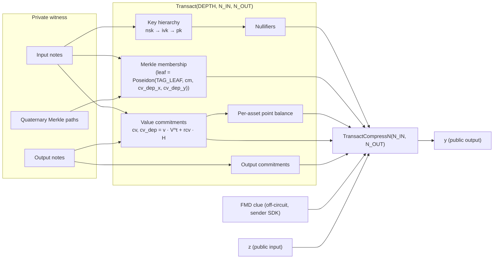

# MASP Circuits

Multi-Asset Shielded Pool circuits in circom 2.2.3 over the BN254 scalar field,
with Baby-Jubjub carrying the value commitments. Two Groth16 entry points:

| Circuit | Instantiation | Purpose |
|---|---|---|
| [`4x6.circom`](4x6.circom) | `Transact(11, 4, 6)` | Spend 4 notes, create 6. 46-coefficient, 69-word public-input layout ([§2a](#2a-public-input-compression)). |
| [`tree_update_batch.circom`](tree_update_batch.circom) | `TreeUpdateBatch(11, 8)` | Relayer proof that the tree advances `old_root → new_root` by up to 8 leaves, any count. |

The two are **ceremony-paired**. A spend emits `N_OUT = 6` leaves that the batch
circuit inserts, so they share `DEPTH = 11` (`4^11 = 4,194,304` leaves) and
cannot be mixed across versions. `MAX_L = 8` rather than 6 because `COUNT_BITS`
requires a power of two. The batch circuit is documented in its own header,
including the contract-side obligations its soundness depends on.

The transact entry point instantiates
[`Transact(DEPTH, N_IN, N_OUT)`](lib/transact.circom), which stays generic; the
Lean development proves against the generic template and instantiates it.

The design follows the Sapling and Namada multi-asset model. Each note carries a
private `asset_id`; a per-asset Baby-Jubjub generator `V^t` is derived in-circuit
by Pedersen hash-to-curve; value commitments are `cv = value · V^t + rcv · H`.
Per-asset conservation is enforced arithmetically over asset ids ([§6](#6-value-commitment-and-balance)),
**not** by the Edwards point balance, which is defence in depth only ([§5](#5-asset-generator)).

Nothing verifies `4x6` on-chain yet. That needs a `PubInputs.compress` overload
at 46 coefficients and a production ceremony.

> **Machine-checked.** The candidate-set argument of §6, its no-wrap lift to the
> naturals, the coefficient-pinning argument of §2a and the faerie-gold defence of §7
> are proved in Lean 4 under [`lean/`](../lean/README.md). The known-discrete-log
> weakness of §5 is formalised as a *negative* result, `pointBalance_not_sound`,
> so conservation cannot be re-derived from the point balance. `FrontierRoot` and
> the `BabyCheck` on `cv_dep` are not modelled. See
> [`lean/README.md`](../lean/README.md) for coverage and
> [`lean/FIDELITY.md`](../lean/FIDELITY.md) for how closely the model tracks this
> source.

---

## 1. Threat model and security goals

With the contract obligations of [§10](#10-smart-contract-obligations), the
circuits enforce the following for every accepted transaction.

- **Ownership.** Each spent note is opened against a key hierarchy
  `nsk → ivk → pk` whose `pk` is bound inside the note commitment.
- **No double spend.** Every spent slot, real or padding, emits
  `nf = Poseidon(TAG_NF, nk, rho, cm)` with `nk = Poseidon(TAG_NK, nsk)`. The
  contract rejects collisions against the global spent set. `cm` is in the
  preimage, so the nullifier identifies one exact note; see §7.
- **Per-asset value conservation.** For every asset class, shielded inputs plus
  the transparent bucket equal shielded outputs plus the transparent bucket.
  Enforced by `PerAssetValueBalance` as integer arithmetic over asset ids
  compared as field elements, with **no** group-theoretic assumption. The
  Edwards point balance does not establish this; see §5.
- **Recipient binding.** `recipient_address` and `chain_id` are bound through
  the PolyEval digest `(z, y)` that Groth16 checks, so a relayer cannot rewrite
  the withdrawal target or replay the proof on another chain.
- **Indistinguishable padding.** Unused input slots emit real Poseidon
  nullifiers; unused output slots are real `value = 0` notes with real Poseidon
  commitments. No sentinel value leaks the transaction shape.
- **Deposit binding.** Each deposit-mode leaf in `tree_update_batch` satisfies
  `cv_dep[k] == leaf_public_in[k] · V^leaf_asset[k] + rcv[k] · H`, pinning that
  leaf to `leaf_public_in` units of `leaf_asset`. The binding is per leaf: an
  aggregate would fix only `Σvalue` modulo the subgroup order, and so not the
  split. Every later spend recomputes the same `cv_dep` from
  `(asset, value, rcv_dep)`.
- **FMD clue binding.** Each output carries a sender-computed FMD2 clue
  `(R, clue_bits)` passed as an off-circuit witness and bound through PolyEval
  (§7a). A relayer cannot corrupt it without invalidating `y`. Honest derivation
  from the recipient's flag key is a sender obligation, not a circuit
  constraint.

### Deposit binding is not injective in `(asset, value)`

The Pedersen equality above fixes the product `value · m(asset)`, not the pair,
because every asset generator is a known multiple `m(a) · BASE[0]` of one base
(§5). A substitution is available whenever two **registered** ids satisfy
`v · m(a) == v' · m(a')` with both values under `2^64`: pay `v` of the cheap
asset, commit the depositor-chosen `cms[k]` to `(a', v')`, then spend the leaf as
the expensive asset. `cms[k]` carries no proof on the deposit path, so nothing
in the circuit closes this.

What rules it out is the registered id set. `just asset-ids <ids>` computes the
bound and must be run before registering any id, since `AssetRegistry.addAsset`
accepts an arbitrary `uint64`. Binding the deposit leaf by hash rather than by
Pedersen would remove the assumption, at the cost of a ceremony. Asset id `0` is
rejected outright on a deposit leaf, since `SpentNote` refuses it and the leaf
would be unspendable.

Out of scope: EdDSA spend authorisation (only key derivation is in-circuit),
encrypted memo layout, and a Sapling-style binding signature on `bvk`, since
balance is enforced in-circuit.

---

## 2. I/O surface

The verifier sees two field elements: `z`, the Fiat-Shamir challenge, and `y`,
the Horner evaluation. The `9 + 3·N_IN + 8·N_OUT` logical public inputs are bound
into `(z, y)`; see §2a for the split between the 46 the circuit evaluates and the
23 it only hashes.

| Signal | Kind | Purpose |
|---|---|---|
| `z` | public input | Fiat-Shamir challenge supplied by the contract, over all 69 words |
| `y` | public output | `Σ_k coeffs[k] · z^k` over the 46 pinned coefficients |

Logical public inputs, with widths at `Transact(11, 4, 6)` totalling 69. The
**bound by** column is the mechanism, and it is load-bearing: a coefficient the
circuit does not constrain is a free variable a prover solves `y = Σ c_k z^k`
with, since it reads `z` before choosing a witness. The bottom eight rows are
therefore not circuit signals at all — they reach the proof through `z` only.

| Signal | Width | Bound by | Purpose |
|---|---:|---|---|
| `merkle_root` | 1 | coefficient | Root of the on-chain commitment tree |
| `nullifier[N_IN]` | 4 | coefficient | One per spent slot |
| `out_cm[N_OUT]` | 6 | coefficient | One per output slot |
| `public_asset_id` | 1 | coefficient | Transparent-bucket asset. `V^pub` is derived in-circuit, not a public input |
| `public_in`, `public_out` | 2 | coefficient | Transparent deposit and withdrawal |
| `in_cv[N_IN][2]` | 8 | coefficient | Value commitments, input side |
| `out_cv[N_OUT][2]` | 12 | coefficient | Value commitments, output side |
| `recipient_address` | 1 | challenge | Withdrawal target (`uint160`) |
| `chain_id` | 1 | challenge | Replay protection |
| `payer_address` | 1 | challenge | Transparent depositor (`uint160`); `0` when no deposit |
| `relayer_address` | 1 | challenge | Relayer payout target (`uint160`); `0` when self-submitted |
| `out_cv_dep[N_OUT][2]` | 12 | coefficient | Deposit-anchored value commitment, exposed so `tree_update_batch` binds the same `cv_dep` baked into the leaf |
| `out_clue_Rx`, `out_clue_Ry` | 12 | challenge | FMD clue point `R = r·G_8` per output |
| `out_clue_bits[N_OUT]` | 6 | challenge | Packed FMD clue bits per output; the contract masks with `CLUE_BITS_MASK = 0x3FFF` |
| `out_aux_digest` | 1 | challenge | `keccak256(abi.encode(aux)) mod r`; the contract MUST recompute it |

Private inputs per slot:

- Spent: `asset_id, value, pk, rho, rcm, nsk, rcv, rcv_dep,
  path_elements[DEPTH][3], path_indices[DEPTH], is_dummy`.
- Output: `asset_id, value, pk, rho, rcm, rcv, rcv_dep`. No `is_dummy`, since
  padding outputs are real `value = 0` notes.

Relayer compensation is not a public input. Fees are paid as a shielded output
addressed to the relayer's key.

### 2a. Public-input compression

Two vectors, not one. The **challenge preimage** is every logical public input;
the **coefficient vector** is the subset the circuit constrains.

```
z = keccak256(abi.encode(challenge)) mod r        69 words at 4x6
y = coeffs[0] + coeffs[1]·z + … + coeffs[M-1]·z^(M-1)   46 words at 4x6
```

Both orders MUST match `contracts/src/libs/PubInputs.sol :: compress(Transact,
aux)` word for word. Reordering either is a soundness change for the contract.

**Coefficients** — evaluated into `y`, and every one pinned by a constraint
elsewhere in the circuit:

| Block | Width | First slot | Pinned by |
|---|---:|---|---|
| `merkle_root` | 1 | `0` | Merkle membership of the real input slot(s) |
| `nullifier` | `N_IN` | `1` | `nf === Poseidon(TAG_NF, nk, rho, cm)` |
| `out_cm` | `N_OUT` | `1 + N_IN` | `NoteCommitment` |
| `public_asset_id`, `public_in`, `public_out` | 3 | `1 + N_IN + N_OUT` | `Num2Bits(64)` and `PerAssetValueBalance` |
| `in_cv`, row-major | `2·N_IN` | `4 + N_IN + N_OUT` | `ValueCommit` |
| `out_cv`, row-major | `2·N_OUT` | `4 + 3·N_IN + N_OUT` | `ValueCommit` |
| `out_cv_dep`, row-major | `2·N_OUT` | `4 + 3·N_IN + 3·N_OUT` | `OutputNote.cv_dep` |

Total `4 + 3·N_IN + 5·N_OUT`, which is 46 at `Transact(11, 4, 6)`.

**Challenge-only words** — hashed into `z`, never evaluated, and constrained
nowhere in the circuit. They occupy the calldata block between `out_cv` and
`out_cv_dep`, then follow the struct:

| Block | Width |
|---|---:|
| `recipient`, `chain_id`, `payer`, `relayer` | 4 |
| `(clue_Rx, clue_Ry, clue_bits)` per output | `3·N_OUT` |
| `out_aux_digest` | 1 |

Total `9 + 3·N_IN + 8·N_OUT` challenge words, 69 at this shape, of which 23 are
hashed only.

The layout is pinned twice. `scripts/gen-vectors.ts` refuses to publish
[`vectors/transact-4x6.json`](../vectors/transact-4x6.json) unless the compiled
circuit's `y` matches the reference evaluation over the 46 coefficients, and
`test/formal/layout_parity.test.ts` pins the published vector against the Lean
dump `lean/expected/layout-4x6.txt`.

**Soundness, and why the split exists.** `z` is a circuit INPUT. The prover reads
it before choosing a witness, because the contract derives it from calldata the
prover authored. Schwartz-Zippel needs the coefficient vector fixed *before* the
challenge, so it does not apply here and the `68/r` reading of it was wrong.

What makes `y` binding is that `PolyEval` is affine in each coefficient with
slope `z^k`, so a coefficient the rest of the circuit leaves free is one linear
equation in one unknown. Solve it and `y` becomes whatever the contract asks for,
for an unrelated transaction — no collision, no low-probability event.

`recipient`, `chain_id`, `payer`, `relayer`, the clue triples and
`out_aux_digest` carry no in-circuit constraint. As coefficients they were 23
such unknowns, so they are not coefficients: they are hashed into `z` instead.
That binds them completely and costs nothing — alter one and `z` moves, so `y`
moves, so the proof fails — while needing no constraint at all.

**Adding a public input is therefore a two-part change**: wire it in, and name
the constraint that pins it. If there is none, it belongs in the challenge
preimage.

Two consequences elsewhere in the circuit:

* **At least one input slot must be real.** `MerkleProofOrDummy` skips the root
  comparison on a dummy slot, so with every slot dummy nothing reads
  `merkle_root` and it becomes a free coefficient. `Transact` rejects the
  all-dummy witness. Nothing legitimate is lost: `MASP.withdraw` and
  `MASP.transfer` both require `publicIn == 0` and shielding goes through the
  deposit escrow, so an all-dummy transact could only ever have been a no-op.
* **`public_asset_id`, `public_in` and `public_out` are the residue.** They are
  64-bit range-checked and only loosely tied to each other by conservation,
  leaving roughly 128 bits of prover freedom against a 254-bit modulus: a
  solution to the linear equation exists for about `2^-126` of challenges. The
  range checks are what keep that number there rather than at 1.

**`out_aux_digest`** covers the whole `AuxValidation.Output` array. The contract
MUST recompute it from the aux calldata rather than accept it as an input; only
recomputation ties the challenge to the payload the recipient receives. Without
it the three clue fields are the only per-output data bound, so a relayer can
leave the clue intact, keeping the proof valid and the note still flagged, while
corrupting `ephPub` and the ciphertext. The recipient then cannot derive the
ECDH secret, cannot decrypt the opening, and cannot spend a note whose inputs are
already nullified.

**The batch circuit does NOT split.** `tree_update_batch` hashes `4 + 6·MAX_L`
words — 52 at `MAX_L = 8` — and evaluates all 52. The order MUST match
`PubInputs.sol :: compress(TreeUpdateBatch)`.

The reason it does not split is the reason the split is sound for transact.
Transact excludes 23 words because they are **not signals of the circuit**:
there is no witness copy of them, so there is nothing for a prover to disagree
with, and `z` is the only thing that can bind them. Every one of the batch's 52
words *is* a signal of `tree_update_batch`. Hashing a signal into `z` binds
nothing — the prover reads `z` first and is free to choose a witness that
disagrees with the calldata `z` was hashed from — so a batch word must be
evaluated into `y` *and* pinned by a constraint.

| Block | Width | First slot | Pinned by |
|---|---:|---|---|
| `old_root` | 1 | `0` | `old_root === FrontierRoot(frontier_in, start_index)` |
| `new_root` | 1 | `1` | `new_root === running_root[MAX_L]` |
| `start_index` | 1 | `2` | `Num2Bits(2·DEPTH)`, then the frontier digits |
| `actual_count` | 1 | `3` | `Num2Bits(COUNT_BITS)`, then `active[k]` and the insert chain |
| `cms` | `MAX_L` | `4` | `Poseidon(TAG_LEAF, …)` into `new_root` |
| `cv_dep`, row-major | `2·MAX_L` | `4 + MAX_L` | `BabyCheck`, and the same leaf hash |
| `leaf_asset` | `MAX_L` | `4 + 3·MAX_L` | the deposit binding, plus step 7a below |
| `leaf_public_in` | `MAX_L` | `4 + 4·MAX_L` | `Num2Bits(64)` and the deposit binding |
| `is_deposit` | `MAX_L` | `4 + 5·MAX_L` | booleanity, the step-5 zeroings, and `active_dep` |

**The deposit-binding fields, and why they need one extra constraint.** The
per-leaf equality

    active_dep[k] · (cv_dep[k] − (leaf_public_in[k]·V^leaf_asset[k] + rcv[k]·H)) === 0

pins `leaf_public_in[k]` and `leaf_asset[k]` against `cv_dep[k]` under the
discrete-log hardness of the Jubjub subgroup: moving either operand forces a
compensating `cv_dep`, itself two coefficients.

It degenerates on its own. `ValueTimesGen(0, gen)` is the curve identity for
every `gen`, so at `leaf_public_in[k] == 0` the equality reduces to
`cv_dep[k] == rcv[k]·H` and `leaf_asset[k]` retains only its 64-bit range check,
reaching neither the leaf hash nor `new_root`. **A range check bounds a
coefficient without pinning it** — the residue bullet above describes the same
condition. Four such leaves give 4 × 64 = 256 bits of free dial against a
254-bit modulus, which is a small CVP rather than a search, and a `fbps = 0`
flush supplies exactly four.

`tree_update_batch.circom` closes that per slot, without reference to any
neighbour, by splitting on whether the binding is degenerate:

* **value != 0** — the equality is non-degenerate and pins the asset under
  discrete-log hardness. `leaf_asset[k] != 0` is required, as before: `SpentNote`
  refuses id 0 on every real note, so a leaf minted there would be unspendable.
* **value == 0** — the asset is unconstrained by the equality and also carries no
  information: `cv_dep` is `rcv·H` whatever it says, and it reaches neither the
  note commitment nor the leaf hash. It is canonicalised to `leaf_asset[k] == 0`.
  Pinned to a constant is pinned.

The zero-value case is legitimate and stays provable — a flush at `fbps = 0`
mints a worthless fee note, which `MASP._validateDeposit` permits explicitly.
What the constraint removes is its freedom, not the shape. `MASP._drainDeposit`
sets `leafAsset` to 0 on such a leaf to match.

Both arms are gated on `active_dep[k]`, so a spend batch is untouched; there
`leaf_asset` and `leaf_public_in` are already forced to zero.

Nothing in this refers to a neighbouring slot, so the circuit stays agnostic to
how a consumer lays deposits out across a batch — the leaf-granular property
`lean/Lelantos/Circuit/TreeUpdateBatch.lean` is written around.

**What "pinned" does and does not mean here.** Each row above names the
constraint that ties its word to the rest of the witness, so none of them is a
free dial a prover can solve `y = Σ c_k z^k` with directly. It does not mean the
coefficient vector is rigid, and the blinders are where it is loosest.

`ValueCommitPair` pins `cv` only *relative* to a prover-chosen blinder, and
`PerAssetPointBalance` cancels every blinder identically, so a blinder appears in
no constraint outside the coefficients its own `cv` produces. `PolyEval` is
affine in each coefficient with slope `z^k`, so uncommitted blinders are
*additively separable* knobs on `y` at a fixed challenge — and `z` is
calldata-derived and read before the witness is chosen, so they survive it.
Forging `y` becomes a modular k-sum rather than a 254-bit search.

So the residue, at `Transact(11, 4, 6)`:

| blinder | count | status |
|---|---:|---|
| `in_rcv_dep` | 4 | pinned — Merkle membership fixes the leaf it opens |
| `in_rcv` | 4 | free and separable |
| `out_rcv` | 6 | free and separable |
| `out_rcv_dep` | 6 | free and separable |

**Sixteen separable knobs, and nothing in the tree closes them today.** The work
factor of a k-sum at that width is **unquantified**: the audit that raised it left
the cost open, and its 2^38 figure does not follow from the knob count. Measure
that before choosing a fix — the two obvious ones were tried and rejected, and
`test/transact/blinders.test.ts` records both with the reason each failed:

* *Hash the blinders into `cm`.* Cheap (+2.3k constraints) and it does make each
  knob's contribution non-linear. But separability is a property *across* knobs,
  and displacements from distinct knobs still add — the knob count is unchanged,
  so the k-sum is unaffected. The separability assertion in that file is what
  caught this.
* *Derive the blinders from the note opening.* This does remove them as
  independent degrees of freedom, at ~15k constraints once the Poseidon output is
  reduced to `RCV_BITS` alias-free. But `rcv` is the sender's fresh per-spend
  blinder: deriving it from the note makes `in_cv` at spend time a deterministic
  function of the note, and deriving `out_rcv` the same way makes it equal the
  creating transaction's value — a direct link between creation and spend. It is
  a privacy design decision, not a constraint-level fix.

The batch shape is not affected: `rcv[k]` there cannot be derived or committed,
because `tree_update_batch` never opens a leaf — it sees `cms[k]` and `cv_dep[k]`
and not the note behind them. Its knobs are already non-separable for a different
reason, since each also feeds `new_root` through the insert chain.

**Do not demote these three to challenge-only.** It was tried, and it is
exploitable in two independent ways: with `is_deposit` free a `flushBatch`
caller escrows one unit and commits a leaf bound by nothing but `BabyCheck`, and
with `leaf_public_in` free the binding certifies a prover-chosen amount. Both
produce a verifying proof against the production key. Promoting them back
*without* step 7a is the other failure, the 256-bit dial above.
`test/tree_update_batch.test.ts :: divergent witness` holds both directions.

**Verifier signature.** `snarkjs zkey export solidityverifier` emits
`verifyProof(uint[2] _pA, uint[2][2] _pB, uint[2] _pC, uint[2] _pubSignals)`
with `_pubSignals = [y, z]`, in that order: circom lays out the main component's
outputs before its public inputs, so wire 1 is `main.y` and wire 2 is `main.z`.
Confirm against the compiled `.sym` rather than this prose. An integrator who
swaps them rejects every proof.

---
## 3. Dataflow



`Transact` is a wiring layer: it instantiates `SpentNote` per input and
`OutputNote` per output, feeds the exposed `rH` components and the public `cv`s
into `PerAssetPointBalance`, and binds `out_cv_dep[j]` to `OutputNote.cv_dep`.

---

## 4. Note commitment

File: [`lib/note.circom`](lib/note.circom).

```
cm = Poseidon(packed_av, owner_pk, rho, rcm)
packed_av = asset_id · 2^64 + value
```

`asset_id` is range-checked below `2^64` inside `HashToAssetGen`, so the packing
is injective. `V^t` is a deterministic in-circuit function of `asset_id`, so
binding `asset_id` inside `cm` locks a commitment to its generator: no prover can
pair one `cm` with a different `V^t`.

Domain separation comes from the arity-4 Poseidon site combined with the packing.
`packed_av ≥ 2^64` for any nonzero `asset_id`, which distinguishes it from
`Poseidon(TAG_LEAF, cm, cv_dep_x, cv_dep_y)` where the first element is the small
constant `TAG_LEAF = 10`. `TAG_CM` is reserved and unused.

`rho` provides per-note uniqueness and feeds the nullifier; `rcm` is the hiding
randomness.

---

## 5. Asset generator

File: [`lib/asset_gen.circom`](lib/asset_gen.circom).

```
V^t = HashToAssetGen(asset_id) = Pedersen(TAG_ASSET || Num2Bits(64, asset_id))

bits[ 0.. 7] = TAG_ASSET (= 7), one byte LSB-first
bits[ 8..71] = asset_id, 64 bits LSB-first
```

`Num2Bits(64)` enforces `asset_id < 2^64` in-circuit, matching the on-chain
`uint64 publicAssetId` and bounding every private asset id too. `TAG_ASSET`
separates this hash from any other Pedersen call on the same curve. The 72-bit
message fits one Pedersen segment over `BASE[0]`; the blinding base `H` is
`BASE[2]`, outside the image.

> **The asset generators are not independent.** A single Pedersen segment means
> `V^a = m(a) · BASE[0]`, where `m(a)` is the signed-4-bit-window multiplier that
> anyone can compute from `a`. All generators therefore lie in the same
> prime-order group with known relative discrete logs. `m(·)` is only about `2^85`
> and is affine in the low nibbles of `asset_id`, so exact relations are easy to
> find: `V^1 + V^3 == 2·V^2`, for instance. The Edwards point balance alone is
> then satisfied by spending `X` of asset 1 plus `X` of asset 3 to mint `2X` of
> asset 2. Conservation is enforced by `PerAssetValueBalance` instead (§6), and
> the point balance is retained only as defence in depth. `H = BASE[2]` is
> unaffected, so blinding remains sound. A real hash-to-curve with unknown
> discrete logs would let the point balance stand on its own, at the cost of a
> ceremony and an SDK mirror.
>
> **The deposit path has no arithmetic fallback.** On the transact side
> `PerAssetValueBalance` makes the known discrete logs harmless, because
> conservation is checked over asset ids as field elements. A deposit leaf in
> `tree_update_batch` carries no transact proof and is pinned by the Pedersen
> equality alone, so `m(·)` decides its binding: `v · V^a == v' · V^a'` holds
> exactly when `v · m(a) == v' · m(a')`, and both values fit `2^64` whenever
> `max(|m(a)|, |m(a')|) / gcd(|m(a)|, |m(a')|) < 2^64`. Concrete pairs of valid
> `uint64` ids meeting that bound exist. `scripts/check-asset-ids.ts`
> (`just asset-ids`) computes it over an id set, verifying its model of `m(·)`
> against the compiled gadget first; `test/check_asset_ids.test.ts` pins both.
> See §1.

Two mirrors reproduce the gadget off-circuit byte for byte: the test reference
[`test/ref/jubjub.ts`](../test/ref/jubjub.ts) passes the 9-byte buffer
`[TAG_ASSET, ...asset_id_LE_8]` to `circomlibjs.pedersen.hash`, and the SDK does
the same in Rust and WASM. Agreement is pinned by the published
[`vectors/`](../vectors/).

Real notes reject `asset_id == 0` via `(1 - is_dummy) · IsZero(asset_id) === 0`.
Output notes apply the same check unconditionally.

---

## 6. Value commitment and balance

Files: [`lib/value_commit.circom`](lib/value_commit.circom),
[`lib/balance.circom`](lib/balance.circom).

```
cv     = value · V^t + rcv     · H
cv_dep = value · V^t + rcv_dep · H
```

`value · V^t` is computed by `EscalarMulAny(64)`, a variable-base multiplication
costing 586 constraints. At `value = 0` the result is the identity `(0, 1)`
whatever the `asset_id`, so dummies are colour-neutral. `rcv · H` uses
`FixedBaseMul(252, H)` ([`lib/fixed_base_mul.circom`](lib/fixed_base_mul.circom))
at 748 constraints; with its `Num2Bits(252)` the whole `MulH` is 1,000.

> `FixedBaseMul` replaces circomlib's `EscalarMulFix`, which costs 3,864
> constraints for the same group element. `EscalarMulFix` takes its base as a
> signal even though the base is a template parameter, so circom cannot
> constant-fold it, and each of its 85 windows spends 22 constraints rebuilding a
> compile-time-constant table plus 3 on a chain undoing the `+1·B` offset baked
> into every window. `FixedBaseMul` builds its tables in `var` arithmetic and
> starts each window at the identity, so neither cost arises. The two agree on
> every scalar, pinned by the committed `vectors/` and by
> [`test/fuzz/fixed_base_mul.fuzz.test.ts`](../test/fuzz/fixed_base_mul.fuzz.test.ts)
> over arbitrary 252-bit scalars.

`ValueCommitPair` computes `value · V^t` once and adds each blinder to it,
sharing one variable-base multiplication per note slot. The blinders must stay
independent: at `rcv == rcv_dep` the `in_cv` published at spend time equals the
leaf's `cv_dep`, revealing which leaf was spent.

`ValueCommit` exposes `rH = rcv · H` so the balance check can sum points.
Collapsing it to a scalar `Σrcv_in − Σrcv_out` would wrap into 254 bits when
outputs exceed inputs and break the decomposition.

### Value conservation, the binding check

`PerAssetValueBalance` checks, for every asset id `c` appearing anywhere in the
transaction:

```
Σ_i in_value[i]·[in_asset[i] == c]  + public_in ·[public_asset_id == c]
  == Σ_j out_value[j]·[out_asset[j] == c] + public_out·[public_asset_id == c]
```

Candidates are `{in_asset[*], out_asset[*], public_asset_id}`. Any asset outside
that set contributes zero to both sides, so covering the candidates covers every
asset present. Assets are compared as field elements via `IsEqual`; values are
64-bit with at most `N_IN + 1` terms per side, so the sums stay far below the
modulus. The result is exact integer arithmetic with no modular wrap and no
group-theoretic assumption. Dummy inputs carry `value = 0` and are neutral
whatever `asset_id` they declare. Cost is about 40 constraints per candidate.

**Precondition.** Every value must already be 64-bit range-checked. `SpentNote`
and `OutputNote` apply `RangeCheck64` to the note values and the transact circuit
applies it to `public_in` and `public_out`. Dropping any of these invalidates the
no-wrap argument.

### Point balance, defence in depth

```
Σ in_cv + public_in · V^pub + Σ out_rH  ==  Σ out_cv + public_out · V^pub + Σ in_rH
```

`V^pub` is derived in-circuit as `HashToAssetGen(public_asset_id)`. The Pedersen
image lies in the prime-order subgroup by construction, so off-curve and
small-order attacks are infeasible without breaking Pedersen. The equation holds
for every honest transaction and keeps `cv` a meaningful on-chain value
commitment, but it does **not** imply per-asset conservation: the generators are
known multiples of one base (§5), so cross-asset cancellation is easy. Never
treat it as the conservation guarantee.

---

## 7. Key hierarchy and nullifier

```
nsk  (spend authority)
 ├─ ivk = Poseidon(TAG_IVK, nsk)      (incoming view key)
 │    └─ pk = Poseidon(TAG_PK, ivk)   (bound in note cm)
 └─ nk  = Poseidon(TAG_NK, nsk)       (nullifier-deriving key, FVK)

nf = Poseidon(TAG_NF, nk, rho, cm)
dk = Poseidon(TAG_DK, ivk)            (off-circuit, FMD)
```

`ivk` confers detection and decryption rights; `nk` adds spent-note visibility.
Neither lets the holder spend: `nsk` is required to satisfy the in-circuit `pk`
check, and Poseidon is one-way, so neither `ivk` nor `nk` reveals `nsk`.

Every spent slot, real or dummy, constrains
`nullifier[i] === Poseidon(TAG_NF, nk, rho, cm)`, with `nk` derived in-circuit
from the prover-supplied `nsk` and `cm` recomputed from the same witness.
Dummies use prover-chosen private `(nsk, rho)`, so their public nullifier is
indistinguishable from a real spend, and the contract inserts every nullifier
unconditionally.

**Why `cm` is in the preimage.** Keyed on `(nk, rho)` alone, two notes sharing a
`rho` share a nullifier, and spending either permanently bricks the other. That
is reachable: output `rho` is `Poseidon(TAG_RHO, nullifier[0], j)` and
`nullifier[0]` is public, so every output note's `rho` is publicly computable;
and the deposit path supplies `cms[]` to `tree_update_batch` with no `rho`
constraint and no proof, so an attacker can plant a dust note at a victim's `pk`
reusing an existing `rho`. Binding `cm` closes this for every inserter rather
than relying on each one to derive `rho` correctly. `DeriveRho` remains the
transact-path defence.

---

## 7a. FMD2 clue, off-circuit

Each output carries an FMD2 clue `(R, clue_bits)` computed by the sender SDK and
passed as a plain witness. The circuit imposes **no** constraint on
`out_clue_Rx`, `out_clue_Ry` or `out_clue_bits` beyond including them as PolyEval
coefficients: a relayer cannot alter them after proof generation without
invalidating `y`, but the circuit does not verify honest derivation from the
recipient's flag key.

```
R         = r · G_8                              (Baby-Jubjub fixed base)
S_i       = r · fk_i                             for i ∈ [GAMMA]
bit_i     = legendre_bit(Poseidon(TAG_FMD_BIT, R.x, R.y, i, S_i.x, S_i.y))
clue_bits = pack(1 - bit_i for i in [GAMMA])     (sender flips; receiver ⊕ == 1)
```

`legendre_bit(h)` is computed off-circuit ([`test/ref/sqrt.ts`](../test/ref/sqrt.ts),
mirrored in the SDK): for nonzero `h`, `bit = 1` iff `h` is a quadratic residue,
else `bit = 0` and `h = y²·Z` for the fixed non-residue `Z = 5`. Exactly one of
`{h, h·Z⁻¹}` is a residue, so the bit is well defined.

`clue_bits` is one field element; the contract masks the upper bits with
`CLUE_BITS_MASK = 0x3FFF`. `GAMMA` is a subscription-time parameter chosen by the
client, not a circuit parameter. Constraint cost is zero.

---

## 8. Quaternary Merkle membership

Files: [`lib/merkle.circom`](lib/merkle.circom),
[`lib/common.circom`](lib/common.circom).

Each level is `node = Poseidon(TAG_MERKLE, c0, c1, c2, c3)`.
`path_indices[d] ∈ {0..3}` selects the position of the proven child through
`PathIndexSelectors`, whose `Num2Bits(2)` also range-checks the digit.
`MerkleProofOrDummy` skips inclusion when `is_dummy == 1`, so a dummy bypasses
the root check while still constraining its nullifier and value commitment.

The leaf is `Poseidon(TAG_LEAF, cm, cv_dep_x, cv_dep_y)`. Baking the
deposit-anchored value commitment into the leaf hash is what stops a future spend
opening it under a different `(asset_id, value)`; see §1.

---

## 9. Multi-asset semantics and padding

The circuit places **no** constraint linking `in_asset[i]` to `in_asset[k]` or to
any `out_asset[j]`. One proof may mix up to `N_IN` shielded asset ids on the
input side and `N_OUT` on the output side, provided per-asset conservation holds.
The transparent bucket is single-asset per transaction.

Holding regardless of asset mix:

- `RangeCheck64` on every private `value`.
- Real notes reject `asset_id == 0`.
- `cv` is bound to `(asset_id, value, rcv)`. This does not stop `cv`s of distinct
  assets from cancelling, since the generators share a base (§5), which is why
  conservation is arithmetic rather than group-theoretic.
- `in_asset`, `out_asset` and `public_asset_id` are compared as field elements,
  so an asset id can only cancel against itself.
- `cv_dep` is bound to `(asset_id, value, rcv_dep)` and pinned into the leaf
  hash, so the deposit-anchored pair cannot drift between spends.

Padding:

- **Spent dummies** carry `is_dummy = 1` and bypass the `pk` check, the Merkle
  check and the `asset != 0` reject. `DummyZeroValue` enforces
  `is_dummy · value === 0`. The nullifier is computed normally.
- **Output padding** is a real `value = 0` note addressed to a registered asset,
  typically the sender. Its `cm` is a real Poseidon insertion, with no sentinel.

---
## 10. Smart-contract obligations

Before invoking the Groth16 verifier the on-chain wrapper MUST:

1. **Fiat-Shamir.** Flatten the logical public inputs in the canonical order
   (§2a), derive `z = H(transcript) mod r` for a domain-separated `H` over **all
   69 words**, compute `y = Σ coeffs[k]·z^k mod r` over **the 46 coefficients**,
   and pass `[y, z]` in that order. `z` MUST be a deterministic function of every
   word, including the 23 the polynomial skips — that is the only thing binding
   them. Evaluating a word the circuit does not constrain is the opposite error
   and breaks soundness outright; see §2a.
2. **Canonical slots.** Either `require(slot < r)` for every logical public
   input before compressing, **or** derive `z` by hashing the raw pre-reduction
   calldata words. One of the two is mandatory. `compress()` is modular, so `v`
   and `v + r` yield the same `y`; if `z` is also derived from reduced values,
   any slot, in particular the unconstrained `out_clue_*`, can be mutated in
   calldata while the proof still verifies. `PubInputs.sol` takes the hashing
   route, which is why it carries no explicit `slot < r` check. Reducing the
   slots before hashing would reintroduce the malleability.
3. **Aux digest.** Fill the final challenge word with
   `keccak256(abi.encode(aux)) mod r` computed from the aux calldata. Never read it from the caller: taking it as an
   input makes it agree with any payload and restores the tampering it prevents.
4. `require(chainId == block.chainid)`.
5. `require(public_in < 2**64 && public_out < 2**64)` and
   `require(public_asset_id < 2**64)`.
6. `require(registry[public_asset_id].token != address(0))`.
7. `require(nullifier[i] != nullifier[k])` for every pair `i < k`, with no
   exception for zero. That is six pairs at four input slots; the count is
   quadratic in `N_IN`.
8. Type `recipient_address`, `payer_address` and `relayer_address` as `address`,
   passing `uint256(uint160(addr))`, with `address(0)` for unused slots.
9. `require(merkleRoots[merkle_root])`.
10. Per input slot: `require(!spent[nullifier[i]]); spent[nullifier[i]] = true;`,
    with no sentinel skip.
11. Per output slot `j`: insert `out_cm[j]` into the commitment tree, emit the
    leaf event, and forward `out_cm[j]` and `out_cv_dep[j]` into the paired
    `tree_update_batch` public inputs at `cms[j]` and `cv_dep[j]`. Both must come
    from the transact proof rather than the relayer, and `actual_count` must be
    pinned to `N_OUT`. The batch circuit proves the tree advanced by those
    leaves, not that they are the ones this spend authorised.
12. Move `public_in` in from `payer_address`; pay `public_out` to
    `recipient_address`.

For the paired batch proof the contract must additionally pin three things.

`start_index == committedCount`. `FrontierRoot` binds the frontier to `old_root`
but cannot bind the index, since a tree with trailing empty leaves has the same
root as one without them, so replaying a valid batch at a lower index would
overwrite committed leaves.

`is_deposit[k]` per active slot — 1 on every leaf of a deposit batch, 0 on every
leaf of a spend batch — taken from the contract's own deposit records rather
than from relayer calldata. The circuit constrains it only to be boolean, and it
gates the per-leaf deposit binding, so a relayer that clears it on a deposit
leaf commits a leaf whose `cv_dep` is constrained by nothing but `BabyCheck`.
`MASP._drainDeposit` and `MASP._validateRequest` cover every active slot on
their respective paths.

`leaf_asset[k] == 0` on every zero-value deposit leaf, matching step 7a (§2a).
`MASP._drainDeposit` sets it on the fee note it emits; a consumer that forwards a
non-zero asset on a worthless leaf produces a batch no prover can satisfy. The
circuit is otherwise indifferent to how deposits are laid out across the batch.

The batch circuit's header carries the full list.

`rcv` is bounded to 252 bits by the `Num2Bits(252)` inside `MulH`. Wallets should
sample it uniformly below the Baby-Jubjub subgroup order `ell < 2^251`, which
stays clear of the boundary.

---

## 11. Domain-separation tags

Defined in [`lib/tags.circom`](lib/tags.circom), the single source of truth
across the in-circuit hash sites and the test helpers. Tag values bake into hash
inputs, so changing one breaks compatibility with every prior proof.

| Function | Value | Use | Arity |
|---|---:|---|---:|
| `TAG_CM` | 1 | Reserved. `NoteCommitment` separates via the `(asset, value)` packing instead | — |
| `TAG_NF` | 2 | `nf = Poseidon(TAG_NF, nk, rho, cm)` | 4 |
| `TAG_PK` | 3 | `pk = Poseidon(TAG_PK, ivk)` | 2 |
| `TAG_IVK` | 4 | `ivk = Poseidon(TAG_IVK, nsk)` | 2 |
| `TAG_MERKLE` | 5 | `node = Poseidon(TAG_MERKLE, c0..c3)` | 5 |
| `TAG_DK` | 6 | `dk = Poseidon(TAG_DK, ivk)`, off-circuit | 2 |
| `TAG_ASSET` | 7 | `V^t = Pedersen(TAG_ASSET ‖ asset_id_bits)` | Pedersen(72) |
| `TAG_FMD_BIT` | 8 | FMD2 clue bit derivation, off-circuit (§7a) | 6 |
| `TAG_NK` | 9 | `nk = Poseidon(TAG_NK, nsk)` | 2 |
| `TAG_LEAF` | 10 | `leaf = Poseidon(TAG_LEAF, cm, cv_dep_x, cv_dep_y)` | 4 |
| `TAG_RHO` | 11 | `rho = Poseidon(TAG_RHO, nullifier[0], out_index)` | 3 |

Arity combined with the tag prevents Poseidon collisions across hash sites.
`POW_2_64` is the packing multiplier in `NoteCommitment` and the bound
`RangeCheck64` enforces.

---

## 12. Constraint budget

R1CS totals from `snarkjs r1cs info`. Each circuit has one public input, `z`, and
one public output, `y`.

| Circuit | Constraints | Wires | Private inputs |
|---|---:|---:|---:|
| `Transact(11, 4, 6)` | 100,320 | 100,473 | 323 |
| `TreeUpdateBatch(11, 8)` | 113,527 | 113,378 | 93 |

Both need the **2^17** domain, so setup fetches `powersOfTau28_hez_final_17`.
snarkjs sizes the domain from `nConstraints + nPubInputs + nOutputs` and requires
that sum to be at most `2^17 - 1`, so the ceiling on the constraint count is
**131,069**. The transact circuit clears it by 30,749 and the batch circuit by
17,542. `just budget` pins both to their exact counts in
[`budget.json`](../budget.json), and `groth16 setup` fails outright above the
ptau as a second line of defence.

`TreeUpdateBatch` is the tighter of the two and decides whether 2^17 holds. A
leaf slot costs roughly 12k constraints, so `MAX_L = 16` would not fit.

`MAX_L = 8` is the floor rather than a tuning choice: `COUNT_BITS` requires a
power of two, and a spend emits `TRANSACT_OUT = 6` leaves that must fit one
batch, with `MASP.sol` pinning `actualCount` to exactly that on the transfer
path. Only `flushBatch` uses the slack, carrying four two-leaf deposits.

Verification gas is a fixed pairing check over two public inputs and is
unaffected by circuit width. A wider batch does not make a verification cheaper;
it caps how many deposits share one.

### Gadget costs

Attributed from a compiled `.r1cs` and `.sym`, not estimated, at circom's default
`--O1`, so surviving linear rows are included. Per-gadget costs are
shape-independent.

| Gadget | Cost |
|---|---:|
| `HashToAssetGen` = `Num2Bits(64)` + `Pedersen(72)` | 975 |
| `MulH` = `Num2Bits(252)` + `FixedBaseMul(252, H)` | 1,000 |
| `EscalarMulAny(64)` | 586 |
| `Poseidon(2)` / `Poseidon(3)` / `Poseidon(4)` | 517 / 605 / 736 |
| `BabyAdd`, `BabyDbl` | 6 |
| `ValueCommitPair` (1 × `EscalarMulAny` + 2 × `MulH` + 2 × `BabyAdd`) | 2,579 |

Instance counts at `Transact(11, 4, 6)`, from the source: 11 `HashToAssetGen`
(one per note slot plus the public bucket), 10 `ValueCommitPair` (one per note
slot), 20 `MulH` and 12 `EscalarMulAny(64)`. The remainder is note commitments,
Merkle levels, nullifiers, leaf hashes and key derivation; `PerAssetValueBalance`
is about 200 constraints, `PerAssetPointBalance` about 70, and the `PolyEval(46)`
Horner chain about 46. FMD clue signals cost nothing (§7a).

`TreeUpdateBatch` is dominated by `MAX_L` single-leaf inserts across `DEPTH`
Merkle levels of `Poseidon(5)`, plus the `MAX_L` deposit-binding equalities, each
a `HashToAssetGen`, a `ValueScalarMul`, a `MulH` and a `BabyAdd` with an `IsZero`
rejecting asset id 0. `FrontierRoot` adds about 8.7k. `BatchCompress` is
negligible.

---

## 13. File map

| File | Role |
|---|---|
| [`4x6.circom`](4x6.circom) | `Transact(11, 4, 6)`, the transact entry point |
| [`tree_update_batch.circom`](tree_update_batch.circom) | `TreeUpdateBatch(11, 8)`, the relayer tree-advance circuit |
| [`lib/transact.circom`](lib/transact.circom) | `Transact(DEPTH, N_IN, N_OUT)`, the generic template |
| [`lib/spent.circom`](lib/spent.circom) | `SpentNote`: key, Merkle, nullifier, range, `cv` and `cv_dep` binding |
| [`lib/output.circom`](lib/output.circom) | `OutputNote`: `cm`, range, `cv` and `cv_dep` binding |
| [`lib/note.circom`](lib/note.circom) | Note commitment, key derivation, `rho`, nullifier |
| [`lib/balance.circom`](lib/balance.circom) | `RangeCheck64`, `ValueTimesGen`, `DummyZeroValue`, both balance checks |
| [`lib/value_commit.circom`](lib/value_commit.circom) | `ValueScalarMul`, `MulH`, `ValueCommit`, `ValueCommitPair`, `PointSum`, `H` |
| [`lib/fixed_base_mul.circom`](lib/fixed_base_mul.circom) | Windowed fixed-base multiplication and its compile-time tables |
| [`lib/asset_gen.circom`](lib/asset_gen.circom) | `HashToAssetGen`, Pedersen hash-to-curve |
| [`lib/merkle.circom`](lib/merkle.circom) | Quaternary level, root, dummy-aware membership |
| [`lib/insert.circom`](lib/insert.circom) | Single-leaf incremental insert with frontier IO |
| [`lib/frontier_root.circom`](lib/frontier_root.circom) | `FrontierRoot`, rebuilding `old_root` from the frontier |
| [`lib/poly_eval.circom`](lib/poly_eval.circom) | `PolyEval`, `TransactCompressN`, `BatchCompress` |
| [`lib/common.circom`](lib/common.circom) | `PathIndexSelectors`, `EmptySubtreeHashes` |
| [`lib/tags.circom`](lib/tags.circom) | Domain-separation tags and `2^64` |

| Test tree | Role |
|---|---|
| [`../test/ref/`](../test/ref/) | TypeScript reference implementation, with no SDK dependency; the circom is the source of truth |
| [`../test/lib/`](../test/lib/) | Harness: circuit loader, dimensions, input shapers, witness assertions, witness builders |
| [`../test/transact/`](../test/transact/) | Transact suites by concern: balance, multi-asset, tamper, PolyEval binding, `rho` |
| [`../test/tree_update_batch.test.ts`](../test/tree_update_batch.test.ts) | Deposit binding, odd counts, frontier binding, padding, capacity |
| [`../test/formal/`](../test/formal/) | Pins the slot order against the Lean dump and `_pubSignals = [y, z]` |
| [`../test/fuzz/`](../test/fuzz/) | Property-based suites over Transact, Merkle, FrontierRoot, PolyEval, FixedBaseMul |
| [`../test/fixtures/`](../test/fixtures/) | Small-parameter wrappers instantiating library templates |

| Script | Role |
|---|---|
| [`../scripts/gen-vectors.ts`](../scripts/gen-vectors.ts) | Builds [`vectors/`](../vectors/); refuses to write when the circuit's `y` disagrees with the reference |
| [`../scripts/check-budget.mjs`](../scripts/check-budget.mjs) | The `just budget` gate: FFT domain plus the exact count |
| [`../scripts/check-asset-ids.ts`](../scripts/check-asset-ids.ts) | Asset-id separation gate for the deposit path (§1) |
| [`../scripts/check-artifacts.ts`](../scripts/check-artifacts.ts) | Pre-publish gate over the shipped artifacts |
