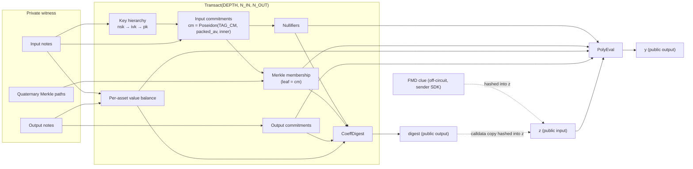

# MASP Circuits

Multi-asset shielded pool circuits in circom 2.2.3 over the BN254 scalar field,
proved with Groth16.

| Circuit | Instantiation | Purpose |
|---|---|---|
| [`4x6.circom`](4x6.circom) | `Transact(11, 4, 6)` | Spend through 4 input slots, create 6 notes |
| [`tree_update_batch.circom`](tree_update_batch.circom) | `TreeUpdateBatch(11, 8)` | Relayer proof that the tree advances `old_root → new_root` by 1 to 8 leaves |

The circuits are paired. A spend emits `N_OUT = 6` leaves that the batch circuit
inserts, so both use `DEPTH = 11` (`4^11 = 4,194,304` leaves) and must come from
the same release. `MAX_L = 8` because `COUNT_BITS` requires a power of two.

`4x6.circom` instantiates the generic template
[`Transact(DEPTH, N_IN, N_OUT)`](lib/transact.circom). Each note carries a
private `asset_id` and `value` and commits to both by hash. Every binding in
either circuit is a Poseidon hash or an integer equation.

The Lean 4 development in [`lean/`](../lean/README.md) proves soundness of the
modelled constraint systems. [`lean/FIDELITY.md`](../lean/FIDELITY.md) describes
how the model corresponds to this source.

---

## 1. Security goals

Given the contract obligations of [§10](#10-smart-contract-obligations), the
circuits enforce the following for every accepted transaction.

- **Ownership.** Each spent note is opened against the key chain
  `nsk → ivk → pk`, with `pk = Poseidon(TAG_PK, ivk, d)` for the note's private
  diversifier `d`, and `pk` is bound inside the note commitment.
- **No double spend.** Every input slot, real or dummy, emits
  `nf = Poseidon(TAG_NF, nk, rho, cm)` with `nk = Poseidon(TAG_NK, nsk)`. The
  contract rejects a nullifier already in the spent set (§7).
- **Per-asset value conservation.** For every asset id, shielded inputs equal
  shielded outputs plus the transparent bucket, as integer arithmetic (§6).
- **Recipient binding.** `recipient_address` and `chain_id` are hashed into the
  challenge `z`, a public signal. A relayer cannot change the withdrawal target
  or replay the proof on another chain.
- **Calldata binding.** A proof verifies only for the calldata its witness
  describes. Each circuit outputs a Poseidon commitment to its coefficients, and
  the contract hashes the calldata copy of that word into `z` (§2a).
- **Indistinguishable padding.** Dummy input slots emit Poseidon nullifiers and
  padding outputs are `value = 0` notes with Poseidon commitments. No sentinel
  value reveals the transaction shape. The clue and ciphertext of a padding
  output are a wallet obligation (§9).
- **A transfer names no asset.** `public_out == 0` forces
  `public_asset_id == 0`.
- **Deposit binding.** Each deposit leaf in `tree_update_batch` is
  `Poseidon(TAG_CM, leaf_asset·2^64 + leaf_public_in, inner)`. Both operands are
  range-checked to 64 bits, so a second `(asset, value)` opening of the same
  leaf is a Poseidon collision.
- **FMD clue binding.** Each output's FMD2 clue `(R, clue_bits)` is bound
  through the challenge (§7a). Its derivation from the recipient's flag key is a
  sender obligation and is not constrained.

**Note secrecy.** An output's `rho` is publicly derivable from `nullifier[0]`
(§7), and a deposit's `(asset, value)` and `inner` are public. `rcm` is therefore
the only secret hiding `pk` in a published `inner` and `(asset, value)` in a
published `cm`. A wallet must sample `rcm` uniformly for every note, including
padding.

**Duplicate deposits.** A deposit repeating an earlier `(asset, value, inner)`
produces a second leaf with the same `cm` and the same nullifier. Only one of
the two is spendable. A wallet must count a `cm` once.

**Out of scope.** EdDSA spend authorisation (only key derivation is in-circuit)
and the encrypted memo layout.

---

## 2. I/O surface

The verifier sees three field elements, in this order:

| Signal | Kind | Value |
|---|---|---|
| `y` | public output | `Σ_k coeffs[k] · z^k` over the 13 coefficients |
| `digest` | public output | `CoeffDigest(coeffs)`, a Poseidon commitment to the same 13 words |
| `z` | public input | Fiat-Shamir challenge computed by the contract over all 38 words |

Logical public inputs, in calldata order, with widths at `Transact(11, 4, 6)`:

| Signal | Width | Bound by | Purpose |
|---|---:|---|---|
| `merkle_root` | 1 | coefficient | Root of the on-chain commitment tree |
| `nullifier[N_IN]` | 4 | coefficient | One per input slot |
| `out_cm[N_OUT]` | 6 | coefficient | One per output slot; the leaf `tree_update_batch` inserts |
| `public_asset_id` | 1 | coefficient | Transparent-bucket asset; `0` unless `public_out != 0` |
| `public_out` | 1 | coefficient | Transparent withdrawal amount |
| `digest` | 1 | public signal | Poseidon digest of the 13 words above |
| `recipient_address` | 1 | challenge | Withdrawal target (`uint160`) |
| `chain_id` | 1 | challenge | Replay protection |
| `payer_address` | 1 | challenge | Account allowed to drive a satellite consuming the spend (`SwapWrapper`); nonzero |
| `relayer_address` | 1 | challenge | Must equal the pool's `msg.sender` |
| `intent_hash` | 1 | challenge | Hash of the swap intent checked by `SwapWrapper`; `0` for other spends. A full word |
| `out_clue_Rx`, `out_clue_Ry` | 12 | challenge | FMD clue point `R = r·G_8` per output |
| `out_clue_bits[N_OUT]` | 6 | challenge | Packed FMD clue bits per output; masked with `CLUE_BITS_MASK = 0x3FFF` |
| `out_aux_digest` | 1 | challenge | `keccak256(abi.encode(aux)) mod r`, recomputed by the contract |

Total `10 + N_IN + 4·N_OUT = 38` words.

A transact proof moves no tokens into the pool. Shielding goes through the
deposit escrow and `tree_update_batch`. Relayer fees are paid as a shielded
output addressed to the relayer's key.

Private inputs per slot:

- Input: `asset_id, value, rho, rcm, nsk, d, path_elements[DEPTH][3],
  path_indices[DEPTH], is_dummy`. The slot derives `pk` from `nsk` and `d`.
- Output: `asset_id, value, pk, rho, rcm`.

### 2a. Public-input compression

```
z      = keccak256(abi.encode(challenge)) mod r               38 words at 4x6
y      = coeffs[0] + coeffs[1]·z + … + coeffs[M-1]·z^(M-1)     13 words at 4x6
digest = CoeffDigest(coeffs)                                   computed in-circuit
```

The challenge preimage is every logical public input. The coefficient vector is
its leading run. The digest is a commitment to the coefficient vector.

The contract computes `z` and `y` from calldata. It does not compute the digest:
it reads the digest word from calldata, hashes it into `z`, and passes it to the
verifier as the second public signal. The circuit outputs the digest of its own
coefficients, so the proof verifies only if the two agree.

Both orders MUST match `contracts/src/libs/PubInputs.sol :: compress(Transact,
aux)` word for word.

**Coefficients**, evaluated into `y` and absorbed by the digest:

| Block | Width | First slot | Constrained by |
|---|---:|---|---|
| `merkle_root` | 1 | `0` | Merkle membership of the real input slots |
| `nullifier` | `N_IN` | `1` | `nf === Poseidon(TAG_NF, nk, rho, cm)` |
| `out_cm` | `N_OUT` | `1 + N_IN` | `NoteInner`, `NoteCommitment` |
| `public_asset_id`, `public_out` | 2 | `1 + N_IN + N_OUT` | `RangeCheck64`, `PerAssetValueBalance`, the bucket constraint |

Total `3 + N_IN + N_OUT = 13`.

**Digest word**, slot `3 + N_IN + N_OUT` of the preimage. Hashed and passed to
the verifier; not evaluated.

**Challenge-only words**, hashed into `z`, not evaluated, and not signals of the
circuit:

| Block | Width |
|---|---:|
| `recipient`, `chain_id`, `payer`, `relayer`, `intent_hash` | 5 |
| `(clue_Rx, clue_Ry, clue_bits)` per output | `3·N_OUT` |
| `out_aux_digest` | 1 |

`scripts/gen-vectors.ts` writes
[`vectors/transact-4x6.json`](../vectors/transact-4x6.json) only if the compiled
circuit's `y` and `digest` match the reference implementation, and
`test/formal/layout_parity.test.ts` checks the vector against the Lean dump
`lean/expected/layout-4x6.txt`.

#### Digest

```
h_0     = Poseidon(TAG_DIGEST, w[0..3])
h_{b+1} = Poseidon(h_b,        w[4b+4 .. 4b+7])        last block zero-padded
```

`CoeffDigest` is a Poseidon(5) fold over the coefficients: four blocks at 4x6,
nine for the batch.

#### Binding argument

`z` is a circuit input derived from calldata the prover authors, so the prover
knows `z` before choosing a witness. The evaluation `y` alone therefore does not
bind the witness to the calldata: `PolyEval` is affine in each coefficient, and
several coefficients (`out_cm` through `rcm`, a dummy's nullifier through `rho`,
`merkle_root`) can be moved independently. The digest fixes the witness before
the challenge.

Let `c` be the calldata coefficients, `d` the calldata digest word and `w` the
witness coefficients. A verifying proof shows `CoeffDigest(w) == d` and
`Σ w_k·z^k == Σ c_k·z^k`, with `z = keccak(c, d, …)`.

- `d` is in the preimage of `z`. Under collision resistance of the fold, the
  prover knows one coefficient vector with digest `d`, so `w` is fixed before
  `z`.
- `c` is in the preimage of `z`. If `w != c`, they are distinct polynomials of
  degree at most 12 fixed before the challenge, and agree at `z` with
  probability at most `12/r`.

The argument assumes Poseidon(5) collision resistance and keccak256 as a random
oracle. The Lean development proves both ingredients; the random-oracle step
joining them is not formalised.

The consumer must satisfy three conditions:

1. The calldata digest word is passed to the verifier unmodified as the second
   public signal.
2. The digest word is in the keccak preimage of `z`.
3. Every coefficient is in the keccak preimage of `z`.

`test/transact/divergent.test.ts` covers calldata and witness disagreement on
each coefficient and on the digest word.

**Adding a public input.** A value with a circuit signal is added to the
coefficient list of `TransactCompressN` and constrained. A value without a
circuit signal is added to the challenge preimage.

**At least one input slot is real.** `MerkleProofOrDummy` skips the root
comparison on a dummy slot, so `Transact` rejects a witness whose input slots
are all dummies. Otherwise no constraint would read `merkle_root`.

**`out_aux_digest`** covers the whole `AuxValidation.Output` array. The contract
MUST recompute it from the aux calldata. If it were accepted as an input, a
relayer could keep the clue fields intact while replacing `ephPub` and the
ciphertext, leaving the recipient unable to decrypt or spend the note.

#### Batch layout

`tree_update_batch` has `4 + 4·MAX_L = 36` coefficients and hashes 37 words: the
coefficients and its digest word. Every input word is a circuit signal, so none
is challenge-only. Its public signals are `(y, digest, z)`, and the binding
argument applies with degree at most 35. The order MUST match
`PubInputs.sol :: compress(TreeUpdateBatch)`.

| Block | Width | First slot | Constrained by |
|---|---:|---|---|
| `old_root` | 1 | `0` | `old_root === BatchAppend(…).old_root`, rebuilt from `frontier_in` at `start_index` |
| `new_root` | 1 | `1` | `new_root === BatchAppend(…).new_root`, from the same frontier |
| `start_index` | 1 | `2` | `Num2Bits(2·DEPTH)`, the frontier digits |
| `actual_count` | 1 | `3` | `Num2Bits(COUNT_BITS)`, `active[k]`, the append window |
| `cms` | `MAX_L` | `4` | The leaf, into `new_root`; zero on an inactive slot |
| `leaf_asset` | `MAX_L` | `4 + MAX_L` | `RangeCheck64`; the deposit hash; zero on a spend or inactive slot |
| `leaf_public_in` | `MAX_L` | `4 + 2·MAX_L` | `RangeCheck64`; the deposit hash; zero on a spend or inactive slot |
| `is_deposit` | `MAX_L` | `4 + 3·MAX_L` | Booleanity; selects the leaf; zero on an inactive slot |

The digest word follows at slot `4 + 4·MAX_L`.

`new_root` does not serve as the commitment to the coefficients: a zero leaf
equals the empty leaf, so `new_root` is not injective in them.

On a deposit slot `cms[k]` is the depositor's `inner`, and the tree leaf is
`Poseidon(TAG_CM, leaf_asset·2^64 + leaf_public_in, cms[k])`. On a spend slot the
leaf is `cms[k]`. `vectors/tree-update-batch-8.json` publishes both per slot.

The deposit fields are coefficients, not challenge-only words. With `is_deposit`
unbound, a `flushBatch` caller could escrow one unit and commit an arbitrary
leaf. With `leaf_public_in` unbound, the leaf could be built for a prover-chosen
amount. `test/batch/divergent.test.ts` covers both.

#### Verifier signature

`snarkjs zkey export solidityverifier` emits
`verifyProof(uint[2] _pA, uint[2][2] _pB, uint[2] _pC, uint[3] _pubSignals)`
with `_pubSignals = [y, digest, z]`. circom orders the main component's outputs
before its public inputs: wire 1 is `main.y`, wire 2 is `main.digest`, wire 3 is
`main.z`. `test/formal/pubsignal_order.test.ts` asserts the order against the
compiled circuits.

---

## 3. Dataflow


```mermaid
flowchart LR
    subgraph Witness["Private witness"]
        IN["Input notes"]
        OUT["Output notes"]
        MP["Quaternary Merkle paths"]
    end
    FMD["FMD clue (off-circuit, sender SDK)"]
    subgraph Circuit["Transact(DEPTH, N_IN, N_OUT)"]
        K["Key hierarchy<br/>nsk → ivk → pk"]
        CI["Input commitments<br/>cm = Poseidon(TAG_CM, packed_av, inner)"]
        NF["Nullifiers"]
        MT["Merkle membership<br/>(leaf = cm)"]
        BAL["Per-asset value balance"]
        CM["Output commitments"]
        DG["CoeffDigest"]
    end
    PE["PolyEval"]
    Z["z (public input)"]
    Y["y (public output)"]
    D["digest (public output)"]
    IN --> K --> CI
    IN --> CI --> NF --> PE
    CI --> MT --> PE
    MP --> MT
    IN --> BAL
    OUT --> BAL --> PE
    OUT --> CM --> PE
    NF --> DG
    MT --> DG
    CM --> DG
    BAL --> DG --> D
    FMD -. hashed into z .-> Z
    D -. calldata copy hashed into z .-> Z
    Z --> PE --> Y
```

`Transact` instantiates `SpentNote` per input and `OutputNote` per output, runs
`PerAssetValueBalance` over their `(asset, value)` pairs and the transparent
bucket, and passes the coefficient signals to `TransactCompressN`, which
evaluates them and computes their digest.

---

## 4. Note commitment

File: [`lib/note.circom`](lib/note.circom).

```
inner     = Poseidon(TAG_INNER, owner_pk, rho, rcm)
cm        = Poseidon(TAG_CM, packed_av, inner)
packed_av = asset_id · 2^64 + value
```

`cm` is the tree leaf. The commitment has two steps so that a deposit, whose
`(asset, value)` is public and whose owner is not, can publish `inner` and have
`tree_update_batch` compute `cm`. A spend opens the same `cm` from the full
note.

The packing is injective because `asset_id` and `value` are both range-checked
below `2^64` wherever `NoteCommitment` is instantiated: `SpentNote`,
`OutputNote`, and `TreeUpdateBatch` for a deposit leaf. The gadget itself checks
neither. `test/gadgets/note.test.ts`, `test/gadgets/note_slots.test.ts` and
`test/batch/deposit_binding.test.ts` cover the out-of-range case.

`rho` provides per-note uniqueness and feeds the nullifier. `rcm` is the hiding
randomness (§1). Domain separation is by leading tag (§11).

---

## 5. Asset ids

An asset id is a field element below `2^64`, matching the on-chain
`uint64 publicAssetId`. The circuits treat it as an opaque label: two ids denote
the same asset exactly when they are equal as field elements.

Id `0` means "no asset". The transparent bucket names it when nothing is
withdrawn, and a zero-value deposit leaf may name it. A real input note and
every output note reject it, and `tree_update_batch` rejects a non-zero value
under it on a deposit leaf. `AssetRegistry` must not register id `0`.

---

## 6. Value conservation

File: [`lib/balance.circom`](lib/balance.circom).

For every asset id `c` in the candidate set
`{in_asset[*], out_asset[*], public_asset_id}`, `PerAssetValueBalance` checks:

```
Σ_i in_value[i]·[in_asset[i] == c]
  == Σ_j out_value[j]·[out_asset[j] == c] + public_out·[public_asset_id == c]
```

An asset outside the candidate set contributes zero to both sides, so the
candidates cover every asset. Ids are compared as field elements via `IsEqual`.
Values are 64-bit with at most `N_OUT + 1` terms per side, so the sums do not
wrap and the equation holds over the integers. Dummy inputs carry `value = 0`.
The transparent bucket is on the output side only.

**Precondition.** Every value is 64-bit range-checked: `SpentNote` and
`OutputNote` apply `RangeCheck64` to note values, and `Transact` applies it to
`public_out`. The no-wrap argument depends on each of these checks.

### Transparent bucket

```
IsZero(public_out).out * public_asset_id === 0
```

`public_out == 0` forces `public_asset_id == 0`. The converse follows from
conservation at id `0`: outputs and real inputs reject id `0`, dummies carry
value `0`, so `public_asset_id == 0` gives `public_out == 0`.

---

## 7. Key hierarchy and nullifier

```
nsk  (spend authority)
 ├─ ivk = Poseidon(TAG_IVK, nsk)         (incoming view key)
 │    └─ pk = Poseidon(TAG_PK, ivk, d)   (bound in note cm; d is the diversifier)
 └─ nk  = Poseidon(TAG_NK, nsk)          (nullifier-deriving key)

nf = Poseidon(TAG_NF, nk, rho, cm)
dk = Poseidon(TAG_DK, ivk)               (off-circuit, FMD)
```

`ivk` grants detection and decryption. `nk` grants spent-note visibility.
Spending requires `nsk`.

**Diversifier.** `d` is a private field element supplied per input slot. One
`ivk` has a distinct `pk` for each `d`, and every such `pk` opens only under
that `ivk`, so notes held under different diversifiers are spent by the same
`nsk`. The circuit does not range-check `d`: wallets use 128-bit values, and
any field element is accepted. An input slot has no `pk` input: it derives
`pk = Poseidon(TAG_PK, ivk, d)` from its own `nsk` and `d` and opens the
commitment under that key, on real and dummy slots alike. An output takes `pk`
as an opaque input, so the sender needs the recipient's `pk` and not its `d`.

Every input slot constrains `nullifier[i] === Poseidon(TAG_NF, nk, rho, cm)`,
with `nk` derived in-circuit from `nsk` and `cm` recomputed from the same
witness. A dummy slot uses prover-chosen `(nsk, rho)`, and the contract inserts
every nullifier unconditionally. The nullifier preimage does not contain `d`:
a note has one nullifier, fixed by `(nk, rho, cm)`.

`cm` is in the nullifier preimage so that two notes sharing a `rho` do not share
a nullifier. Output `rho` is `Poseidon(TAG_RHO, nullifier[0], j)`, which is
publicly computable, and the deposit path accepts `inner` with no constraint on
`rho`. Two leaves with the same `cm` share a nullifier (§1).

---

## 7a. FMD2 clue

Each output carries an FMD2 clue `(R, clue_bits)` computed by the sender SDK.
The clue fields are words of the challenge preimage and not signals of the
circuit: a relayer cannot alter them without invalidating `y`, and the circuit
does not verify their derivation.

```
R         = r · G_8                              (Baby-Jubjub fixed base)
S_i       = r · fk_i                             for i ∈ [GAMMA]
bit_i     = legendre_bit(Poseidon(TAG_FMD_BIT, R.x, R.y, i, S_i.x, S_i.y))
clue_bits = pack(1 - bit_i for i in [GAMMA])
```

`legendre_bit(h)` is `1` if and only if nonzero `h` is a quadratic residue
([`test/ref/sqrt.ts`](../test/ref/sqrt.ts)). `clue_bits` is one field element,
masked by the contract with `CLUE_BITS_MASK = 0x3FFF`. `GAMMA` is chosen by the
client at subscription time.

---

## 8. Quaternary Merkle membership

Files: [`lib/merkle.circom`](lib/merkle.circom),
[`lib/common.circom`](lib/common.circom).

Each level is `node = Poseidon(TAG_MERKLE, c0, c1, c2, c3)`.
`path_indices[d] ∈ {0..3}` selects the child position through
`PathIndexSelectors`, whose `Num2Bits(2)` range-checks the digit.
`MerkleProofOrDummy` skips the root comparison when `is_dummy == 1`.

The leaf is the note commitment `cm`. A spend opens `cm` from its note and
proves membership, so it claims the `(asset, value)` the leaf was inserted with.

---

## 9. Multi-asset semantics and padding

No constraint links `in_asset[i]` to another `in_asset[k]` or to any
`out_asset[j]`. One proof may carry up to `N_IN` asset ids on the input side and
`N_OUT` on the output side, subject to per-asset conservation. The transparent
bucket is single-asset per transaction.

For any asset mix:

- `RangeCheck64` applies to every `value` and every `asset_id`.
- Real notes reject `asset_id == 0`.
- Asset ids are compared as field elements.
- `(asset_id, value)` is inside `cm`, and `cm` is the leaf.

Padding:

- **Dummy inputs** carry `is_dummy = 1` and skip the Merkle check and the
  `asset != 0` check. `DummyZeroValue` enforces `is_dummy · value === 0`. The
  `pk` derivation, the nullifier and both range checks still apply, over
  prover-chosen `nsk`, `d`, `rho` and `rcm`.
- **Padding outputs** are `value = 0` notes under a non-zero asset id, with a
  uniformly sampled `rcm`.

The circuit does not constrain whom an output is addressed to. A wallet MUST
address each padding output to keys drawn uniformly for that output (`pk`, the
ECDH key and the FMD clue key), not to its own address. A clue made for a key
no one holds matches a given detection key with probability `2^-GAMMA`, as an
unrelated output does. Padding addressed to the spender carries a matching
clue on every unused slot, which identifies the spender to whoever holds its
detection key (§7a).

---

## 10. Smart-contract obligations

Before invoking the Groth16 verifier the contract MUST:

1. **Fiat-Shamir.** Flatten the logical public inputs in the order of §2a,
   derive `z = H(transcript) mod r` over all 38 words with a domain-separated
   `H`, compute `y = Σ coeffs[k]·z^k mod r` over the 13 coefficients, and pass
   `[y, digest, z]` in that order.
2. **Digest word.** Take `digest` from calldata and pass it to the verifier as
   the second public signal. It MUST be inside the hashed span, MUST NOT be
   evaluated into `y`, MUST NOT be recomputed, and MUST be rejected when `>= r`.
3. **Canonical slots.** Either require `slot < r` for every logical public
   input, or derive `z` from the raw pre-reduction calldata words. Since `y` is
   computed modulo `r`, `v` and `v + r` give the same `y`; deriving `z` from
   reduced values would make every slot malleable. `PubInputs.sol` hashes raw
   words for the challenge-only slots and rejects an evaluated word `>= r`.
4. **Aux digest.** Compute the final challenge word as
   `keccak256(abi.encode(aux)) mod r` from the aux calldata. Never accept it
   from the caller.
5. `require(chainId == block.chainid)`.
6. `require(public_out < 2**64)` and `require(public_asset_id < 2**64)`.
7. On a withdrawal, `require(registry[public_asset_id].token != address(0))`. On
   a transfer, `require(public_asset_id == 0 && public_out == 0)`. Id `0` MUST
   NOT be registrable.
8. `require(nullifier[i] != nullifier[k])` for every pair `i < k`, with no
   exception for zero.
9. Type `recipient_address`, `payer_address` and `relayer_address` as `address`,
   passed as `uint256(uint160(addr))`, with `address(0)` for unused slots.
   `intent_hash` is a full `uint256`.
10. `require(merkleRoots[merkle_root])`.
11. Per input slot: `require(!spent[nullifier[i]]); spent[nullifier[i]] = true;`
    with no sentinel skip.
12. Per output slot `j`: insert `out_cm[j]` into the commitment tree, emit the
    leaf event, and forward `out_cm[j]` to the paired `tree_update_batch` public
    inputs at `cms[j]` with `is_deposit[j] = 0` and `actual_count = N_OUT`. The
    value comes from the transact calldata, not from the relayer.
13. Pay `public_out` to `recipient_address`.

The paired batch proof takes `[y, digest, z]` in the same way: `y` over its 36
coefficients, the batch digest word from calldata, and `z` over the 37 words.
For the batch the contract MUST also set, from its own records:

- `start_index == committedCount`. `BatchAppend` binds the frontier to
  `old_root` but not the index: a tree with trailing empty leaves has the same
  root as one without, so a batch replayed at a lower index would overwrite
  committed leaves.
- `is_deposit[k]` for each active slot: `1` on a deposit batch, `0` on a spend
  batch. The circuit constrains it only to be boolean. Cleared on a deposit
  slot, the depositor's word is inserted as the leaf, so a depositor who
  escrows a commitment in place of `inner` obtains a note of arbitrary value.
  Set on a spend slot, the leaf has no opening and the outputs are unspendable.
- `leaf_asset[k]`, `leaf_public_in[k]` and the `inner` in `cms[k]` for each
  deposit slot, from the escrow record of that deposit.

The header of [`tree_update_batch.circom`](tree_update_batch.circom) lists the
batch obligations in full.

---

## 11. Domain-separation tags

Defined in [`lib/tags.circom`](lib/tags.circom).

| Function | Value | Use | Arity |
|---|---:|---|---:|
| `TAG_CM` | 1 | `cm = Poseidon(TAG_CM, packed_av, inner)` | 3 |
| `TAG_NF` | 2 | `nf = Poseidon(TAG_NF, nk, rho, cm)` | 4 |
| `TAG_PK` | 3 | `pk = Poseidon(TAG_PK, ivk, d)` | 3 |
| `TAG_IVK` | 4 | `ivk = Poseidon(TAG_IVK, nsk)` | 2 |
| `TAG_MERKLE` | 5 | `node = Poseidon(TAG_MERKLE, c0..c3)` | 5 |
| `TAG_DK` | 6 | `dk = Poseidon(TAG_DK, ivk)`, off-circuit | 2 |
| `TAG_FMD_BIT` | 8 | FMD2 clue bit derivation, off-circuit (§7a) | 6 |
| `TAG_NK` | 9 | `nk = Poseidon(TAG_NK, nsk)` | 2 |
| `TAG_RHO` | 11 | `rho = Poseidon(TAG_RHO, nullifier[0], out_index)` | 3 |
| `TAG_INNER` | 14 | `inner = Poseidon(TAG_INNER, pk, rho, rcm)` | 4 |
| `TAG_DIGEST` | 15 | First block of `CoeffDigest`, in both circuits | 5 |

Values 7 and 10 are reserved and must not be assigned. Values 12, 13, 16 and 17
are used off-circuit (`TAG_SUB_TOKEN`, `TAG_FMD_EXPAND`, `TAG_GD`,
`TAG_FMD_EXPAND2`).

Sites sharing an arity have distinct leading tags: `TAG_IVK` and `TAG_NK` at 2,
`TAG_CM`, `TAG_PK` and `TAG_RHO` at 3, `TAG_NF` and `TAG_INNER` at 4,
`TAG_MERKLE` and `TAG_DIGEST` at 5. A later
`CoeffDigest` block leads with the previous block's output. `POW_2_64` is the
packing multiplier in `NoteCommitment` and the bound `RangeCheck64` enforces.

---

## 12. Constraint budget

R1CS totals from `snarkjs r1cs info`, compiled at `--O2`: every constraint is
multiplicative, the linear ones being substituted away. Each circuit has one
public input and two public outputs.

| Circuit | Constraints | Wires | Private inputs | Domain | Ceiling |
|---|---:|---:|---:|---:|---:|
| `Transact(11, 4, 6)` | 28,775 | 28,914 | 247 | 2^15 | 32,764 |
| `TreeUpdateBatch(11, 8)` | 16,802 | 16,747 | 69 | 2^15 | 32,764 |

snarkjs requires `nConstraints + nPubInputs + nOutputs ≤ domain − 1`, so the
ceiling on the constraint count is `domain − 4`. Both setups use
`powersOfTau28_hez_final_16`. `just budget`
checks both circuits against the exact counts and domains in
[`budget.json`](../budget.json).

For `TreeUpdateBatch`, a depth level costs 965 constraints and a leaf slot
about 820. The 2^15 domain holds through depth 27 at `MAX_L = 8` and through
`MAX_L = 16` (23,325) at depth 11.

Verification gas is a fixed pairing check over three public signals and does
not depend on circuit size.

### Gadget costs

Each gadget compiled on its own at `--O2`.

| Gadget | Constraints |
|---|---:|
| `Poseidon(2)` / `Poseidon(3)` / `Poseidon(4)` / `Poseidon(5)` | 240 / 261 / 297 / 321 |
| `RangeCheck64` | 64 |
| `NoteInner` + `NoteCommitment` | 294 + 258 |
| `MerkleProofOrDummy(11)` | 3,643 |
| `SpentNote(11)` | 5,352 |
| `OutputNote` (plus its `DeriveRho`, 258) | 681 |
| `PerAssetValueBalance(4, 6)` | 330 |
| `CoeffDigest(13)`, four `Poseidon(5)` | 1,272 |
| `CoeffDigest(36)`, nine `Poseidon(5)` | 2,886 |

`Transact(11, 4, 6)` is four `SpentNote` (21,408), six output slots (5,634),
the balance, the digest, and about 130 constraints for the transparent bucket,
the dummy checks and the Horner chain.

`TreeUpdateBatch(11, 8)` is `BatchAppend`, one `NoteCommitment` and two range
checks per leaf slot, and the digest. `BatchAppend` uses one `Poseidon(5)` per
level for `old_root` and one per changed node for `new_root`: 11 + 22 at
`MAX_L = 8`.

---

## 13. File map

| File | Role |
|---|---|
| [`4x6.circom`](4x6.circom) | `Transact(11, 4, 6)` entry point |
| [`tree_update_batch.circom`](tree_update_batch.circom) | `TreeUpdateBatch(11, 8)` entry point |
| [`lib/transact.circom`](lib/transact.circom) | `Transact(DEPTH, N_IN, N_OUT)` |
| [`lib/spent.circom`](lib/spent.circom) | `SpentNote`: key, range, commitment, Merkle, nullifier |
| [`lib/output.circom`](lib/output.circom) | `OutputNote`: range, commitment |
| [`lib/note.circom`](lib/note.circom) | Key derivation, `NoteInner`, `NoteCommitment`, `rho`, nullifier |
| [`lib/balance.circom`](lib/balance.circom) | `RangeCheck64`, `DummyZeroValue`, `PerAssetValueBalance` |
| [`lib/merkle.circom`](lib/merkle.circom) | Quaternary level, root, dummy-aware membership |
| [`lib/batch_append.circom`](lib/batch_append.circom) | `BatchAppend`: count, capacity, frontier, both roots |
| [`lib/poly_eval.circom`](lib/poly_eval.circom) | `PolyEval`, `CoeffDigest`, `TransactCompressN`, `BatchCompress` |
| [`lib/common.circom`](lib/common.circom) | `PathIndexSelectors`, `EmptySubtreeHashes` |
| [`lib/tags.circom`](lib/tags.circom) | Domain-separation tags and `2^64` |

| Tests | Role |
|---|---|
| [`../test/ref/`](../test/ref/) | TypeScript reference implementation |
| [`../test/lib/`](../test/lib/) | Harness: circuit loader, input and witness builders, assertions |
| [`../test/transact/`](../test/transact/) | Transact suites: balance, multi-asset, tamper, digest, binding, divergent witness, `rho` |
| [`../test/batch/`](../test/batch/) | Batch suites: shapes, deposit binding, frontier, padding, divergent witness |
| [`../test/gadgets/`](../test/gadgets/) | Library templates in isolation |
| [`../test/tooling/`](../test/tooling/) | Budget gate and under-constraint detector self-test |
| [`../test/formal/`](../test/formal/) | Layout and public-signal order parity with the Lean dump |
| [`../test/fuzz/`](../test/fuzz/) | Property-based suites and the R1CS second-witness search |
| [`../test/fixtures/`](../test/fixtures/) | Small-parameter wrappers for library templates |

| Script | Role |
|---|---|
| [`../scripts/gen-vectors.ts`](../scripts/gen-vectors.ts) | Builds [`vectors/`](../vectors/) |
| [`../scripts/check-budget.mjs`](../scripts/check-budget.mjs) | `just budget` gate |
| [`../scripts/check-artifacts.ts`](../scripts/check-artifacts.ts) | Pre-publish gate over the shipped artifacts |
