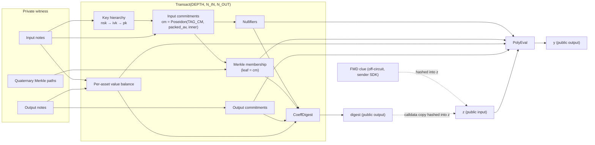

# MASP Circuits

Multi-Asset Shielded Pool circuits in circom 2.2.3 over the BN254 scalar field.
Two Groth16 entry points:

| Circuit | Instantiation | Purpose |
|---|---|---|
| [`4x6.circom`](4x6.circom) | `Transact(11, 4, 6)` | Spend 4 notes, create 6. 13-coefficient, 38-word public-input layout ([§2a](#2a-public-input-compression)). |
| [`tree_update_batch.circom`](tree_update_batch.circom) | `TreeUpdateBatch(11, 8)` | Relayer proof that the tree advances `old_root → new_root` by up to 8 leaves, any count. |

The two are **ceremony-paired**. A spend emits `N_OUT = 6` leaves that the batch
circuit inserts, so they share `DEPTH = 11` (`4^11 = 4,194,304` leaves) and
cannot be mixed across versions. `MAX_L = 8` rather than 6 because `COUNT_BITS`
requires a power of two. The batch circuit is documented in its own header,
including the contract-side obligations its soundness depends on.

The transact entry point instantiates
[`Transact(DEPTH, N_IN, N_OUT)`](lib/transact.circom), which stays generic; the
Lean development proves against the generic template and instantiates it.

Each note carries a private `asset_id` and `value` and commits to both by hash.
Per-asset conservation is enforced arithmetically over asset ids
([§6](#6-value-conservation)). Neither circuit contains a value commitment or
any curve arithmetic: every binding is a Poseidon hash or an integer equation.

This layout is a breaking change against every earlier release. The note
format, both public-input layouts and the deposit request differ, so
`PubInputs.sol`, the SDK and the relayer must move with it, and the phase-2
setup must be redone.

> **Machine-checked.** The Lean 4 development under [`lean/`](../lean/README.md)
> proves soundness of the modelled constraint systems. See
> [`lean/README.md`](../lean/README.md) for what is and is not covered and
> [`lean/FIDELITY.md`](../lean/FIDELITY.md) for how closely the model tracks this
> source.

---

## 1. Threat model and security goals

With the contract obligations of [§10](#10-smart-contract-obligations), the
circuits enforce the following for every accepted transaction.

- **Ownership.** Each spent note is opened against a key hierarchy
  `nsk → ivk → pk` whose `pk` is bound inside the note commitment.
- **No double spend.** Every spent slot, real or padding, emits
  `nf = Poseidon(TAG_NF, nk, rho, cm)` with `nk = Poseidon(TAG_NK, nsk)`. The
  contract rejects collisions against the global spent set. `cm` is in the
  preimage, so the nullifier identifies one exact note; see §7.
- **Per-asset value conservation.** For every asset class, shielded inputs equal
  shielded outputs plus the transparent bucket. Enforced by
  `PerAssetValueBalance` as integer arithmetic over asset ids compared as field
  elements, with no group-theoretic assumption.
- **Recipient binding.** `recipient_address` and `chain_id` are hashed into the
  challenge `z`, which is a public signal, so a relayer cannot rewrite the
  withdrawal target or replay the proof on another chain.
- **Calldata binding.** The proof verifies only for the calldata the witness
  describes. Each circuit outputs a Poseidon commitment to its coefficients as
  a public signal, and the contract hashes the calldata copy of that word into
  `z`, so the witness is committed before the challenge exists (§2a).
- **Indistinguishable padding.** Unused input slots emit real Poseidon
  nullifiers; unused output slots are real `value = 0` notes with real Poseidon
  commitments. No sentinel value leaks the transaction shape.
- **A transfer names no asset.** `public_out == 0` forces
  `public_asset_id == 0`, so only a withdrawal publishes an asset id.
- **Deposit binding.** Each deposit-mode leaf in `tree_update_batch` is
  `Poseidon(TAG_CM, leaf_asset·2^64 + leaf_public_in, inner)`, the commitment of
  a note carrying exactly `leaf_public_in` units of `leaf_asset`. The binding is
  per leaf, and it is injective: both operands are range-checked to 64 bits, so
  a second `(asset, value)` opening of the same leaf is a Poseidon collision.
  Nothing depends on which asset ids are registered.
- **FMD clue binding.** Each output carries a sender-computed FMD2 clue
  `(R, clue_bits)` passed outside the circuit and bound through the challenge
  (§7a). A relayer cannot corrupt it without invalidating `y`. Honest derivation
  from the recipient's flag key is a sender obligation, not a circuit
  constraint.

### What a note's secrecy rests on

`cm = Poseidon(TAG_CM, asset·2^64 + value, inner)` and
`inner = Poseidon(TAG_INNER, pk, rho, rcm)`. An output's `rho` is publicly
derivable from `nullifier[0]` (§7), and a deposit's `(asset, value)` and `inner`
are public. So `rcm` is the only secret keeping `pk` out of a published `inner`
and `(asset, value)` out of a spend's published `cm`. A wallet must sample it
uniformly for every note, padding included.

### Duplicate deposits

A deposit that repeats an earlier `(asset, value, inner)` exactly produces a
second leaf with the same `cm`, hence the same nullifier, and only one of the
two can be spent. It costs the depositor the second deposit. A wallet must count
a `cm` once.

Out of scope: EdDSA spend authorisation (only key derivation is in-circuit) and
the encrypted memo layout.

---

## 2. I/O surface

The verifier sees three field elements, in this order:

| Signal | Kind | Purpose |
|---|---|---|
| `y` | public output | `Σ_k coeffs[k] · z^k` over the 13 coefficients |
| `digest` | public output | `CoeffDigest(coeffs)`, a Poseidon commitment to the same 13 words |
| `z` | public input | Fiat-Shamir challenge supplied by the contract, over all 38 words |

The `10 + N_IN + 4·N_OUT` logical public inputs are bound into them; see §2a.

Logical public inputs, in calldata order, with widths at `Transact(11, 4, 6)`
totalling 38:

| Signal | Width | Bound by | Purpose |
|---|---:|---|---|
| `merkle_root` | 1 | coefficient | Root of the on-chain commitment tree |
| `nullifier[N_IN]` | 4 | coefficient | One per spent slot |
| `out_cm[N_OUT]` | 6 | coefficient | One per output slot; also the leaf `tree_update_batch` inserts |
| `public_asset_id` | 1 | coefficient | Transparent-bucket asset; `0` unless `public_out != 0` |
| `public_out` | 1 | coefficient | Transparent withdrawal |
| `digest` | 1 | public signal | Poseidon digest of the 13 words above. The circuit outputs it; calldata carries the same value |
| `recipient_address` | 1 | challenge | Withdrawal target (`uint160`) |
| `chain_id` | 1 | challenge | Replay protection |
| `payer_address` | 1 | challenge | Who may drive a satellite that consumes the spend (`SwapWrapper`); nonzero |
| `relayer_address` | 1 | challenge | Must equal the pool's `msg.sender` |
| `intent_hash` | 1 | challenge | Hash of the swap intent `SwapWrapper` checks (output note, floor, venue, deadline, refund owner); `0` for other spends. A full word, not an address |
| `out_clue_Rx`, `out_clue_Ry` | 12 | challenge | FMD clue point `R = r·G_8` per output |
| `out_clue_bits[N_OUT]` | 6 | challenge | Packed FMD clue bits per output; the contract masks with `CLUE_BITS_MASK = 0x3FFF` |
| `out_aux_digest` | 1 | challenge | `keccak256(abi.encode(aux)) mod r`; the contract MUST recompute it |

There is no `public_in`. A transact proof never moves tokens into the pool:
shielding goes through the deposit escrow and `tree_update_batch`.

Private inputs per slot:

- Spent: `asset_id, value, pk, rho, rcm, nsk, path_elements[DEPTH][3],
  path_indices[DEPTH], is_dummy`.
- Output: `asset_id, value, pk, rho, rcm`. No `is_dummy`, since padding outputs
  are real `value = 0` notes.

Relayer compensation is not a public input. Fees are paid as a shielded output
addressed to the relayer's key.

### 2a. Public-input compression

Three things are derived from the logical public inputs. The **challenge
preimage** is every one of them; the **coefficient vector** is its leading run;
the **digest** is a commitment to the coefficient vector.

```
z      = keccak256(abi.encode(challenge)) mod r               38 words at 4x6
y      = coeffs[0] + coeffs[1]·z + … + coeffs[M-1]·z^(M-1)     13 words at 4x6
digest = CoeffDigest(coeffs)                                   computed in-circuit
```

The contract computes `z` and `y` from calldata. It does **not** compute the
digest: it reads the digest word from calldata, where it sits right after the
coefficients, hashes it into `z` like every other word, and hands it to the
verifier as the second public signal. The circuit outputs the digest of its own
coefficients, so the proof verifies only if the two agree.

Both orders MUST match `contracts/src/libs/PubInputs.sol :: compress(Transact,
aux)` word for word. Reordering either is a soundness change for the contract.

**Coefficients** — evaluated into `y` and absorbed by the digest, in this order:

| Block | Width | First slot | Constrained by |
|---|---:|---|---|
| `merkle_root` | 1 | `0` | Merkle membership of the real input slot(s) |
| `nullifier` | `N_IN` | `1` | `nf === Poseidon(TAG_NF, nk, rho, cm)` |
| `out_cm` | `N_OUT` | `1 + N_IN` | `NoteInner` + `NoteCommitment` |
| `public_asset_id`, `public_out` | 2 | `1 + N_IN + N_OUT` | `RangeCheck64`, `PerAssetValueBalance`, the bucket constraint |

Total `3 + N_IN + N_OUT`, which is 13 at `Transact(11, 4, 6)`.

**The digest word** — slot `3 + N_IN + N_OUT` of the preimage. Hashed, passed to
the verifier, never evaluated.

**Challenge-only words** — hashed into `z`, never evaluated, and not signals of
the circuit. They close the calldata struct, then follow it:

| Block | Width |
|---|---:|
| `recipient`, `chain_id`, `payer`, `relayer`, `intent_hash` | 5 |
| `(clue_Rx, clue_Ry, clue_bits)` per output | `3·N_OUT` |
| `out_aux_digest` | 1 |

Total `10 + N_IN + 4·N_OUT` challenge words, 38 at this shape: 13 evaluated, the
digest word, and 24 hashed only.

The layout is pinned twice. `scripts/gen-vectors.ts` refuses to publish
[`vectors/transact-4x6.json`](../vectors/transact-4x6.json) unless the compiled
circuit's `y` and `digest` match the reference, and
`test/formal/layout_parity.test.ts` pins the published vector against the Lean
dump `lean/expected/layout-4x6.txt`.

**Why the evaluation alone does not bind.** `z` is a circuit INPUT. The prover
reads it before choosing a witness, because the contract derives it from
calldata the prover authored. Schwartz-Zippel needs the coefficient vector fixed
*before* the challenge.

`PolyEval` is affine in each coefficient with slope `z^k`. A witness has
parameters that nothing but their own coefficient depends on: each output's
`rcm` moves only that slot's `out_cm`; a dummy slot's `rho` moves only its
nullifier; and `merkle_root` is whatever tree the prover builds, since the
circuit only checks that the spent notes are under the root it is given. Each
such parameter displaces `y` independently and the displacements add
(`test/transact/digest.test.ts` asserts exactly that). Making `y` match calldata
that describes a *different* transaction (fresh nullifiers, a withdrawal, any
recipient) would then be a modular k-sum over about a dozen lists of cheap hash
outputs, far below a search of the field, and the forger would need no funds:
the witness spends notes in a tree of its own making.

**The digest.**

```
digest = CoeffDigest(merkle_root, nullifier[..], out_cm[..], public_asset_id, public_out)

h_0     = Poseidon(TAG_DIGEST, w[0..3])
h_{b+1} = Poseidon(h_b,        w[4b+4 .. 4b+7])        last block zero-padded
```

a Poseidon(5) fold over the coefficients, four blocks at 4x6, exposed as a
public signal. Let `c` be the calldata coefficients, `d` the calldata digest
word and `w` the witness's coefficients. A verifying proof shows
`CoeffDigest(w) == d` and `Σ w_k·z^k == Σ c_k·z^k`, with `z = keccak(c, d, …)`.

* `d` is in the preimage of `z`. Under collision resistance of the fold, the
  prover knows one coefficient vector with digest `d`. So `w` is fixed before
  `z`.
* `c` is in the preimage of `z` too. If `w != c`, the two are distinct
  polynomials of degree at most 12, both fixed before a challenge that behaves
  as random, and agree at it with probability at most `12/r`.

That is commit-then-challenge Fiat-Shamir, and it assumes two standard things:
Poseidon(5) is collision resistant, which the Merkle tree needs anyway, and
keccak256 behaves as a random oracle. It does not depend on which witness
parameters a prover can move, or on how many.

The Lean development proves the two ingredients: the digest determines the
coefficient vector under the collision-resistance hypothesis, and two distinct
vectors agree on at most 12 challenges. The step that joins them, the
random-oracle argument, is the standard one and is not formalised.

Three conditions on the consumer follow, and the argument needs each:

* **The calldata digest word is passed to the verifier unmodified**, as the
  second public signal.
* **The digest word is in the keccak preimage of `z`.** Left out, the prover can
  choose the witness, and with it the digest, after seeing `z`, and the k-sum is
  back.
* **Every coefficient is in the keccak preimage of `z`.**

The digest word is *not* a coefficient: it is not evaluated into `y`.

`test/transact/divergent.test.ts` runs every coefficient through a
calldata/witness disagreement, with the calldata digest both left at the
witness's value and recomputed for the rewritten coefficients, and the digest
word on its own.

**Adding a public input is a two-part change**: wire it into the coefficient
list of `TransactCompressN`, so both the evaluation and the digest take it, and
constrain it. A value the circuit has no signal for belongs in the challenge
preimage instead. Each coefficient is pinned by a constraint of its own, listed
above; that is what makes each word mean something, while the digest is what
ties the proof to the calldata.

One consequence elsewhere in the circuit:

* **At least one input slot must be real.** `MerkleProofOrDummy` skips the root
  comparison on a dummy slot, so with every slot dummy no spend constraint reads
  `merkle_root`. `Transact` rejects the all-dummy witness. Nothing legitimate is
  lost: shielding goes through the deposit escrow, so an all-dummy transact has
  nothing to spend.

**`out_aux_digest`** covers the whole `AuxValidation.Output` array. The contract
MUST recompute it from the aux calldata rather than accept it as an input; only
recomputation ties the challenge to the payload the recipient receives. Without
it the three clue fields are the only per-output data bound, so a relayer can
leave the clue intact, keeping the proof valid and the note still flagged, while
corrupting `ephPub` and the ciphertext. The recipient then cannot derive the
ECDH secret, cannot decrypt the opening, and cannot spend a note whose inputs are
already nullified.

**The batch circuit evaluates every input word.** `tree_update_batch` has
`4 + 4·MAX_L` coefficients — 36 at `MAX_L = 8` — and hashes those plus its own
digest word, 37. The order MUST match
`PubInputs.sol :: compress(TreeUpdateBatch)`.

Nothing is challenge-only there because every one of its input words *is* a
signal of the circuit. Hashing a signal into `z` without evaluating it binds
nothing — the prover reads `z` first and is free to choose a witness that
disagrees with the calldata `z` was hashed from.

Its public signals are `(y, digest, z)` as well, with
`digest = CoeffDigest(<the 36 coefficients>)`, nine Poseidon(5) blocks, and the
argument above applies unchanged with degree at most 35. `new_root` is not used
as the commitment, although every active word reaches it: a zero leaf is the
empty leaf, so `new_root` is not injective in the coefficients.

| Block | Width | First slot | Constrained by |
|---|---:|---|---|
| `old_root` | 1 | `0` | `old_root === BatchAppend(…).old_root`, rebuilt from `frontier_in` at `start_index` |
| `new_root` | 1 | `1` | `new_root === BatchAppend(…).new_root`, from the same frontier |
| `start_index` | 1 | `2` | `Num2Bits(2·DEPTH)`, then the frontier digits |
| `actual_count` | 1 | `3` | `Num2Bits(COUNT_BITS)`, then `active[k]` and the append window |
| `cms` | `MAX_L` | `4` | the leaf, into `new_root`; zero on an inactive slot |
| `leaf_asset` | `MAX_L` | `4 + MAX_L` | `RangeCheck64`; the deposit hash; zero on a spend or inactive slot |
| `leaf_public_in` | `MAX_L` | `4 + 2·MAX_L` | `RangeCheck64`; the deposit hash; zero on a spend or inactive slot |
| `is_deposit` | `MAX_L` | `4 + 3·MAX_L` | booleanity; selects the leaf; zero on an inactive slot |

The digest word follows, at slot `4 + 4·MAX_L` of the preimage.

On a deposit slot `cms[k]` carries the depositor's `inner`, not a commitment.
The tree leaf is then **not** the calldata word: a consumer that rebuilds the
tree must compute `Poseidon(TAG_CM, leaf_asset·2^64 + leaf_public_in, cms[k])`
for a deposit slot and take `cms[k]` as it stands for a spend slot.
`vectors/tree-update-batch-8.json` publishes both per slot.

**Do not demote the deposit fields to challenge-only.** It was tried on an
earlier layout, and it is exploitable in two independent ways: with `is_deposit`
free a `flushBatch` caller escrows one unit and commits a leaf of its own
choosing, and with `leaf_public_in` free the leaf is built for a prover-chosen
amount. `test/batch/divergent.test.ts` holds both.

**Verifier signature.** `snarkjs zkey export solidityverifier` emits
`verifyProof(uint[2] _pA, uint[2][2] _pB, uint[2] _pC, uint[3] _pubSignals)`
with `_pubSignals = [y, digest, z]`, in that order: circom lays out the main
component's outputs before its public inputs, so wire 1 is `main.y`, wire 2 is
`main.digest` and wire 3 is `main.z`. Confirm against the compiled `.sym` rather
than this prose. An integrator who reorders them rejects every proof.

---
## 3. Dataflow


```mermaid
flowchart LR
    subgraph Witness["Private witness"]
        IN["Input notes"]
        OUT["Output notes"]
        MP["Quaternary Merkle paths"]
    end
    FMD["FMD clue (off-circuit, sender SDK)"]
    subgraph Circuit["Transact(DEPTH, N_IN, N_OUT)"]
        K["Key hierarchy<br/>nsk → ivk → pk"]
        CI["Input commitments<br/>cm = Poseidon(TAG_CM, packed_av, inner)"]
        NF["Nullifiers"]
        MT["Merkle membership<br/>(leaf = cm)"]
        BAL["Per-asset value balance"]
        CM["Output commitments"]
        DG["CoeffDigest"]
    end
    PE["PolyEval"]
    Z["z (public input)"]
    Y["y (public output)"]
    D["digest (public output)"]
    IN --> K --> CI
    IN --> CI --> NF --> PE
    CI --> MT --> PE
    MP --> MT
    IN --> BAL
    OUT --> BAL --> PE
    OUT --> CM --> PE
    NF --> DG
    MT --> DG
    CM --> DG
    BAL --> DG --> D
    FMD -. hashed into z .-> Z
    D -. calldata copy hashed into z .-> Z
    Z --> PE --> Y
```

`Transact` is a wiring layer: it instantiates `SpentNote` per input and
`OutputNote` per output, runs `PerAssetValueBalance` over their private
`(asset, value)` pairs and the transparent bucket, and hands the coefficient
signals to `TransactCompressN`, which evaluates them and commits to them.

---

## 4. Note commitment

File: [`lib/note.circom`](lib/note.circom).

```
inner     = Poseidon(TAG_INNER, owner_pk, rho, rcm)
cm        = Poseidon(TAG_CM, packed_av, inner)
packed_av = asset_id · 2^64 + value
```

Two steps so that the deposit path can bind a leaf without opening the note. A
deposit's `(asset, value)` is public and its owner is not: the depositor
publishes `inner`, and `tree_update_batch` computes `cm` from the three. A spend
later opens the same `cm` from the whole note. `cm` is the tree leaf; there is
no separate leaf hash.

The packing is injective because **both** `asset_id` and `value` are
range-checked below `2^64` wherever `NoteCommitment` is instantiated:
`SpentNote`, `OutputNote`, and `TreeUpdateBatch` for a deposit leaf. The gadget
itself checks neither. Without the value bound, `(7, 2^64)` and `(8, 0)` pack to
the same word and share a commitment; `test/gadgets/note.test.ts` records the
aliasing, and `test/gadgets/note_slots.test.ts` and
`test/batch/deposit_binding.test.ts` show the out-of-range reading rejected.

Domain separation is by leading tag. `cm` shares arity 3 with `DeriveRho`, and
`inner` shares arity 4 with the nullifier; every other site differs in arity as
well (§11).

`rho` provides per-note uniqueness and feeds the nullifier; `rcm` is the hiding
randomness (§1).

---

## 5. Asset ids

An asset id is a field element below `2^64`, matching the on-chain
`uint64 publicAssetId`. The circuits treat it as an opaque label: two ids are
the same asset exactly when they are equal as field elements, and no arithmetic
relation between ids means anything.

**Id 0 means "no asset".** It is what the transparent bucket names when nothing
is withdrawn, and what a zero-value deposit leaf may name. A real spent note and
every output note reject it, and `tree_update_batch` refuses value under it on a
deposit leaf, so no note carrying value under id 0 can enter the tree.
`AssetRegistry` must never register id 0.

There are no per-asset generators and no registration-time check on the id set.

---

## 6. Value conservation

File: [`lib/balance.circom`](lib/balance.circom).

`PerAssetValueBalance` checks, for every asset id `c` appearing anywhere in the
transaction:

```
Σ_i in_value[i]·[in_asset[i] == c]
  == Σ_j out_value[j]·[out_asset[j] == c] + public_out·[public_asset_id == c]
```

Candidates are `{in_asset[*], out_asset[*], public_asset_id}`. Any asset outside
that set contributes zero to both sides, so covering the candidates covers every
asset present. Assets are compared as field elements via `IsEqual`; values are
64-bit with at most `N_OUT + 1` terms per side, so the sums stay far below the
modulus. The result is exact integer arithmetic with no modular wrap and no
group-theoretic assumption. Dummy inputs carry `value = 0` and are neutral
whatever `asset_id` they declare. The gadget costs 594 constraints at 4x6.

The transparent bucket sits on the output side only.

**Precondition.** Every value must already be 64-bit range-checked. `SpentNote`
and `OutputNote` apply `RangeCheck64` to the note values and the transact circuit
applies it to `public_out`. Dropping any of these invalidates the no-wrap
argument.

### The transparent bucket

```
IsZero(public_out).out * public_asset_id === 0
```

`public_out == 0` forces `public_asset_id == 0`. Without it a shielded transfer
would have to publish *some* asset id, and the natural choice is the one it
moves.

The converse needs no constraint. At `public_asset_id == 0` the candidate row
for id 0 reads `Σ in_value[asset == 0] == Σ out_value[asset == 0] + public_out`.
Outputs reject id 0 and a real input rejects it, so only dummies remain on the
left, at value 0, and `public_out == 0` follows.

---

## 7. Key hierarchy and nullifier

```
nsk  (spend authority)
 ├─ ivk = Poseidon(TAG_IVK, nsk)      (incoming view key)
 │    └─ pk = Poseidon(TAG_PK, ivk)   (bound in note cm)
 └─ nk  = Poseidon(TAG_NK, nsk)       (nullifier-deriving key, FVK)

nf = Poseidon(TAG_NF, nk, rho, cm)
dk = Poseidon(TAG_DK, ivk)            (off-circuit, FMD)
```

`ivk` confers detection and decryption rights; `nk` adds spent-note visibility.
Neither lets the holder spend: `nsk` is required to satisfy the in-circuit `pk`
check, and Poseidon is one-way, so neither `ivk` nor `nk` reveals `nsk`.

Every spent slot, real or dummy, constrains
`nullifier[i] === Poseidon(TAG_NF, nk, rho, cm)`, with `nk` derived in-circuit
from the prover-supplied `nsk` and `cm` recomputed from the same witness.
Dummies use prover-chosen private `(nsk, rho)`, so their public nullifier is
indistinguishable from a real spend, and the contract inserts every nullifier
unconditionally.

**Why `cm` is in the preimage.** Keyed on `(nk, rho)` alone, two notes sharing a
`rho` share a nullifier, and spending either permanently bricks the other. That
is reachable: output `rho` is `Poseidon(TAG_RHO, nullifier[0], j)` and
`nullifier[0]` is public, so every output note's `rho` is publicly computable;
and the deposit path takes `inner` from the depositor with no `rho` constraint
and no proof, so an attacker can plant a dust note at a victim's `pk` reusing an
existing `rho`. Binding `cm` closes this for every inserter rather than relying
on each one to derive `rho` correctly. `DeriveRho` remains the transact-path
defence. Two leaves with the *same* `cm` still share a nullifier; see §1.

---

## 7a. FMD2 clue, off-circuit

Each output carries an FMD2 clue `(R, clue_bits)` computed by the sender SDK.
The clue fields are not signals of the circuit: they are words of the challenge
preimage, so a relayer cannot alter them after proof generation without
invalidating `y`, but the circuit does not verify honest derivation from the
recipient's flag key.

```
R         = r · G_8                              (Baby-Jubjub fixed base)
S_i       = r · fk_i                             for i ∈ [GAMMA]
bit_i     = legendre_bit(Poseidon(TAG_FMD_BIT, R.x, R.y, i, S_i.x, S_i.y))
clue_bits = pack(1 - bit_i for i in [GAMMA])     (sender flips; receiver ⊕ == 1)
```

`legendre_bit(h)` is computed off-circuit ([`test/ref/sqrt.ts`](../test/ref/sqrt.ts),
mirrored in the SDK): for nonzero `h`, `bit = 1` iff `h` is a quadratic residue,
else `bit = 0` and `h = y²·Z` for the fixed non-residue `Z = 5`. Exactly one of
`{h, h·Z⁻¹}` is a residue, so the bit is well defined.

`clue_bits` is one field element; the contract masks the upper bits with
`CLUE_BITS_MASK = 0x3FFF`. `GAMMA` is a subscription-time parameter chosen by the
client, not a circuit parameter. Constraint cost is zero. This is the only place
Baby-Jubjub appears, and it is outside both circuits.

---

## 8. Quaternary Merkle membership

Files: [`lib/merkle.circom`](lib/merkle.circom),
[`lib/common.circom`](lib/common.circom).

Each level is `node = Poseidon(TAG_MERKLE, c0, c1, c2, c3)`.
`path_indices[d] ∈ {0..3}` selects the position of the proven child through
`PathIndexSelectors`, whose `Num2Bits(2)` also range-checks the digit.
`MerkleProofOrDummy` skips inclusion when `is_dummy == 1`, so a dummy bypasses
the root check while still constraining its nullifier.

The leaf is the note commitment `cm`. A spend opens `cm` from its note and
proves that value is in the tree, so it can claim only the `(asset, value)` the
leaf was inserted for: by a transact proof for an output, or by
`tree_update_batch` from the public amount for a deposit.

---

## 9. Multi-asset semantics and padding

The circuit places **no** constraint linking `in_asset[i]` to `in_asset[k]` or to
any `out_asset[j]`. One proof may mix up to `N_IN` shielded asset ids on the
input side and `N_OUT` on the output side, provided per-asset conservation holds.
The transparent bucket is single-asset per transaction.

Holding regardless of asset mix:

- `RangeCheck64` on every private `value` and every `asset_id`.
- Real notes reject `asset_id == 0`.
- `in_asset`, `out_asset` and `public_asset_id` are compared as field elements,
  so an asset id can only cancel against itself.
- `(asset_id, value)` is inside `cm`, and `cm` is the leaf, so the pair cannot
  drift between a note's creation and its spend.

Padding:

- **Spent dummies** carry `is_dummy = 1` and bypass the `pk` check, the Merkle
  check and the `asset != 0` reject. `DummyZeroValue` enforces
  `is_dummy · value === 0`. The nullifier is computed normally, and both range
  checks still apply.
- **Output padding** is a real `value = 0` note under a non-zero asset id,
  typically addressed to the sender. Its `cm` is a real Poseidon insertion, with
  no sentinel, and needs a uniformly sampled `rcm` like any other note (§1).

---
## 10. Smart-contract obligations

Before invoking the Groth16 verifier the on-chain wrapper MUST:

1. **Fiat-Shamir.** Flatten the logical public inputs in the canonical order
   (§2a), derive `z = H(transcript) mod r` for a domain-separated `H` over **all
   38 words**, compute `y = Σ coeffs[k]·z^k mod r` over **the 13 coefficients**,
   and pass `[y, digest, z]` in that order. `z` MUST be a deterministic function
   of every word, including the 25 the polynomial skips.
2. **The digest word.** Take `digest` from calldata as given and pass it to the
   verifier as the second public signal. It MUST be inside the hashed span, MUST
   NOT be evaluated into `y`, and MUST be rejected when `>= r`, as the verifier
   requires of any public signal. Do not recompute it; see §2a.
3. **Canonical slots.** Either `require(slot < r)` for every logical public
   input before compressing, **or** derive `z` by hashing the raw pre-reduction
   calldata words. One of the two is mandatory. `compress()` is modular, so `v`
   and `v + r` yield the same `y`; if `z` is also derived from reduced values,
   any slot, in particular the `out_clue_*` words, can be mutated in calldata
   while the proof still verifies. `PubInputs.sol` takes the hashing route for
   the challenge-only words. Reducing the slots before hashing would reintroduce
   the malleability. An evaluated word `>= r` is rejected outright.
4. **Aux digest.** Fill the final challenge word with
   `keccak256(abi.encode(aux)) mod r` computed from the aux calldata. Never read it from the caller: taking it as an
   input makes it agree with any payload and restores the tampering it prevents.
5. `require(chainId == block.chainid)`.
6. `require(public_out < 2**64)` and `require(public_asset_id < 2**64)`.
7. On a withdrawal, `require(registry[public_asset_id].token != address(0))`. On
   a transfer, `require(public_asset_id == 0 && public_out == 0)`; the circuit
   forces the id to 0 whenever `public_out` is. Id 0 MUST NOT be registrable.
8. `require(nullifier[i] != nullifier[k])` for every pair `i < k`, with no
   exception for zero. That is six pairs at four input slots; the count is
   quadratic in `N_IN`.
9. Type `recipient_address`, `payer_address` and `relayer_address` as
   `address`, passing `uint256(uint160(addr))`, with `address(0)` for unused
   slots. `intent_hash` is a full `uint256`, hashed as given.
10. `require(merkleRoots[merkle_root])`.
11. Per input slot: `require(!spent[nullifier[i]]); spent[nullifier[i]] = true;`,
    with no sentinel skip.
12. Per output slot `j`: insert `out_cm[j]` into the commitment tree, emit the
    leaf event, and forward `out_cm[j]` into the paired `tree_update_batch`
    public inputs at `cms[j]` with `is_deposit[j] = 0`. It must come from the
    transact proof rather than the relayer, and `actual_count` must be pinned to
    `N_OUT`. The batch circuit proves the tree advanced by those leaves, not
    that they are the ones this spend authorised.
13. Pay `public_out` to `recipient_address`.

The paired batch proof takes `[y, digest, z]` the same way: `y` over its 36
coefficients, the batch digest word from calldata, and `z` over the 37 words.
On the spend path the contract builds the batch coefficients itself from the
transact calldata, but the batch digest is still a word the prover supplies.

For it the contract must additionally pin three things.

`start_index == committedCount`. `BatchAppend` binds the frontier to `old_root`
but cannot bind the index, since a tree with trailing empty leaves has the same
root as one without them, so replaying a valid batch at a lower index would
overwrite committed leaves.

`is_deposit[k]` per active slot — 1 on every leaf of a deposit batch, 0 on every
leaf of a spend batch — taken from the contract's own records rather than from
relayer calldata. The circuit constrains it only to be boolean, and it selects
how `cms[k]` becomes a leaf. Both mistakes verify:

* cleared on a deposit slot, the depositor's word is inserted as it stands. A
  depositor who escrowed a commitment of its choosing in place of `inner` then
  holds a note of any value for a one-unit deposit;
* set on a spend slot, the leaf is the hash of `out_cm` under
  `(leaf_asset, leaf_public_in)`. It has no opening, so the spend's outputs are
  burned.

`leaf_asset[k]`, `leaf_public_in[k]` and the `inner` in `cms[k]` on a deposit
slot, taken from the contract's record of that deposit. They are what the leaf
is minted for.

The batch circuit's header carries the full list.

---

## 11. Domain-separation tags

Defined in [`lib/tags.circom`](lib/tags.circom), the single source of truth
across the in-circuit hash sites and the test helpers. Tag values bake into hash
inputs, so changing one breaks compatibility with every prior proof.

| Function | Value | Use | Arity |
|---|---:|---|---:|
| `TAG_CM` | 1 | `cm = Poseidon(TAG_CM, packed_av, inner)` | 3 |
| `TAG_NF` | 2 | `nf = Poseidon(TAG_NF, nk, rho, cm)` | 4 |
| `TAG_PK` | 3 | `pk = Poseidon(TAG_PK, ivk)` | 2 |
| `TAG_IVK` | 4 | `ivk = Poseidon(TAG_IVK, nsk)` | 2 |
| `TAG_MERKLE` | 5 | `node = Poseidon(TAG_MERKLE, c0..c3)` | 5 |
| `TAG_DK` | 6 | `dk = Poseidon(TAG_DK, ivk)`, off-circuit | 2 |
| — | 7 | Retired (`TAG_ASSET`). Never reuse | — |
| `TAG_FMD_BIT` | 8 | FMD2 clue bit derivation, off-circuit (§7a) | 6 |
| `TAG_NK` | 9 | `nk = Poseidon(TAG_NK, nsk)` | 2 |
| — | 10 | Retired (`TAG_LEAF`). Never reuse | — |
| `TAG_RHO` | 11 | `rho = Poseidon(TAG_RHO, nullifier[0], out_index)` | 3 |
| `TAG_INNER` | 14 | `inner = Poseidon(TAG_INNER, pk, rho, rcm)` | 4 |
| `TAG_DIGEST` | 15 | First block of `CoeffDigest`, in both circuits | 5 |

12 and 13 are reserved off-circuit (`TAG_SUB_TOKEN`, `TAG_FMD_EXPAND`).

Every pair of sites sharing an arity has distinct leading tags: `TAG_CM` and
`TAG_RHO` at 3, `TAG_NF` and `TAG_INNER` at 4, `TAG_MERKLE` and `TAG_DIGEST` at
5. A later `CoeffDigest` block leads with the previous block's output rather
than a tag. `POW_2_64` is the packing multiplier in `NoteCommitment` and the
bound `RangeCheck64` enforces.

---

## 12. Constraint budget

R1CS totals from `snarkjs r1cs info`. Each circuit has one public input, `z`, and
two public outputs, `y` and `digest`.

| Circuit | Constraints | Wires | Private inputs |
|---|---:|---:|---:|
| `Transact(11, 4, 6)` | 69,291 | 69,422 | 247 |
| `TreeUpdateBatch(11, 8)` | 41,521 | 41,466 | 69 |

The two circuits use different domains. `Transact` is set up on **2^17**
(`powersOfTau28_hez_final_17`), `TreeUpdateBatch` on **2^16**
(`powersOfTau28_hez_final_16`). snarkjs sizes the domain from
`nConstraints + nPubInputs + nOutputs` and requires that sum to be at most
`domain - 1`, so the ceiling on the constraint count is `domain - 4`: **131,068**
for the transact circuit, which clears it by 61,777, and **65,532** for the batch
circuit, which clears it by 24,011. Neither fits the next domain down: transact
is 3,759 over the 2^16 ceiling and the batch 8,757 over the 2^15 one.
`just budget` pins both to their exact counts and domains in
[`budget.json`](../budget.json), and `groth16 setup` fails outright above the
ptau as a second line of defence.

Measured, a depth level costs `TreeUpdateBatch` 2,534 constraints and a leaf slot
about 1,800, a digest block included. So 2^16 holds through depth 20 at
`MAX_L = 8` (once `EMPTY_SUBTREE` is extended past `d = 11`), and at depth 11
through `MAX_L = 16` (56,026); `MAX_L = 32` is 85,891 and needs 2^17.

`MAX_L = 8` is the floor rather than a tuning choice: `COUNT_BITS` requires a
power of two, and a spend emits `TRANSACT_OUT = 6` leaves that must fit one
batch, with `MASP.sol` pinning `actualCount` to exactly that on the transfer
path. Only `flushBatch` uses the slack, carrying four two-leaf deposits.

Verification gas is a fixed pairing check over three public signals and is
unaffected by circuit width. A wider batch does not make a verification cheaper;
it caps how many deposits share one.

### Gadget costs

Each compiled on its own at circom's default `--O1`, so surviving linear rows
are included.

| Gadget | Cost |
|---|---:|
| `Poseidon(2)` / `Poseidon(3)` / `Poseidon(4)` / `Poseidon(5)` | 517 / 605 / 736 / 835 |
| `RangeCheck64` | 65 |
| `NoteInner` + `NoteCommitment` | 736 + 606 |
| `MerkleProofOrDummy(11)` | 9,419 |
| `SpentNote(11)` | 13,182 |
| `OutputNote` (plus its `DeriveRho`, 605) | 1,473 |
| `PerAssetValueBalance(4, 6)` | 594 |
| `CoeffDigest(13)`, four `Poseidon(5)` | 3,340 |
| `CoeffDigest(36)`, nine `Poseidon(5)` | 7,515 |

At `Transact(11, 4, 6)`: four `SpentNote` (52,728), six output slots (12,468),
the balance, the digest, and about 160 for the transparent bucket, the dummy
bookkeeping and the Horner chain. An input slot costs about 6.3 output slots,
almost all of it the Merkle path.

`TreeUpdateBatch` is `BatchAppend`, one `NoteCommitment` and two range checks
per leaf slot, and the digest over its 36 coefficients. The tree is one `Poseidon(5)` per level rebuilding `old_root` from
the frontier, and one per node the batch changes for `new_root` — 11 + 22 at
`MAX_L = 8`, against the 11 + 88 a chain of single-leaf inserts spends. Both
folds read the frontier as plain linear terms. The Horner chain is negligible.

---

## 13. File map

| File | Role |
|---|---|
| [`4x6.circom`](4x6.circom) | `Transact(11, 4, 6)`, the transact entry point |
| [`tree_update_batch.circom`](tree_update_batch.circom) | `TreeUpdateBatch(11, 8)`, the relayer tree-advance circuit |
| [`lib/transact.circom`](lib/transact.circom) | `Transact(DEPTH, N_IN, N_OUT)`, the generic template |
| [`lib/spent.circom`](lib/spent.circom) | `SpentNote`: key, range, commitment, Merkle, nullifier |
| [`lib/output.circom`](lib/output.circom) | `OutputNote`: range, commitment |
| [`lib/note.circom`](lib/note.circom) | Key derivation, `NoteInner`, `NoteCommitment`, `rho`, nullifier |
| [`lib/balance.circom`](lib/balance.circom) | `RangeCheck64`, `DummyZeroValue`, `PerAssetValueBalance` |
| [`lib/merkle.circom`](lib/merkle.circom) | Quaternary level, root, dummy-aware membership |
| [`lib/batch_append.circom`](lib/batch_append.circom) | `BatchAppend`: count, capacity, frontier pin, and both roots of the batched append |
| [`lib/poly_eval.circom`](lib/poly_eval.circom) | `PolyEval`, `CoeffDigest`, `TransactCompressN`, `BatchCompress` |
| [`lib/common.circom`](lib/common.circom) | `PathIndexSelectors`, `EmptySubtreeHashes` |
| [`lib/tags.circom`](lib/tags.circom) | Domain-separation tags and `2^64` |

| Test tree | Role |
|---|---|
| [`../test/ref/`](../test/ref/) | TypeScript reference implementation, with no SDK dependency; the circom is the source of truth |
| [`../test/lib/`](../test/lib/) | Harness: circuit loader, suite hooks, dimensions, input shapers, signal paths, witness assertions, witness builders |
| [`../test/transact/`](../test/transact/) | Transact suites by concern: balance and the transparent bucket, multi-asset (including the four-asset full shape), tamper, the coefficient digest, PolyEval binding, divergent witness, `rho` |
| [`../test/batch/`](../test/batch/) | Tree-update batch suites by concern: shapes and capacity, deposit binding, frontier, padding, divergent witness |
| [`../test/gadgets/`](../test/gadgets/) | Library templates in isolation: Merkle, `MerkleProofOrDummy`, `PathIndexSelectors`, `PolyEval`, `BatchAppend`, the note derivations, `PerAssetValueBalance` and the `SpentNote` / `OutputNote` slots |
| [`../test/tooling/`](../test/tooling/) | The `just budget` gate and the underconstraint detectors' self-test |
| [`../test/formal/`](../test/formal/) | Pins the slot order against the Lean dump and `_pubSignals = [y, digest, z]` |
| [`../test/fuzz/`](../test/fuzz/) | Property-based suites over Transact, Merkle, frontier binding, PolyEval, per-asset balance, and the R1CS-level second-witness search |
| [`../test/fixtures/`](../test/fixtures/) | Small-parameter wrappers instantiating library templates |

| Script | Role |
|---|---|
| [`../scripts/gen-vectors.ts`](../scripts/gen-vectors.ts) | Builds [`vectors/`](../vectors/); refuses to write when the circuit's `y` disagrees with the reference |
| [`../scripts/check-budget.mjs`](../scripts/check-budget.mjs) | The `just budget` gate: FFT domain plus the exact count |
| [`../scripts/check-artifacts.ts`](../scripts/check-artifacts.ts) | Pre-publish gate over the shipped artifacts |
